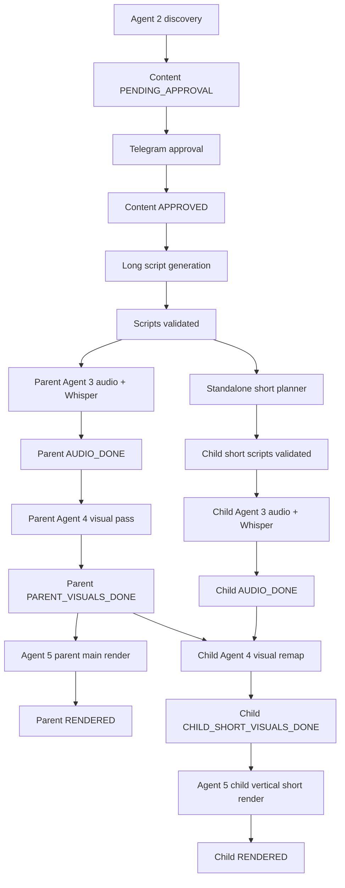
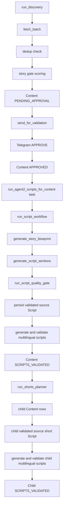
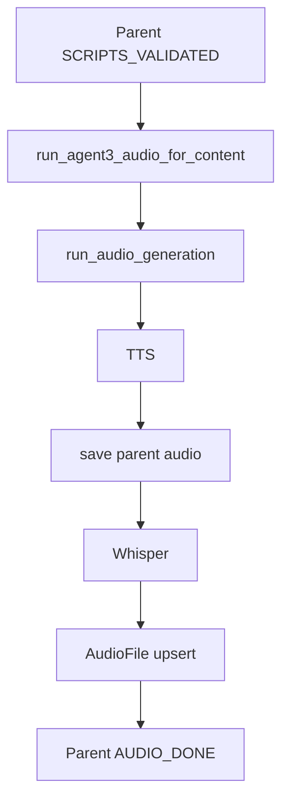
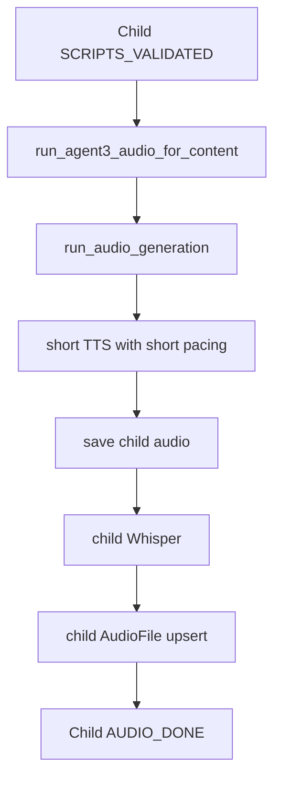
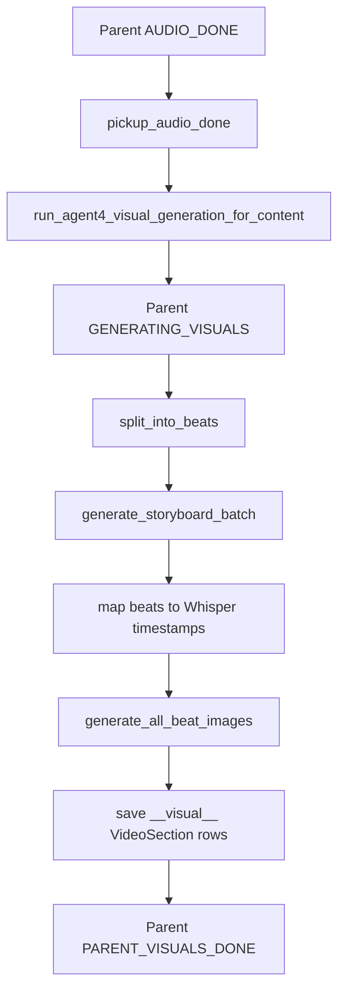
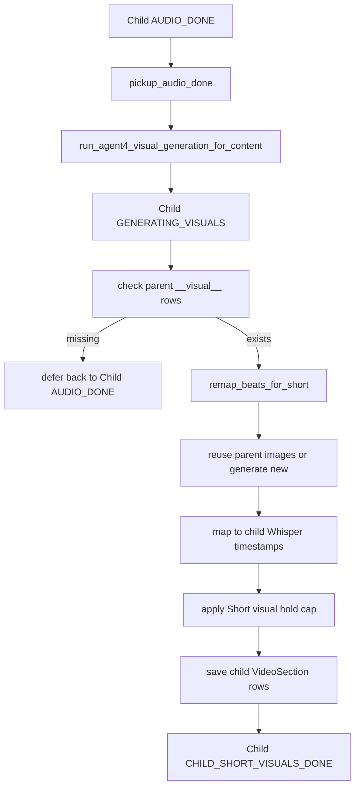
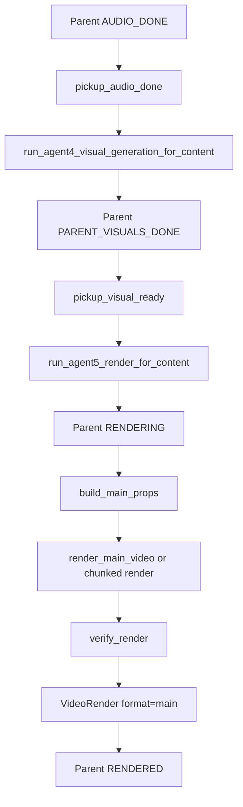
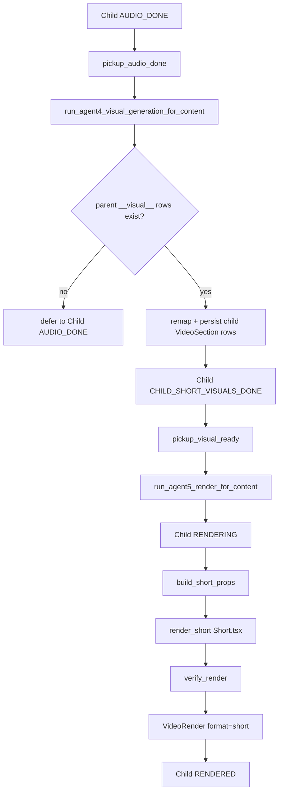

# CLAUDE.md — Content Factory Engineering Guide

This file is the **single source of truth** for Content Factory architecture, coding rules, prompting rules, and operational constraints.

It has two major parts:

1. **Platform architecture** — what exists today, how the pipeline flows, which modules own which responsibility, and what invariants must hold.
2. **Rules** — mandatory engineering, database, testing, naming, prompting, Claude Code/Codex, logging, reliability, and safety rules.

When architecture changes, update this file in the same change set.  
When a rule becomes obsolete, remove or replace it.  
Do not append temporary phase notes. This file describes the current product, not the development history.

---

# Part 1 — Platform Architecture

## 1. Product Overview

Content Factory is an automated media pipeline for generating multilingual long-form videos and standalone short episodes for YouTube, TikTok, Instagram, and Facebook.

The system:

- Discovers source stories from configured sources.
- Scores and deduplicates stories.
- Sends selected stories to the operator through Telegram for approval.
- Generates long-form scripts.
- Generates standalone short episode scripts linked to the long-form parent.
- Generates audio with TTS.
- Generates word-level timestamps with Whisper.
- Generates visual storyboards.
- Generates Flux images.
- Renders videos through Remotion.
- Stores all outputs in PostgreSQL and the local media filesystem.
- Runs through Celery workers and Celery Beat scheduling.

The current production-relevant pipeline covers:

- Agent 1 — Channel Setup
- Agent 2 — Story discovery, validation, long script generation, short episode planning
- Agent 3 — Audio and Whisper
- Agent 4 — Visual planning and media generation
- Agent 5 — Rendering
- Agent 6+ — not part of the current media-generation core yet

Deterministic script checks and script correction run inside Agent 2.

---

## 2. Core Technology Stack

| Area | Technology |
|---|---|
| Language | Python 3.11+ |
| API | FastAPI |
| Workers | Celery |
| Scheduler | Celery Beat |
| Queue/Broker | Redis |
| Database | PostgreSQL |
| ORM | SQLAlchemy 2.0 |
| Migrations | Alembic |
| AI text/reasoning | Claude API |
| TTS | Cartesia by default; ElevenLabs supported as legacy/provider option |
| Transcription | OpenAI Whisper API with word-level timestamps |
| Image generation | fal.ai Flux Schnell |
| Video rendering | Remotion, called from Python through subprocess |
| Notifications | Telegram Bot API |
| Credential encryption | Fernet |
| Frontend | React/Vite for Agent 1 UI |
| Media storage | Local filesystem under configured media path |

---

## 3. High-Level Pipeline



Arrow explanation:

Discovery  
→ creates parent `Content` row  
→ sends Telegram validation  
→ approval marks parent as `APPROVED`  
→ Agent 2 generates and validates the parent source script  
→ Agent 2 generates and validates all required parent multilingual scripts  
→ parent scripts reach `SCRIPTS_VALIDATED`  
→ short planner creates child short contents and validated source scripts (requires the
parent's own validated source `Script` row — see `run_shorts_planner`)  
→ Agent 2 generates and validates all required child multilingual scripts  
→ child scripts reach `SCRIPTS_VALIDATED`  
→ parent Agent 3 generates parent audio and Whisper  
→ child short episodes are immediately eligible for Agent 3 audio  
→ parent reaches `AUDIO_DONE`  
→ each child generates its own audio and Whisper  
→ parent Agent 4 generates shared visual beats and writes `PARENT_VISUALS_DONE`  
→ child Agent 4 remaps parent visual beats to its own short narration — this
requires the parent's persisted `VideoSection(language="__visual__")` rows,
i.e. requires `PARENT_VISUALS_DONE` to have been reached at least once — and
writes `CHILD_SHORT_VISUALS_DONE`  
→ Agent 5 renders the long video once parent is `PARENT_VISUALS_DONE`, and each
child short once it is `CHILD_SHORT_VISUALS_DONE`  
→ each child renders as vertical `Short.tsx`  
→ parent and children reach `RENDERED` independently

Important ordering rule:

- Child script generation requires the parent's validated source `Script` row
  (`run_shorts_planner` aborts if it is missing). Short planning may use the
  parent source script, but parent `SCRIPTS_VALIDATED` is written only after
  the complete required parent script set is generated and validated.
- Agent 3 pickup must see only fully completed script sets: for both parent and
  child content, `SCRIPTS_VALIDATED` means the required source-language script
  exists, the required source-language script is validated, all configured
  multilingual scripts exist, and all configured multilingual scripts are validated.
- Child short videos require child audio and the parent's persisted visual
  beats (`PARENT_VISUALS_DONE` reached at least once for the parent).
- Child short videos do **not** require the parent MP4 to be fully rendered
  (parent `RENDERED`).
- Child short videos must never use parent audio.
- Parent content must never render cut-down parent shorts.

---

## 4. Runtime Status Model

### 4.1 Parent Long Content

```text
PENDING_APPROVAL
→ APPROVED
→ GENERATING_SCRIPTS
→ SCRIPTS_VALIDATED
→ GENERATING_AUDIO
→ AUDIO_DONE
→ GENERATING_VISUALS
→ PARENT_VISUALS_DONE
→ RENDERING
→ RENDERED
```

Optional/problem statuses:

```text
AWAITING_MANUAL_STORY
NEEDS_REVIEW
FAILED
```

### 4.2 Child Short Episodes

```text
GENERATING_SCRIPTS
→ SCRIPTS_VALIDATED
→ GENERATING_AUDIO
→ AUDIO_DONE
→ GENERATING_VISUALS
→ CHILD_SHORT_VISUALS_DONE
→ RENDERING
→ RENDERED
```

A child may revert from `GENERATING_VISUALS` back to `AUDIO_DONE` if its
parent has not yet reached `PARENT_VISUALS_DONE` — this is a normal wait, not
a failure, and the child is re-picked-up on the next Beat cycle.

Script completion rule:

- For both parent and child content, `SCRIPTS_VALIDATED` means: required source-language script exists; required source-language script is validated; all required multilingual scripts exist; all required multilingual scripts are validated; and no intermediate script status remains active.
- For parent content, `SCRIPTS_VALIDATED` means the source-language long script
  exists and is validated, and every configured multilingual script exists and
  is validated. If no channel target languages are configured, the validated
  source-language script is the complete required script set.
- For child short episodes, `SCRIPTS_VALIDATED` means the source-language short
  script exists and is validated, and every configured multilingual child short
  script exists and is validated. If no channel target languages are configured,
  the validated source-language short script is the complete required script set.
- `SCRIPTS_READY` is retired and must not be read or written by live runtime code.
- `SCRIPTS_VALIDATED_AWAITING_PARENT` is retired and must not be read or
  written by live runtime code. Child short audio is picked up from
  `SCRIPTS_VALIDATED` like any other content; there is no parent-audio gate
  status in the current architecture.
- `run_script_workflow()` owns the final parent `SCRIPTS_VALIDATED` transition.
- `run_shorts_planner()` owns the final child `SCRIPTS_VALIDATED` transition.

Child short audio rule:

- Child short contents become `SCRIPTS_VALIDATED` only after their complete
  required standalone short script set passes validation.
- Child short audio does not wait for parent `AUDIO_DONE`.
- Each child must generate its own audio and Whisper.

### 4.3 Status Ownership

| Transition | Owner |
|---|---|
| `PENDING_APPROVAL` → `APPROVED` | Telegram approval handler |
| `APPROVED` → `GENERATING_SCRIPTS` → `SCRIPTS_VALIDATED` | Agent 2 |
| `SCRIPTS_VALIDATED` → `GENERATING_AUDIO` → `AUDIO_DONE` | Agent 3 |
| `AUDIO_DONE` → `GENERATING_VISUALS` → `PARENT_VISUALS_DONE` / `CHILD_SHORT_VISUALS_DONE` (or back to `AUDIO_DONE` on child defer) | Agent 4 |
| `PARENT_VISUALS_DONE` / `CHILD_SHORT_VISUALS_DONE` → `RENDERING` → `RENDERED` | Agent 5 |
| any stage → `FAILED` | the agent active at that stage |

No agent writes a status outside its own row in this table. Agent 4 never
writes `RENDERING`/`RENDERED`; Agent 5 never writes
`GENERATING_VISUALS`/`PARENT_VISUALS_DONE`/`CHILD_SHORT_VISUALS_DONE`.

`VIDEO_DONE` and `GENERATING_VIDEO` are retired — no runtime code path reads
or writes them. They previously conflated Agent 4's visual-generation window
and Agent 5's render window into one ambiguous status with crossover
ownership; this section's split removes that ambiguity. `SCRIPTS_READY` and
`SCRIPTS_VALIDATED_AWAITING_PARENT` are also retired script-stage statuses;
current script/audio pickup uses only `SCRIPTS_VALIDATED`. No compatibility
shim was needed for the retired video statuses: nothing outside the render
pipeline itself ever filtered on `VIDEO_DONE`/`GENERATING_VIDEO` (no Agent
6/publishing consumer existed yet).

---

## 5. Core Database Tables

### 5.1 Configuration Tables

```text
users
channels
channel_config
channel_languages
channel_voices
channel_sources
channel_platforms
channel_publish_timing
proxy_config
```

### 5.2 Pipeline Tables

```text
content
scripts
content_validations
audio_files
video_sections
video_renders
publish_schedule
video_analytics
analytics_anomalies
```

### 5.3 Key Model Invariants

#### `content`

Parent content:

```text
is_short_episode = False
parent_content_id = NULL
short_part_number = NULL
short_total_parts = NULL
```

Child short content:

```text
is_short_episode = True
parent_content_id = parent Content.id
short_part_number = 1-based part index
short_total_parts = total number of parts
```

#### `scripts`

- Parent rows contain long-form `video_script` and `voice_script`.
- Child short rows contain standalone short narration.
- Child short scripts are flat narration, not `[SECTION N]` structured long-form scripts.
- `video_script` and `voice_script` may be identical when visuals are storyboard-driven.

#### `audio_files`

- Parent `AudioFile` contains parent audio and parent Whisper transcript.
- Child `AudioFile` contains child short audio and child Whisper transcript.
- `shorts_breakpoints`, `short_rehook_paths`, and `short_bridge_paths` are not part of the V2 schema.
- Parent and child audio rows store only their own audio metadata and Whisper transcript.

#### `video_sections`

- Parent shared visual pass writes rows using `language="__visual__"`.
- Parent per-language render can also write/load language-specific rows.
- Child short episodes do not generate a full visual pass.
- Child short episodes write remapped, timed beats under their actual language.

#### `video_renders`

Parent long render:

```text
content_id = parent id
format = "main"
short_order = NULL
```

Child short render:

```text
content_id = child id
format = "short"
short_order = child.short_part_number - 1
```

No parent content may create `VideoRender(format="short")`.

---

## 6. Project Structure

```text
content-factory/
├── CLAUDE.md
├── .env
├── alembic/
├── app/
│   ├── main.py
│   ├── config.py
│   ├── database.py
│   ├── models/
│   ├── schemas/
│   ├── services/
│   │   ├── claude_client.py
│   │   ├── model_routing.py
│   │   ├── script_checks.py
│   │   ├── telegram_client.py
│   │   └── ...
│   ├── scheduler/
│   │   └── tasks.py
│   └── agents/
│       ├── agent1_setup/
│       ├── agent2_discovery/
│       ├── agent3_audio/
│       ├── agent4_visuals/
│       └── agent5_render/
├── remotion/
│   └── src/
│       ├── compositions/
│       │   ├── MainVideo.tsx
│       │   └── Short.tsx
│       └── components/
└── scripts/
```

---

## 6A. Service Ownership Boundaries

Scheduler and Celery tasks own orchestration only:

- scheduling
- enqueueing
- retries
- task coordination
- worker guard checks
- task-level status handoffs

Scheduler and Celery tasks must not own prompt construction, script generation,
storyboard logic, audio generation, Flux logic, render transformations, or media
generation logic. When those behaviors are currently coordinated from a task for
runtime sequencing, the business logic must live in the relevant agent service.

Agent ownership:

| Area | Owner | Owns |
|---|---|---|
| Story discovery and scripts | Agent 2 | discovery, validation handoff, long script generation, deterministic script validation, multilingual scripts, standalone short planning and child short script generation |
| Audio | Agent 3 | TTS generation, Whisper transcription, audio persistence, audio validation |
| Visuals | Agent 4 | storyboard generation and validation, beat generation, timestamp mapping, Flux prompt generation and validation, Flux image generation, media reuse, child short visual remap, `VideoSection` persistence, visual-readiness task orchestration |
| Rendering | Agent 5 | reading existing `VideoSection`/`AudioFile` rows, subtitles, Remotion props, rendering, render verification, `VideoRender` persistence |

Shared services own only generic infrastructure:

- API clients
- credential/security helpers
- common deterministic utilities
- serialization/parsing helpers
- generic storage/client abstractions

Shared services must not contain agent orchestration or agent-specific business
flows. Deterministic utilities may be used by agents when they remain generic and
side-effect free.

Current state (Phase 4D-D implemented — Agent 4 is the visual-ready producer,
Agent 5 is a render-only consumer, and status is the pickup source of truth):

- `app/agents/agent4_visuals/services/visual_orchestrator.py` owns visual
  generation end to end. `run_visual_generation_for_content(content_id, db)`
  is the Agent 4 **task** entrypoint (called from the
  `run_agent4_visual_generation_for_content` Celery task): it loads its own
  preconditions (`Content`, `Channel`, `ChannelConfig`, validated `Script`
  rows, `AudioFile` rows), transitions `AUDIO_DONE` -> `GENERATING_VISUALS`,
  and calls `run_visual_generation()` — storyboard generation, storyboard
  validation, Flux prompt generation, Flux image generation/cache reuse,
  child short narration remap, and all `VideoSection` persistence
  (`VideoSection(language="__visual__")` for parents and per-language
  `VideoSection` rows for both parent and child short). On success it writes
  `Content.status = "PARENT_VISUALS_DONE"` (parent) or
  `"CHILD_SHORT_VISUALS_DONE"` (child) — Agent 4 is the sole writer of these
  three statuses. On `CHILD_SHORT_VISUALS_DEFERRED` it reverts `Content.status`
  to `AUDIO_DONE` for re-pickup; on `VISUALS_FAILED` it sets `"FAILED"`.
- `app/agents/agent5_render/services/video.py` does not import any
  `app.agents.agent4_visuals` module and does not call Agent 4 in any form.
  `run_video_generation()` loads its own preconditions independently
  (`Content`, `Channel`, `ChannelConfig`, validated `Script` rows, `AudioFile`
  rows), requires `Content.status` to already be `PARENT_VISUALS_DONE`,
  `CHILD_SHORT_VISUALS_DONE`, or `RENDERING` (re-entrant retry), and
  transitions to `RENDERING` at the start. It reads existing `VideoSection`
  rows with a private read-only loader (`_load_video_sections()`) as a
  **defensive** check — it never writes that table, and never generates
  storyboards, runs Flux, performs remap, or falls back to Agent 4 in any way.
  If a language has no persisted `VideoSection` rows despite the status saying
  ready, Agent 5 defers that language (`RENDER_DEFERRED ...
  reason=visual_sections_missing`) rather than treating it as a hard failure.
  On success it writes `Content.status = "RENDERED"` — Agent 5 is the sole
  writer of `RENDERING`/`RENDERED`. Agent 5 owns subtitles, Remotion props,
  rendering, render verification, and `VideoRender` persistence.
- Agent 4 and Agent 5 are fully decoupled at the Celery layer, not just the
  Python-import layer: `pickup_audio_done` (status `AUDIO_DONE`, has
  `AudioFile`, no `VideoRender` yet) dispatches
  `run_agent4_visual_generation_for_content`. `pickup_visual_ready` (status
  `PARENT_VISUALS_DONE`/`CHILD_SHORT_VISUALS_DONE` — **status is the primary
  readiness signal**, not `VideoSection` existence) independently dispatches
  `run_agent5_render_for_content`; `VideoSection` row existence is checked
  again only as a defensive validation (a status/row mismatch is logged as a
  data-consistency warning and skipped, not silently rendered). Neither Celery
  task calls the other directly; the handoff is purely through `Content.status`
  polled every 15 minutes by Celery Beat (`pickup-audio-done`,
  `pickup-visual-ready`).
- Visual-readiness milestone logs (`PARENT_VISUALS_START`, `PARENT_VISUALS_DONE`,
  `CHILD_SHORT_VISUALS_START`, `CHILD_SHORT_VISUALS_DONE`,
  `CHILD_SHORT_VISUALS_DEFERRED`) are emitted from the Agent 4 orchestrator.
  Render milestone logs (`RENDER_START`, `RENDER_DONE`,
  `CHILD_SHORT_RENDER_START`, `CHILD_SHORT_RENDER_DONE`, `RENDER_DEFERRED`)
  stay in Agent 5.
- `VIDEO_DONE` and `GENERATING_VIDEO` are fully retired — see Section 4.3 for
  the complete status ownership table and the dependency graph (Section 3) for
  the parent→child script and visual dependencies this pickup model assumes.

---

## 7. Shared Services Architecture

### 7.1 Claude Client

File:

```text
app/services/claude_client.py
```

Responsibilities:

- Own the Anthropic client singleton.
- Apply retries/backoff.
- Log every Claude call.
- Support structured tool-use responses.
- Support tool/web-search calls where intentionally used.
- Enforce empty-response guards.
- Keep prompt transport separate from prompt content.

Public call helpers:

```text
call_claude()
call_claude_structured()
call_claude_with_tools()
```

`call_claude_with_usage()` was removed in Phase 10A-0 as confirmed-dead code
(zero callers anywhere in the repo) — it duplicated `call_claude()`'s shared
`_call_claude_core()` retry/caching/logging path with no caller ever using
the extra usage-dict return value. If a future caller needs token-usage
diagnostics from a free-form (non-structured) call, reintroduce it deliberately
rather than assuming it still exists from this section.

Rules:

- Agents must never instantiate Anthropic clients directly.
- Agents must never bypass `claude_client.py`.
- Every Claude call must include a `task=` key.
- Every new task key must be added to `app/services/model_routing.py`.
- Use `call_claude_structured()` when code needs JSON or schema-like output.
- Use `call_claude_with_tools()` only when tool use is required.
- Do not put system prompts inside `claude_client.py`.

### 7.2 Model Routing

File:

```text
app/services/model_routing.py
```

Responsibilities:

- Map `task` keys to model IDs.
- Fail loudly on unknown task keys.
- Centralize model selection.

Rules:

- No ad-hoc model strings inside agents unless explicitly passed through a documented override.
- Unknown task → `ValueError`.
- Model choice is an architecture decision, not a random call-site detail.
- Cheap/fast tasks should use smaller models only when quality is not degraded.
- High-quality creative generation, source research, and complex visual storyboard tasks use the configured high-quality model.

### 7.3 Deterministic Script Checks

File:

```text
app/services/script_checks.py
```

Responsibilities:

- TTS compliance checks.
- Hook checks.
- Section transition checks.
- Sentence rhythm variance checks (Phase 11.1).
- Completeness checks.
- Length checks.
- Deterministic cleanup utilities.

This file has no per-function check inventory table (unlike Agent 4's
`validate_storyboard()` table in §11.4) — its checks are documented only as
the responsibility bullets above and via each function's own docstring.

Rules:

- Any issue that can be checked deterministically must be checked in Python, not by prompt.
- Claude may generate or revise, but Python decides pass/fail.
- TTS cleanup should run before expensive retries whenever possible.
- No script with remaining MAJOR deterministic issues should be silently marked validated.

---

## 8. Agent 1 — Channel Setup

Agent 1 owns channel configuration and credential entry.

Current responsibilities:

- Conversational/dynamic setup UI.
- Field suggestions through Claude.
- Channel configuration persistence.
- Language setup.
- Per-language voice provider/model/Voice ID entry.
- Platform credential entry and verification.
- Fernet encryption before credential storage.
- Channel activation after required credentials are verified.

Key API area:

```text
app/agents/agent1_setup/
```

Rules:

- Credential handling is structured, not AI-driven.
- Raw credentials must never be logged.
- Credentials must be encrypted before storage.
- Credential verification must be explicit and logged without secrets.
- Claude may suggest channel fields, but not validate credentials.
- Voice IDs are operator-provided hard inputs. The setup UI may mark a Voice ID as locally validated for operator review, but it must not call a provider validation API unless a future backend phase explicitly implements one.

### 8.1 Content Factory V3 Groundwork Fields (schema-only, Phase Agent1-V3.2)

`code_report/agent1_v3_1_architecture_baseline_audit.md` audited the
current Agent 1 stack ahead of a V3 redesign (dynamic, conditional channel
setup). Phase Agent1-V3.2 added the minimum additive schema/model
groundwork for that redesign — five new `channel_config` columns. **None
of these fields are read by Agent 2, Agent 3, Agent 4, or Agent 5 yet.**
Setting any of them today changes no runtime behavior — they exist so
Agent 1's API/UI can start capturing operator intent before any agent
acts on it.

| Field | Type | Default | Currently supported value(s) | Coming-soon values (accepted, not yet executed) |
|---|---|---|---|---|
| `content_mode` | `str` (Pydantic `Literal`) | `"single_story"` | `"single_story"` — matches today's only real behavior (one discovery → one parent + standalone shorts per cycle) | `"limited_series"`, `"ongoing_series"` — reserved; no Agent 2 execution logic exists for either |
| `script_source` | `str` (Pydantic `Literal`) | `"reddit"` | `"reddit"` — matches Agent 2's current discovery default | `"ai_generated"`, `"user_provided"`, `"hybrid"` — reserved; Agent 2 always runs the same discovery→blueprint→script flow regardless of this value today |
| `output_mode` | `str` (Pydantic `Literal`) | `"youtube_and_shorts"` | `"youtube_and_shorts"` — matches today's only real behavior (parent render + standalone shorts via `run_shorts_planner`, per §9.4) | `"youtube_long_only"`, `"shorts_only"` — reserved; no agent currently branches on this value |
| `visual_style` | `str` (free-form, no DB enum) | `"documentary"` | **Read by Agent 2 and Agent 4** — Agent 2 injects it into `generate_story_blueprint()`, `generate_section()`, and `generate_short_episode_script()` user messages as "Visual style:" so narration and hook framing align with the channel's visual aesthetic; Agent 4 injects it into every `generate_storyboard_batch()` call as "Global visual direction:" applying a consistent mood/color/lighting constraint across all beats. See §11 (Agent 4) for the Agent 4 injection contract. | Intentionally a **separate column from `video_style_type`** (§19's existing field, same default); a future phase should decide whether to reconcile/deprecate one of them — do not silently merge them without updating this section |
| `image_style` | `str` (free-form, no DB enum) | `"photorealistic"` | **Read by Agent 2 and Agent 4** — Agent 2 injects it into the same three prompt functions as `visual_style` as "Image style:"; Agent 4 injects it into every `generate_storyboard_batch()` call as "Global image style:" applying a consistent Flux rendering approach across all beats. See §11 (Agent 4) for the Agent 4 injection contract. | No per-beat `image_style` override exists; the channel-level setting applies uniformly to every `flux_generated` beat |

Rules:

- `visual_style` and `image_style` are now wired into **both Agent 2 and
  Agent 4** — do not treat them as unread. Agent 2 receives them in
  `generate_story_blueprint()`, `generate_section()`, and
  `generate_short_episode_script()` via the `ScriptWorkflowContext`
  threading chain; Agent 4 receives them in
  `generate_storyboard_batch()` via `split_into_beats()` (see §11.4).
  All other fields (`content_mode`, `script_source`, `output_mode`)
  remain schema-only; do not make any other agent read them until a
  dedicated phase explicitly wires them in, documents the new behavior
  here, and proves it with a runtime test (§19.4).
- `content_mode`/`script_source`/`output_mode` are Pydantic `Literal`
  types in `app/schemas/channel.py` (`ContentMode`/`ScriptSource`/
  `OutputMode`) — the API rejects any value outside the table above.
  `visual_style`/`image_style` are plain strings (no enum), matching the
  existing looseness of `video_style_type`/`video_color_grade`.
- All five columns are `NOT NULL` with a `server_default` (migration
  `alembic/versions/004_add_v3_channel_config_fields.py`) — additive and
  backwards-compatible; every existing channel row is backfilled with the
  same default a brand-new row gets, with no manual data migration step.
- Do not add execution logic for `limited_series`/`ongoing_series`,
  or voice/credential verification under this section — those are
  explicitly separate, not-yet-scheduled phases per the V3.1 audit's
  phase plan.

### 8.2 V3 Config Rule Helpers (Phase Agent1-V3.3; enforced only at activation since V3.4)

File:

```text
app/agents/agent1_setup/services/v3_config_rules.py
```

Pure, local, side-effect-free helpers that classify §8.1's `content_mode`/
`script_source`/`output_mode` values along two independent axes:
**supported** (does the V3.2 Pydantic schema accept this value at all?)
and **executable** (does any agent actually run differently, or run at
all, for this value, today?). No database access, no network call, no
mutation of a `ChannelConfig` row.

**Only one combination is executable today:**
`content_mode="single_story"` + `script_source="reddit"` +
`output_mode="youtube_and_shorts"` — i.e. exactly what every channel
already does. Everything else is schema-supported (an operator can already
save it) but not yet executable:

| Field | Executable today | Supported, not executable | Reason |
|---|---|---|---|
| `content_mode` | `single_story` | `limited_series`, `ongoing_series` | Agent 2 has no multi-episode or open-ended series planning/execution logic |
| `script_source` | `reddit` (only when `content_mode="single_story"`) | `ai_generated` (alias: `claude_generated`), `user_provided`, `hybrid` | Agent 2's discovery flow always fetches a real source story today, for every content_mode — there is no AI-improvised, operator-supplied, or mixed script-origin path |
| `output_mode` | `youtube_and_shorts` | `shorts_only`, `youtube_long_only` | Nothing in Agent 2/Agent 5 reads `output_mode` yet; `run_shorts_planner()` always runs and Agent 5 always renders the parent main video, unconditionally |

`normalize_script_source()` maps `"claude_generated"` → `"ai_generated"` —
a pure mapping, never a DB write. The V3.2 schema itself only ever accepts
`"ai_generated"` (the alias only matters for a future internal caller that
bypasses the Pydantic schema).

`validate_v3_channel_config(config: dict) -> dict` returns
`{"executable": bool, "supported": bool, "issues": list[V3ConfigIssue]}`
— one `V3ConfigIssue` (`severity`/`field`/`code`/`message`) per
not-yet-executable or unsupported field, each `coming_soon_reason()`-backed
where applicable.

Rules:

- **Not wired into any route, the activation check, or any agent yet** —
  confirmed and tested directly (`scripts/smoke_agent1_v3_config_rules.py`):
  neither `routers/channels.py` nor `services/channels.py` imports this
  module. A future phase decides where enforcement belongs (the activation
  route, a new dedicated endpoint, or the frontend) — do not assume this
  module is already protecting anything.
- Do not add execution logic for any "supported, not executable" value
  under this section — that remains separate, not-yet-scheduled phase
  work per the V3.1 audit's phase plan.
- Do not let this module's normalization functions write to the database —
  they only ever return a value.
- **Update (Phase Agent1-V3.4):** this module is now used by
  `activation_readiness.check_activation_readiness()` (§8.3) — a channel
  whose `content_mode`/`script_source`/`output_mode` is not fully
  executable per this module can no longer be activated. It is still not
  called from anywhere in Agent 2/3/4/5, and it still performs no database
  access itself.

### 8.3 Channel Activation Readiness (Phase Agent1-V3.4)

File:

```text
app/agents/agent1_setup/services/activation_readiness.py
```

**The backend is the sole source of truth for activation readiness.** The
frontend's own "all platforms verified" gating on the Activate button
(`Tab2Credentials.jsx`) is a UI affordance only — it may mirror the
backend's rule for a responsive UI, but it must never be treated as
enforcement. `POST /api/agent1/channels/{id}/activate`
(`activate_channel()`) calls
`check_activation_readiness(channel)` and rejects activation (`400`) for
any channel that is not fully ready — a direct API call can no longer
activate an incomplete or partially-verified channel.

This replaces the previous, looser check
(`any(p.verified for p in channel.platforms)` — at least one verified
platform was enough) with a check that **all** selected platform rows
(every `ChannelPlatform` row that exists for the channel — a row only
exists once credentials were saved for that platform×language pair) must
be `verified=True`. This was a real mismatch the V3.1 audit found between
this route and the frontend's own (always-stricter) gating; it is now
fixed at the backend.

`check_activation_readiness(channel)` is a pure function over an
already-eager-loaded `Channel` ORM object (no queries of its own, no
network call) returning
`{"ready": bool, "issues": list[ReadinessIssue], "warnings": list}`. Checks
performed, all independent (every issue is collected, not just the first):

1. A `ChannelConfig` row exists.
2. The channel's V3 config is fully executable per §8.2's
   `validate_v3_channel_config()` — this is how `limited_series`/
   `ongoing_series` (and any other not-yet-executable V3 value) block
   activation.
3. At least one `ChannelLanguage` row exists.
4. Every configured language has at least one `ChannelVoice` row.
5. `script_source="reddit"` (the only executable script source today)
   requires at least one `ChannelSource` row.
6. At least one `ChannelPublishTiming` row exists.
7. At least one `ChannelPlatform` row exists.
8. **Every** existing `ChannelPlatform` row is `verified=True` — not just
   one of them.
9. `output_mode="youtube_and_shorts"` (the only executable output mode
   today) requires a `ChannelPlatform` row with `platform="youtube"`.

Logging: a blocked activation logs
`CHANNEL_ACTIVATION_BLOCKED channel_id=<id> issue_codes=[...]` at WARNING,
listing every blocking issue's machine-readable code.

**Credential save workflow (verify-before-store):** `POST /api/agent1/channels/{id}/credentials`
now calls `platform_verifier.verify()` on the raw (not-yet-encrypted) credentials before
encrypting or persisting anything. If verification fails the endpoint returns `400` and
nothing is stored. On success, `save_credential(db, ..., verified=True)` writes the
encrypted credential and sets `ChannelPlatform.verified = True` in one step — no separate
`/verify` call is needed for a newly-saved credential. The existing `POST .../verify`
endpoint remains for re-verifying previously-saved credentials.

**Pre-flight readiness endpoint:** `GET /api/agent1/channels/{id}/readiness` exposes
`check_activation_readiness()` as a read-only endpoint. `ActivationStep.jsx` calls this on
mount so the operator sees every blocking issue before clicking Activate — the issues list
renders inline as a checklist, and the Activate button is disabled until `ready=True`.
The `POST .../activate` route still calls `check_activation_readiness()` internally, so the
backend remains the sole enforcement point regardless of what the UI shows.

Rules:

- **Platform credential verification itself remains fully stubbed** — this
  phase did not touch `app/services/platform_verifier.py`. Activation now
  consistently relies on the existing `ChannelPlatform.verified` flag
  (requiring it `True` for every selected platform, not just one). Real
  per-platform credential verification is a separate, not-yet-scheduled
  phase.
- The `HTTPException` raised on a blocked activation still carries a plain
  string `detail` (not a structured object).
- Do not loosen check 8 back to "any platform verified" — that reopens the
  exact mismatch this phase fixed.
- Do not call `check_activation_readiness()` from Agent 2/3/4/5 — it is
  Agent 1's own activation gate only.

### 8.4 Setup Wizard UI (9-step redesign, supersedes Phase Agent1-V3.5)

Key API area:

```text
app/ui/src/App.jsx                          (owns the full step state machine)
app/ui/src/components/StepIndicator.jsx     (sticky top nav + "why this step" panel)
app/ui/src/components/ReadinessSidebar.jsx  (live progress checklist)
app/ui/src/components/StepShell.jsx         (generic per-step card/back/next chrome)
app/ui/src/components/ModeStep.jsx          (content_mode selection)
app/ui/src/components/CredentialsStep.jsx   (credential entry/verify, no activate bar)
app/ui/src/components/ActivationStep.jsx    (final readiness + activate + success screen)
app/ui/src/index.css, app/ui/src/form.css   (full visual reskin — dark purple/indigo theme)
```

Phase Agent1-V3.5's three-stage structure (`Tab0Discovery.jsx`,
`Tab1Config.jsx`'s six stacked accordion sections, `Tab2Credentials.jsx`)
was replaced by a single flattened, one-step-at-a-time wizard with 9 named
steps: **Mode → Concept → Languages → Voices → Schedule → Sources →
Platforms → Credentials → Activation**. This was an operator-directed
visual and structural redesign (modeled on an externally supplied
reference design) — not a new V3.x phase number, since no new backend
capability, schema, or executable/supported matrix changed. `Tab0Discovery.jsx`,
`tab0/ModeSelectionSection.jsx`, `Tab1Config.jsx`, `Tab2Credentials.jsx`,
and `Section.jsx` were deleted; `App.jsx` now owns all wizard state
directly (the per-section state and save handlers that used to live in
`Tab1Config.jsx` moved here unchanged).

**Most leaf section components kept their pre-existing logic** —
`LanguagesSection.jsx`, `VoicesSection.jsx`,
`ScheduleSection.jsx`, `SourcesSection.jsx`, `PlatformsSection.jsx`,
`CredentialRow.jsx`, `AISuggestionField.jsx`, and `ChannelList.jsx` remain
ordinary editable form components. `BasicInfoSection.jsx` is the exception:
it now owns the Agent 1 Research Ideas UX (§8.5). No new dependency was
added — no Tailwind, no icon library, no animation library; the visual
design is plain hand-written CSS.

**`BasicInfoSection.jsx` — two-path UX with progressive reveal (supersedes
earlier inline Research panel):** The Concept step now shows a description
textarea and two explicitly-separated action paths. "✨ Research Ideas" is
enabled when the description is **empty** (the operator has no idea yet and
wants Claude to find one); "✨ Validate Description" is enabled when the
description is **non-empty** (the operator has an idea and wants feedback).
Both paths call `POST /api/agent1/research-ideas`. The result appears in a
**modal dialog** (`ResearchDialog`) overlaid on the step, not inline below
the textarea. The editable channel-name/niche/tone fields are **hidden until
the operator takes an action** — either uses a recommendation (populates the
fields and closes the dialog), closes the dialog without applying, or clicks
"Skip — I'll fill in details manually" (progressive reveal). This fixes the
previously-inverted flow (Research was disabled when empty, enabled when
non-empty — the opposite of the intended design).

**`ScheduleSection.jsx` — dropdowns with explanations (Items 16/17):**
`visual_style` and `image_style` are now `<select>` dropdowns driven by
`VISUAL_STYLE_OPTIONS`/`IMAGE_STYLE_OPTIONS` in `constants.js` (structured
`{value, label, description}` objects), replacing the previous
`<input type="text">` + `<datalist>` pair. A per-option description line
renders below the selected value. `output_mode` has an `OUTPUT_MODE_DESCRIPTIONS`
sentence rendered below the dropdown explaining what that mode produces.
All three constants remain in sync with Agent 4's runtime behavior — the
dropdown labels match the values Agent 4 receives.

**`VoicesSection.jsx` — honest voice status labels:** "Validated ✓" and
"Not validated" (implying a provider API had been called) were replaced by
"Saved for review ✓" / "Not saved" and "Save Voice ID" button label. The
status bar below the Voice ID field now reads "Voice ID saved — will be
verified when the channel first runs audio generation." This matches the
actual architecture (no provider API call is made; the Voice ID is stored
and used on Agent 3's first TTS run).

**`Tab2Credentials.jsx` was split into two separate steps**, mirroring the
reference design's separate Credentials/Readiness steps: `CredentialsStep.jsx`
(the credential-row grid only — real Fernet-encrypted save + verify,
unchanged from before) and `ActivationStep.jsx` (the final review +
`POST .../activate` call + success screen). `ActivationStep.jsx` now loads
`GET /api/agent1/channels/{id}/readiness` on mount and displays a pre-flight
checklist with every blocking issue before the operator clicks Activate. The
Activate button is disabled while the readiness check is loading or when
`ready=False`. Issue codes are mapped to human labels in `ActivationStep.jsx`;
the API response format itself is untouched.

**`ModeStep.jsx` replaces `Tab0Discovery.jsx`/`ModeSelectionSection.jsx`**
with identical behavior: only `content_mode="single_story"` (`CONTENT_MODES`
in `constants.js`, mirroring §8.2's executable matrix) allows Continue;
`limited_series`/`ongoing_series` show a Coming Soon notice and make no
API call of any kind.

**`ReadinessSidebar.jsx` is new** — a live checklist (mode/concept/
languages/voices/schedule/sources/platforms/credentials) driven by the
same `completedSteps` state `App.jsx` already tracks; it is a pure
presentation layer over existing state, not a new readiness computation
(the real, authoritative readiness check remains §8.3's backend
`check_activation_readiness()`, surfaced in `ActivationStep.jsx`).

**`StepIndicator.jsx`'s context panel is deliberately a single, honest
"why this step" explanation** — the reference design this was modeled on
also had a second panel implying a live background AI process ("AI Agent
State"); that panel was not carried over because no such background
process exists, and CLAUDE.md §15/§25 forbid implying unimplemented
behavior. Every real AI-assisted action in this wizard (the ✨ suggest
buttons, ✨ Research Ideas, ✨ Suggest timing) already speaks for
itself at the point it runs.

**Per-language voice configuration (Agent 1 V3 voice tab)** —
voice setup is per publishing language, not per channel. For every selected
language, `VoicesSection.jsx` renders an independent Voice Card with
provider, model, Voice ID, and local setup status. Production providers
currently exposed by the UI are Cartesia (`sonic-3.5` default; `sonic-3`
and `sonic-2` also selectable) and ElevenLabs (`eleven_v3` default;
`eleven_multilingual_v2` also selectable). Saving voices writes one
`ChannelVoice` row per language with `language`, `provider`, `tts_model`,
and `voice_id`; it does not create a shared channel-level voice.

**No fake provider/API voice-test or OAuth simulation exists** —
the Voice Card's `Save Voice ID` button (formerly "Validate Voice") is a
local setup-state affordance for a non-empty operator-entered Voice ID; it
does not call Cartesia, ElevenLabs, Claude, or any external service. The
status display reads "Saved for review ✓" (not "Validated") — this matches
the actual architecture where the Voice ID is accepted and stored but only
verified on Agent 3's first real TTS run, not at setup time. No synthesized-tone
fake verification or simulated OAuth handshake was added anywhere. Agent 1's
Research Ideas feature (§8.5) is a real backend Claude call, not a simulated
background process, and it never verifies platform analytics or credentials.

Rules:

- Do not reintroduce a multi-section-at-once accordion view — the wizard
  is one step at a time by design, matching the approved reference.
- Do not add a simulated voice-test button or simulated OAuth flow — these
  were explicitly decided against; if a future phase wants real versions of
  either, that is new backend scope requiring its own CLAUDE.md update, not
  a frontend-only addition.
- Do not add Tailwind, an icon library, or an animation library to
  `app/ui/` without updating this section — the current design intentionally
  uses zero new dependencies.
- Keep `ReadinessSidebar.jsx`'s checklist driven by `App.jsx`'s
  `completedSteps` state, not a second readiness computation — the
  backend's `check_activation_readiness()` (§8.3) remains the sole source
  of truth for whether activation will actually succeed.
- Keep `constants.js`'s `CONTENT_MODES`/`SCRIPT_SOURCES`/`OUTPUT_MODES`
  `executable` flags in sync by hand with §8.2's `is_executable_*()`
  helpers — there is no shared source of truth between frontend and
  backend yet.
- Keep `VISUAL_STYLE_OPTIONS`/`IMAGE_STYLE_OPTIONS` in `constants.js`
  in sync with values that Agent 2's script prompts and Agent 4's
  storyboard prompt both recognize — both agents now receive these as
  free-form strings (Agent 2 via "Visual style:"/"Image style:" lines in
  blueprint/section/short-episode user messages; Agent 4 via "Global
  visual direction:"/"Global image style:" lines in the storyboard user
  message). Adding a new option here that neither agent's prompts
  explicitly document causes silent prompt mismatch.
- Research results open in a modal dialog (`ResearchDialog`) — do not
  reinline them below the textarea; that was an explicitly-fixed UX defect.

### 8.5 Research Ideas UX (Agent 1 V3.5c)

Agent 1's Concept step includes a real **Research Ideas** action for
`content_mode="single_story"` setup. The operator enters a rough channel
description, then clicks `✨ Research Ideas`; the frontend calls
`POST /api/agent1/research-ideas` and shows a rich recommendation panel
before the channel is saved or activated.

Backend ownership:

```text
app/agents/agent1_setup/routers/suggest.py      — `/api/agent1/research-ideas`
app/agents/agent1_setup/system_prompt.py        — `research_channel_ideas()` structured Claude prompt
app/schemas/research_ideas.py                   — request/response models
app/services/model_routing.py                   — `channel_research` Claude task key
```

The endpoint accepts `channel_description` (optional when `mode="explore"`),
`mode` (`"explore"` | `"validate"`, default `"validate"`), `content_mode`,
optional `target_languages`, and optional `target_platforms`.

`mode="explore"` — the operator has no channel idea yet; `channel_description`
may be empty. `research_channel_ideas()` injects a synthetic open-ended brief
so Claude proposes the best available niche opportunity from scratch.
`mode="validate"` — the operator has an idea and wants feedback;
`channel_description` is required and the endpoint returns HTTP 400 if empty.
The frontend sends `mode="explore"` for the **"✨ Research Ideas"** button and
`mode="validate"` for the **"✨ Validate Description"** button.

The endpoint calls Claude only through the shared `call_claude_structured()`
client pattern with task `channel_research`. It does **not** call YouTube,
TikTok, Instagram, Facebook, Reddit, credential-verification services, or any
scraping/tooling. If web-enabled Claude research tooling is unavailable, the
feature remains a structured AI estimate based only on the operator's
description (or the pipeline-constraint brief in explore mode) and the current
pipeline constraints.

Required response shape includes: recommended channel concept, why Claude
selected it, qualitative RPM potential, qualitative follower/subscriber
growth potential, platform suitability for YouTube/TikTok/Instagram/
Facebook, best script source (`reddit` or Claude Generated), recommended
output mode, visual style, image style, tone, target languages, target
platforms, suggested channel names, example video ideas, risks/difficulty,
a final recommendation summary, an `editable_config` object that maps
into the wizard's existing editable state, and a `references_used` array
of well-known subreddits, publications, or public resources Claude knows
from training data (empty when none apply — real web search is a future
phase, not wired yet).

The result is explicitly labeled **"AI market research estimate — not
verified platform analytics"**. Claude must not invent exact verified
numbers, exact RPM values, competitor analytics, audience sizes, or claims
that it checked live platforms. Qualitative labels (`low`/`medium`/`high`/
`very_high`) are allowed when paired with reasoning. `references_used`
entries must only be sources Claude is confident are real — it must not
fabricate URLs or source names.

Frontend behavior (two-path UX with progressive reveal):

- `BasicInfoSection.jsx` shows a description textarea and two action paths:
  **"✨ Research Ideas"** (enabled when description is empty — sends
  `mode="explore"`; no idea yet, Claude proposes one from scratch) and
  **"✨ Validate Description"** (enabled when description is non-empty —
  sends `mode="validate"`; operator has an idea and wants Claude to analyse
  it). Both paths call `POST /api/agent1/research-ideas` and open the same
  `ResearchDialog`.
- Research/Validate result opens in a **modal dialog** (`ResearchDialog`)
  overlaid on the step — not inline below the textarea.
- Editable fields (channel name, niche, tone) are hidden until the
  operator takes an action: closes the dialog (with or without applying),
  or clicks "Skip — I'll fill in details manually" (progressive reveal).
- `Use this recommendation` updates local React state only — channel name,
  description, niche, tone, script source, output mode, visual style, image
  style, languages, platforms, videos per week, and Reddit source rows when
  applicable — then closes the dialog and reveals the editable fields. It
  does not save the channel, activate the channel, create content, start
  Agent 2, or bypass operator review.
- Loading text is explicit: "Analyzing niche opportunities…", "Checking
  platform fit…", "Estimating monetization potential…", and "Preparing
  channel recommendation…".

Rules:

- Research Ideas is Agent 1 setup assistance only; it must never start
  script generation, discovery, credential verification, Telegram approval,
  or activation.
- Telegram validation remains mandatory later in the pipeline; Research
  Ideas does not approve or publish anything.
- Do not implement real platform API integrations, scraping, or credential
  verification under this feature.
- Do not wire `limited_series`, `ongoing_series`, `shorts_only`, or
  `ai_generated` execution into Agent 2/3/4/5 from this feature. Those
  values may be suggested into editable setup state, but activation/runtime
  executability remains governed by §8.2/§8.3 until future phases implement
  them.
- `references_used` is populated from Claude's training knowledge only —
  do not add `call_claude_with_tools()` web search under this section. A
  future phase may add real web citations; when it does, this section must
  be updated and the schema field's description updated to reflect that it
  may contain live-fetched URLs.
- Research result must open in the `ResearchDialog` modal — do not reinline
  it below the textarea (that was an explicitly-fixed UX defect).
- `mode="explore"` must never call an external API to discover ideas — Claude
  generates the opportunity from its training data using the synthetic brief
  in `research_channel_ideas()`. Do not wire real discovery or scraping into
  the explore path without explicitly scheduling it as a new phase and updating
  this section.
- Do not make `channel_description` required when `mode="explore"` — the
  entire point of explore mode is that the operator has nothing to describe yet.

### 8.6 Channel Configuration Snapshot Foundation (Phase Agent1-V3.6)

File:

```text
app/agents/agent1_setup/services/config_snapshot.py
```

Today every agent reads channel configuration live, via whatever
`channel.config`/`channel.languages`/`channel.voices`/`channel.sources`/
`channel.platforms`/`channel.publish_timings` happen to be at the moment
it runs — there is no stable, point-in-time record of what configuration
actually applied to a given content run. If an operator edits the channel
mid-pipeline, a later agent has no way to know whether it saw the same
configuration an earlier agent saw. This phase adds the **foundation
only** for fixing that: an immutable snapshot dict, captured once per
content run, carried on the `Content` row itself.

**Storage decision: a nullable JSONB column on `Content`
(`channel_config_snapshot`), not a new table.** `Content` already carries
a directly analogous nullable JSONB column for exactly this kind of
point-in-time captured data (`story_blueprint`, captured once at
blueprint-generation time and never mutated afterward) — reusing that
existing, proven pattern is lower-risk than introducing a new table with
its own model, relationship wiring, and migration surface for a value
that is always 1:1 with a single `Content` row and never queried
independently of it. A new table would only be justified if a snapshot
needed to be queried/joined across many content rows by its own fields,
or needed its own history (many snapshots per content) — neither applies
here: a content run has exactly one snapshot, captured exactly once.

`build_channel_config_snapshot(channel) -> dict` — a pure function over an
already-eager-loaded `Channel` (the same precondition §8.3's
`check_activation_readiness()` already documents: `config`/`languages`/
`voices`/`sources`/`platforms`/`publish_timings` must already be loaded).
No query of its own, no network/API call. Captures:

```text
channel_id, channel_config_id, content_mode, script_source, output_mode,
visual_style, image_style, languages (language + channel_name),
platforms (platform + language + verified + active — never
credentials_encrypted), videos_per_week, publish_timing_summary
(platform/language/timezone/days/hours), voices (language/provider/
tts_model/voice_id — never any ElevenLabs override field), source_summary
(source_type/source_value/language/trust_score), captured_at (UTC ISO
timestamp)
```

`ChannelConfig` is a one-to-one row keyed directly by `channel_id` (no
separate version column exists today) — `channel_config_id` is therefore
identical to `channel_id` when a config row exists, `None` when it does
not. This is documented as a known simplification rather than invented as
a fake version number; a future phase may add a real version column to
`ChannelConfig` if config history ever needs its own audit trail.

`validate_channel_config_snapshot(snapshot) -> list[ConfigSnapshotIssue]`
— deterministic structural validation only (every required top-level key
present; `channel_id` specifically non-empty). Returns an issue list
rather than raising, matching §8.2/§8.3's existing "collect every issue,
let the caller decide" convention. Never judges snapshot *content*
correctness (e.g. it does not re-derive what the snapshot "should" have
contained) — only that the shape a caller built is structurally complete.

`attach_snapshot_to_content(content, snapshot) -> None` — sets
`content.channel_config_snapshot` in memory only; no query, no commit.
**Immutability is enforced at this one point**: calling it a second time
on a content row that already has a snapshot raises `ValueError` rather
than overwriting — this is the only mechanism in this phase that actively
prevents a snapshot from being silently replaced.

Rules:

- **Not wired into any route, task, Celery job, or agent yet** — no code
  anywhere calls `build_channel_config_snapshot()` or
  `attach_snapshot_to_content()` outside this module's own smoke test. A
  future phase decides the actual generation-start hook (most likely
  inside Agent 2's `run_script_workflow()`, at the point parent `Content`
  moves `APPROVED` → `GENERATING_SCRIPTS`, but that decision is explicitly
  **not** made by this phase) and updates this section when it does.
- Do not call either function from Agent 2/3/4/5 until that future phase
  explicitly wires it in and documents the chosen hook here.
- Do not add a `channel_config_snapshots` table — the JSONB-column
  decision above is deliberate; revisit only if a real requirement for
  cross-content snapshot querying or multiple snapshots per content
  emerges.
- Never include `ChannelPlatform.credentials_encrypted` or any
  `ChannelVoice` override field in a snapshot — see CLAUDE.md §30; a
  snapshot must never become a second, less-protected copy of credential
  material.
- A snapshot, once attached, must never be mutated or re-attached — any
  future change to a content row's effective configuration belongs in a
  new content run, not a rewritten snapshot.

---

## 9. Agent 2 — Discovery, Scripts, and Standalone Short Planning

### 9.1 Agent 2 Responsibilities

Agent 2 owns:

- Story discovery.
- Deduplication.
- Story scoring.
- Telegram validation.
- Manual fallback story handling.
- Long-form script blueprinting.
- Section-by-section script generation.
- Script quality gate.
- Multilingual script generation.
- Standalone short episode planning and script creation.

Agent 2 must not:

- Generate audio.
- Generate images.
- Render videos.
- Decide publishing.
- Cut parent videos into shorts.

### 9.2 Agent 2 Flow



### 9.3 Important Agent 2 Functions

#### `run_discovery`

File:

```text
app/agents/agent2_discovery/services/discovery.py
```

Input:

- Channel ID
- Database session
- Optional rejected stories list

Output:

- Parent `Content` row
- Story object
- Gate assessment

Responsibilities:

- Load channel and sources.
- Fetch a candidate story.
- Deduplicate.
- Score story.
- Persist parent content if accepted.
- Trigger manual fallback if discovery fails.

#### `fetch_batch`

File:

```text
app/agents/agent2_discovery/services/fetcher.py
```

Input:

- Source config
- Channel/niche context
- Rejected story exclusions

Output:

- Candidate `Story`

Rules:

- Must return direct story candidates when possible.
- Must accept rejected story exclusions.
- Must not block the whole pipeline on one duplicate candidate.
- Must not invent URLs.
- Must not validate business decisions by prompt alone.

#### `send_for_validation`

File:

```text
app/agents/agent2_discovery/services/validation.py
```

Input:

- Parent content
- Channel
- Assessment

Output:

- Telegram validation message

Rules:

- Telegram failures must log clearly.
- Markdown formatting failures may retry as plain text.
- Approval marks content `APPROVED`.
- Change flow before script generation must be handled explicitly; do not pretend script revision exists when no script exists.

#### `run_agent2_scripts_for_content`

File:

```text
app/scheduler/tasks.py
```

Input:

- Parent content ID

Output:

- Agent 2 script workflow task execution

Responsibilities:

- Load parent content.
- Guard that content is still `APPROVED`.
- Open and close the worker database session.
- Call Agent 2 `run_script_workflow`.
- Preserve task-level retry and failure logging.

#### `run_script_workflow`

File:

```text
app/agents/agent2_discovery/services/script_workflow.py
```

Input:

- Approved parent `Content`
- Database session

Output:

- Validated long scripts
- Child short content rows/scripts

Responsibilities:

- Move status to `GENERATING_SCRIPTS`.
- Generate story blueprint.
- Generate section scripts.
- Run quality gate.
- Persist validated source script.
- Generate and validate required multilingual scripts.
- Mark parent `SCRIPTS_VALIDATED` only after the complete required script set exists.
- Call `run_shorts_planner` after parent `SCRIPTS_VALIDATED`.

#### `generate_story_blueprint`

File:

```text
app/agents/agent2_discovery/system_prompt.py
```

Output fields:

- hook
- major_turns
- final_payoff
- comment_trigger
- suggested_section_count
- suggested_title

Rules:

- Use structured Claude call.
- Python validates required fields.
- Major turns drive section progression.
- Business logic remains in Python.

#### `generate_script_sections`

File:

```text
app/agents/agent2_discovery/services/scripts.py
```

Responsibilities:

- Generate INTRO.
- Generate body sections one primary turn at a time.
- Generate OUTRO.
- Enforce TTS cleanup.
- Track coverage.
- Avoid collapsing multiple major turns into one section.
- Retry only when required.
- Preserve section progression.

Rules:

- One body section should primarily advance one major turn.
- Future turns may be foreshadowed, not resolved.
- TTS checks are deterministic.
- Major business decisions live in Python.
- Narrative completeness retry must not create infinite loops.

#### `run_script_quality_gate`

File:

```text
app/agents/agent2_discovery/services/scripts.py
```

Responsibilities:

- Run final deterministic cleanup.
- Run quality assessment.
- Run global narrative-coherence validation (`validate_script_globally`,
  Haiku) exactly once per quality-gate pass, on attempt 1 only.
- Skip expensive rewrite when issues are TTS-only and fixable in Python.
- Log cost estimates.

Rules:

- Do not call expensive rewrite for cheap deterministic issues.
- Clean before assessment and before final return.
- Log hash/trace when scripts move across stages.

Global validation wiring (Phase 10A-0):

- `validate_script_globally()` used to run inside `generate_script_sections()`
  (before the quality gate ever saw the script) with its result only logged,
  never persisted, never acted on. It now runs once inside
  `run_script_quality_gate()` itself, via `_run_global_script_validation()`,
  which:
  - persists the result to the content's existing `ContentValidation` row —
    `script_validation_status` (`"PASSED"` | `"AUTO_CORRECTED"` |
    `"NEEDS_REVIEW"`) and `script_issues_log` (the raw issues list) — fields
    that existed on the model but were unused for this purpose before this
    phase;
  - returns its issues converted to the rewrite-issue shape
    (`severity="HIGH"`, `category="global_narrative"`), merged into the
    *same* `all_issues` list `_collect_quality_gate_issues()` already builds
    from Claude's quality-gate review and converted deterministic MAJORs —
    there is no second, parallel rewrite mechanism and no second retry
    counter; the existing `_MAX_QUALITY_REWRITES` cap bounds both issue
    sources together.
- `status_validation_status` mapping: `"PASSED"` when
  `validate_script_globally()` returns `status="PASS"`; `"AUTO_CORRECTED"`
  when it returns `status="NEEDS_FIX"` (since those issues are
  unconditionally forwarded into this same gate pass's rewrite mechanism,
  regardless of whether that specific rewrite attempt later succeeds);
  `"NEEDS_REVIEW"` if the Claude call itself fails (non-blocking — the gate
  continues with the script as-is, exactly as before this phase).
- Global-validation issues are folded into the rewrite issue list on attempt
  1 only — they are not re-added on subsequent attempts within the same
  gate pass, since the underlying global-coherence check is not re-run
  per attempt.
- A `ContentValidation` row is expected to already exist for the content by
  this point (created at discovery time, `run_discovery()`) — if missing,
  the result is logged and not persisted, but the gate does not fail.

#### `generate_multilingual_scripts`

File:

```text
app/agents/agent2_discovery/services/scripts.py
```

Responsibilities:

- Generate/adapt scripts into configured languages for parent and child content.
- Persist `Script` rows.
- Validate language outputs.
- Return the complete required validated script set to the caller.

Rules:

- Native adaptation, not literal translation.
- Maintain factual consistency.
- Do not silently shorten content across languages.
- Must not write `SCRIPTS_READY` or any terminal status.
- Must fail the script step rather than allowing `SCRIPTS_VALIDATED` when any
  required configured language is missing or unvalidated.

Parent vs. child native-adaptation prompt selection (Phase 12.4):

- `generate_multilingual_scripts()` derives `content_kind` directly from
  `Content.is_short_episode` (`"parent_long_form"` or `"child_short"`) and
  passes it to `generate_native_script()` → `build_native_system_prompt()`.
  `content_kind` is the selector for which native-adaptation base prompt is
  used — it is independent of `ChannelConfig.script_format`, which is a
  channel-wide setting that does not vary per content row and must not be
  used to distinguish parent vs. child content.
- `content_kind="parent_long_form"` (default) preserves all pre-existing
  behavior unchanged: `script_format == "youtube_long"` selects
  `_BASE_YOUTUBE_LONG_FORM_NATIVE` (1200-1600 words, `[INTRO]`/`[SECTION N]`/
  `[OUTRO]` markers preserved); any other `script_format` selects
  `_BASE_SHORT_FORM_NATIVE` (420-700 words, sectioned short-form-platform
  format — distinct from a standalone child Short, see below).
- `content_kind="child_short"` always selects the dedicated
  `_BASE_CHILD_SHORT_NATIVE` prompt, regardless of `script_format`. This
  prompt requires flat, unsectioned narration; forbids `[INTRO]`,
  `[SECTION N]`, `[OUTRO]`, or any bracketed structural marker; requires
  matching the source Short's approximate length; and requires preserving
  the source's cliffhanger/forward-tease intent and its minimum-necessary-context
  framing (the same standalone-clarity rules `_SHORT_EPISODE_SYSTEM_PROMPT`
  already enforces on the source-language Short, per §16/§9.4's
  `generate_short_episode_script`).
- Translated/adapted child Short scripts are validated by
  `_collect_translated_short_script_issues()` (section-marker presence,
  `check_tts_compliance()`, the shared `_MAX_SHORT_WORDS` hard cap, and a
  length-parity ratio against the source word count) and generated through
  `_generate_validated_translated_short_script()`, which retries up to
  `_MAX_SHORT_CORRECTION_ROUNDS` times with a corrective
  `override_instruction` on MAJOR findings — the same retry-and-log
  convention `_generate_validated_short_script()` already uses for the
  source-language Short script. On retry exhaustion the latest attempt is
  used non-blocking (logged `FAIL_USING_LATEST`), never silently dropped.
  This closes the gap where, before Phase 12.4, a translated child Short's
  output was persisted as `validated=True` with no length or
  section-marker check of any kind.
- Fixes the Phase 12.3-identified defect: before this phase, every child
  Short's multilingual adaptation used `_BASE_YOUTUBE_LONG_FORM_NATIVE` in
  real operation (no code path ever set `ChannelConfig.script_format` to
  anything but its `"youtube_long"` default), directly contradicting
  `Content.is_short_episode`'s flat-narration contract in §5.2.

Parent translated-script validation (Phase 13.4):

- Phase 12.4 closed the multilingual validation gap for child Shorts only.
  The parent branch of `generate_multilingual_scripts()` still called
  `generate_native_script()` directly and persisted its result as
  `validated=True` with **zero** deterministic check — confirmed by direct
  code reading, not assumed. Phase 13.4 closes this remaining gap with
  `_generate_validated_translated_parent_script()`, mirroring Phase 12.4's
  retry-and-validate pattern exactly, with its own separate retry budget
  (`_MAX_PARENT_TRANSLATION_CORRECTION_ROUNDS`, independent of
  `_MAX_SHORT_CORRECTION_ROUNDS`).
- `_collect_translated_parent_script_issues()` reuses `check_completeness()`
  and `check_tts_compliance()` from `app/services/script_checks.py` exactly
  as `run_deterministic_checks()` already runs them for the source-language
  script — no structural-check logic is duplicated. `check_completeness()`
  alone covers required-marker presence, consecutive `[SECTION N]`
  numbering (catching most duplicated/malformed headers), non-empty section
  bodies, and terminal punctuation.
- Two source-comparison checks were added because no existing per-language
  check function takes the source script as a second input:
  - **`section_loss`** — the translation's `[SECTION N]` marker count must
    equal the source's. This catches a section silently dropped and the
    remainder renumbered consecutively, which `check_completeness()`'s
    purely-internal numbering check cannot detect on its own.
  - **`length_parity`** — translated word count must stay within
    `_PARENT_TRANSLATION_LENGTH_RATIO_MIN`-`_PARENT_TRANSLATION_LENGTH_RATIO_MAX`
    (0.6x-1.6x) of the source word count, checked immediately per-language
    during generation (distinct from the cross-language check below, which
    requires every language to already exist).
- `check_length_coherence()` (`script_checks.py`) was previously dead code:
  defined, with its own docstring claiming "the caller is
  `run_deterministic_checks()` which is invoked from
  `generate_multilingual_scripts()`," but never actually called from
  anywhere — confirmed by a repo-wide grep returning zero call sites before
  this phase. It is now wired into `generate_multilingual_scripts()`,
  called once after every language's `Script` row is persisted, exactly per
  its own documented placement constraint. It runs as an **observability-only
  diagnostic** (`MULTILINGUAL_LENGTH_COHERENCE_PASS`/`_FAIL`, logged, never
  retried) rather than a blocking gate — an outlier here may require
  touching an already-accepted sibling language to fix, which is out of
  scope for a single language's generation/retry pass.
- Logs: `PARENT_TRANSLATION_VALIDATION_PASS`,
  `PARENT_TRANSLATION_VALIDATION_RETRY`, `PARENT_TRANSLATION_VALIDATION_FAIL`
  (both the `FAIL_USING_LATEST` exhaustion case and the
  `reason=generation_error` case), `MULTILINGUAL_LENGTH_COHERENCE_PASS`/`_FAIL`.
- Does not touch Phase 12.4's child Short translation path
  (`_generate_validated_translated_short_script()`,
  `_collect_translated_short_script_issues()`) or Phase 13.2/13.3's child
  Short generation gates — confirmed unchanged.

### 9.4 Standalone Short Planning

#### `run_shorts_planner`

File:

```text
app/agents/agent2_discovery/services/scripts.py
```

Input:

- Parent content ID
- Channel
- Config
- Database session

Output:

- Child `Content` rows
- Child short `Script` rows

Current standalone short flow:

```text
Parent SCRIPTS_VALIDATED
→ shorts planner
→ child Content rows
→ child short scripts
→ child SCRIPTS_VALIDATED
```

Rules:

- Child short scripts are standalone.
- Child short scripts are not parent cuts.
- Child short source scripts and all required child multilingual scripts must
  be validated before the child row is marked `SCRIPTS_VALIDATED`.
- If child short rows already exist, do not create duplicates.
- Existing child rows in `SCRIPTS_VALIDATED` are picked up by normal Agent 3 audio pickup.
- No child with MAJOR deterministic script issues may be marked ready.

Short Quality Gate (Phase 13.2) and Parent/Child Overlap Detector (Phase 13.3):

- `_generate_validated_short_script()` (`scripts.py`) runs three gates per
  generation attempt, in order, sharing one `_MAX_SHORT_CORRECTION_ROUNDS`
  retry budget — no separate or expanded retry counter exists for either
  the overlap detector or the AI gate:
  1. **Structural** (`_collect_short_script_major_issues()`): word cap, TTS
     compliance, hook opener, and — as of Phase 13.2 — section-marker
     presence (`_SHORT_TRANSLATION_MARKER_RE`, shared with the translated-Short
     check below). A structural MAJOR retries immediately; neither later
     gate is reached for that attempt.
  2. **Parent/child overlap** (`detect_parent_child_overlap()`, Phase 13.3):
     deterministic exact word-sequence reuse check between the child
     Short's narration and the parent long-form `voice_script`. Real
     production data showed some Shorts reused 21-24% of exact word
     sequences from the parent despite `_SHORT_EPISODE_SYSTEM_PROMPT`'s
     existing ORIGINALITY rule ("never lift a run of 6 or more consecutive
     words directly from it") — this is that same rule's deterministic
     Python-side enforcement (CLAUDE.md §15: business rules live in
     Python). Compares normalized (lowercased, punctuation-stripped) word
     tokens using `_OVERLAP_NGRAM_LENGTH`-word (6) sliding windows; any
     child-token position covered by an exact-match window against the
     parent is flagged, adjacent/overlapping matches are merged into one
     span, and `overlap_ratio = (total flagged child words) / (total child
     words)`. A ratio at or above `_OVERLAP_MAX_RATIO` (15% — comfortably
     below the 21-24% real-defect range, comfortably above what a few
     shared names/places could ever produce on their own) is one MAJOR
     `parent_child_overlap` issue, with up to `_OVERLAP_MAX_EXCERPTS` (3)
     concrete overlapping excerpts quoted directly in the issue description
     fed into `override_instruction`. An overlap MAJOR retries immediately;
     the AI quality gate is never reached for that attempt. If the parent
     `voice_script` is missing/empty, the check is skipped entirely
     (`PARENT_CHILD_OVERLAP_SKIPPED`, logged) — never crashes, never counts
     as a pass or a fail. Applies only to source-language Short generation
     against the parent long-form script — not to parent long-form
     generation itself, and not to Phase 12.4's multilingual child-Short
     translation/adaptation path (which compares a Short against its own
     source-language version in a different language, an unrelated
     comparison this detector does not apply to).
  3. **AI quality** (`_run_short_quality_gate()` →
     `assess_short_script_quality()`, `system_prompt.py`): a holistic,
     Haiku-judged retention review for flat short-form narration — hook
     strength in the first 1-2 sentences, clarity for a first-time viewer,
     emotional pull/curiosity gap, exactly one clear main reveal,
     cliffhanger intent preserved (skipped for the final part, which ends on
     a comment-trigger question instead), no over-recapping, no generic
     filler, TTS readability, and short-form retention pacing (re-hook every
     7-10 seconds). Only reached once a draft is structurally clean AND has
     passed the overlap detector — the same ordering `run_script_quality_gate()`
     already uses for parent scripts (deterministic checks before the
     holistic AI pass), extended one step further for Shorts.
- The Short quality prompt (`_SHORT_QUALITY_SYSTEM_PROMPT`) explicitly
  forbids requiring or suggesting `[INTRO]`/`[SECTION N]`/`[OUTRO]` markers
  or a long-form word arc — it judges 160-250 word flat narration on its own
  terms, not as a short documentary section.
- On `NEEDS_REWRITE`, the AI gate's issues feed the same
  `override_instruction` mechanism the structural retry loop already uses —
  there is no separate rewrite-from-scratch call (unlike the parent gate's
  `rewrite_script_for_quality()`); the next attempt simply regenerates via
  `generate_short_episode_script()` with the issues appended.
- If the AI assessment call itself fails (malformed JSON, API error), the
  structurally-valid draft is accepted as-is and logged
  (`SHORT_AI_QUALITY_VALIDATION_FAIL reason=assessment_error`) — mirrors
  `run_script_quality_gate()`'s own fail-safe convention of never retrying
  against a failed assessment.
- On retry exhaustion, the latest attempt is used non-blocking, logged at
  WARNING — never silently dropped, never raises.
- Logs: `SHORT_AI_QUALITY_VALIDATION_PASS`, `SHORT_AI_QUALITY_VALIDATION_FAIL`
  (both the assessment-error and the NEEDS_REWRITE case).
- Parent long-form quality validation (`run_script_quality_gate`,
  `assess_script_quality`, `rewrite_script_for_quality`) is untouched by this
  gate — it is a separate function, separate prompt, separate task key
  (`short_quality_check`, Haiku — see `model_routing.py`), reusing no part of
  the parent gate's rewrite mechanism.

Naming rule:

- Use product names such as `short_episode`, `standalone_short`, or `child_short`.
- Do not name functions, files, constants, classes, logs, or DB concepts after development phase labels such as `phase4`.
- Log messages may mention the current product concept, for example:
  - `STANDALONE_SHORTS_ALREADY_EXIST`
  - `AUDIO_PICKUP`
  - `CHILD_SHORT_AUDIO_START`
  - `SHORT_EPISODE_RENDER_DONE`
- Existing phase-labeled logs should be renamed when touched.

---

## 10. Agent 3 — Audio and Whisper

### 10.1 Agent 3 Responsibilities

Agent 3 owns:

- TTS generation.
- Audio file persistence.
- Duration measurement.
- Whisper transcription.
- AudioFile upsert.
- Audio pickup for any content with `SCRIPTS_VALIDATED`, including child short episodes.

Agent 3 must not:

- Generate parent short cuts.
- Generate parent short breakpoints.
- Generate parent rehooks/bridges under standalone-short architecture.
- Render video.
- Generate visual beats.

### 10.2 Agent 3 Flow

Parent:



Child short:



### 10.3 Important Agent 3 Functions

#### `pickup_scripts_validated`

File:

```text
app/scheduler/tasks.py
```

Responsibilities:

- Find content rows in `SCRIPTS_VALIDATED`.
- Enqueue `run_agent3_audio_for_content`.

Rules:

- May pick parent and child content.
- Worker-side guards must prevent duplicate processing.
- It should not rely on parent/child timing assumptions.

#### `run_agent3_audio_for_content`

File:

```text
app/scheduler/tasks.py
```

Responsibilities:

- Run audio generation for one content ID.
- Mark that content `AUDIO_DONE` after successful AudioFile persistence.

Rules:

- Parent success must not release, flip, or enqueue child short audio.
- Child short audio is picked up from `SCRIPTS_VALIDATED` like any other content.
- Do not open unnecessary second sessions for critical orchestration if the current session has the needed state.

Temporary compatibility:

- `run_agent4_for_content` remains as a Celery task alias for old queued messages only.
- New code must call `run_agent3_audio_for_content`.

#### `ensure_child_short_audio_enqueued`

File:

```text
app/scheduler/tasks.py
```

Responsibilities:

- Temporary compatibility no-op for old imports or queued code paths.
- Return `0` and log that the parent-audio child gate has been removed.

Rules:

- Must not release, flip, or enqueue child short audio.
- Must not depend on parent `AUDIO_DONE`.
- New code must use `pickup_scripts_validated` for child audio pickup.

#### `run_audio_generation`

File:

```text
app/agents/agent3_audio/services/audio.py
```

Responsibilities:

- Load content and validated scripts.
- Set status to `GENERATING_AUDIO`.
- Generate TTS per language.
- Save audio file.
- Run Whisper.
- Upsert `AudioFile`.
- Mark content `AUDIO_DONE`.

Rules:

- Parent content does not generate breakpoints, bookends, rehooks, bridges, or semantic short splits.
- Child content does not generate breakpoints, bookends, rehooks, or bridges.
- Child content uses its own script, audio, and Whisper.
- TTS skip-on-disk must still update/confirm `AudioFile` consistency.

#### `generate_audio`

File:

```text
app/agents/agent3_audio/services/tts.py
```

Responsibilities:

- Prepare text.
- Select provider path.
- Generate audio bytes.
- Handle chunking and concatenation.

Rules:

- Provider-specific behavior must be behind a clear provider abstraction.
- Cartesia default model is `sonic-2`.
- Cartesia `sonic-2` uses the legacy request shape: `voice_id` plus
  `_experimental_voice_controls` with string speed labels and weighted emotion lists.
- Cartesia `sonic-3` and `sonic-3.5` use the generation-config request shape:
  `voice={"mode":"id","id":...}`, numeric `generation_config.speed`, and a
  single `generation_config.emotion` value. Unknown Cartesia model generations
  must fail clearly instead of silently reusing the wrong request format.
- Cartesia pronunciation dictionaries are configured per `ChannelVoice` with
  `cartesia_pronunciation_dict_id`; when unset, no pronunciation dictionary
  field is sent.
- Cartesia long-form scripts with `[INTRO]`, `[SECTION N]`, and `[OUTRO]`
  markers are sent as one TTS request per section so deterministic section
  delivery can vary emotion/intensity across the narrative arc.
- Multi-chunk TTS audio stitching uses ffmpeg re-encoding and inserts a short
  deterministic silence pad between chunks to avoid abrupt section-boundary joins.
- Section delivery is selected in Python from section metadata only: INTRO uses
  a restrained curious delivery; early body sections use tense buildup;
  reveal/climax-titled sections use scared/faster delivery; OUTRO uses a
  slower somber delivery.
- Missing/unknown section metadata and child-short flat narration fall back to
  the configured channel-level emotion and speed profile; audio generation must
  not fail solely because section delivery cannot be inferred.
- ElevenLabs remains supported only as configured provider/legacy path.
- Voice, model, pronunciation dictionary, and fallback delivery choices come from `channel_voices`.

#### `ChannelVoice.cartesia_pronunciation_dict_id`

File:

```text
app/models/channel_voices.py
```

Rules:

- Nullable per-language Cartesia pronunciation dictionary id.
- Used only by Cartesia Sonic 3 / Sonic 3.5 request formatting.
- Allows unusual or invented words to be forced through a configured Cartesia
  pronunciation dictionary without hardcoding story-specific words in code.
- Existing `NULL` values mean omit the pronunciation dictionary field entirely.

#### `prepare_script_for_tts`

File:

```text
app/agents/agent3_audio/services/tts.py
```

Rules:

- Strip unsupported markers.
- Normalize TTS text.
- Add pacing markers deterministically before any AI review.
- Reveal-pause insertion must require deterministic reveal-beat evidence; broad
  sentence starters such as "Then", "But", "The truth", or "It turned out" are
  insufficient by themselves.
- Run at most one optional Haiku pause-marker review after deterministic pacing.
- The Haiku pause-marker reviewer may only remove, move, or adjust punctuation
  and pause markers; it must not rewrite narration words, sentence order,
  content, style, rhythm, clarity, emotion, or meaning.
- Accept Haiku-reviewed TTS text only when Python confirms the exact narration
  word sequence is unchanged; otherwise fall back to the deterministic text and log.
- If the Haiku review fails, times out, returns invalid output, or violates the
  word-sequence check, fall back to the deterministic text and log.
- Short episodes may use different pacing caps.
- Never insert pauses that corrupt meaning.

#### `transcribe`

File:

```text
app/agents/agent3_audio/services/whisper.py
```

Rules:

- Use actual generated audio.
- Store word-level timestamps.
- Captions must derive from Whisper, not script text.

### 10.4 Phase 11 — Agent 3 TTS Pipeline Architecture Contract

This section is the ownership and execution-flow contract established by
Phase 11 (sub-phases 11.1-11.6). It exists so that a future phase touching
either Agent 2 (script wording) or Agent 3 (TTS preparation/delivery) can
tell, without re-reading every function body, exactly which agent owns a
given decision.

#### Ownership boundary

**Agent 2 owns** (`app/agents/agent2_discovery/`):

- Story wording and sentence construction.
- Sentence-rhythm generation (alternating short/long sentences, Phase 11.1).
- Narration content — facts, structure, section boundaries, what the
  narrator says.

**Agent 3 owns** (`app/agents/agent3_audio/`):

- TTS preparation (`prepare_script_for_tts()` — normalization, sentence
  length limiting).
- Deterministic pacing (`_apply_pacing_markers()`).
- Reveal-pause evidence logic (`_is_reveal_beat_sentence()`, Phase 11.5).
- The optional Haiku pause-marker review pass (`_review_pause_marker_placement()`,
  Phase 11.2) and its word-sequence safety check.
- Section-unit delivery selection (`_select_section_delivery()`, Phase 11.4).
- Provider request-payload construction (`_build_cartesia_tts_kwargs()` and
  the ElevenLabs equivalent in `generate_audio()`, Phase 11.3).
- Pronunciation dictionaries (`ChannelVoice.cartesia_pronunciation_dict_id`).
- Audio generation and chunk stitching (`_concat_mp3_chunks()`, Phase 11.6).

Agent 3 never rewrites narration words, reorders sentences, or changes
story content — every Phase 11 mechanism that touches text (the
deterministic pacing gate, the Haiku review) is constrained to
punctuation/pause-marker placement only, enforced in Python, not by prompt
alone (the Haiku review's output is discarded and replaced with the
deterministic text whenever the exact narration word sequence does not
match — see `_has_same_narration_words()`).

**Future phases must not move ownership across this boundary without
updating this section first.** If a future phase needs Agent 3 to influence
narration wording (or Agent 2 to influence audio delivery), that is an
ownership-boundary change and requires an explicit CLAUDE.md update in the
same change set, per §32 — not a silent expansion of what either agent's
existing functions already do.

#### Real Agent 3 TTS runtime flow (Cartesia path, the default)

```text
voice_script (full narrator text, may carry [INTRO]/[SECTION N]/[OUTRO] markers)
↓
_split_script_into_section_units()   — one unit per section; flat narration
                                        (and all child shorts) is a single unit  (11.4)
↓ (per unit)
_select_section_delivery()           — deterministic emotion + speed_profile from
                                        section type/title; channel-level fallback
                                        when section metadata is missing            (11.4)
↓
prepare_script_for_tts(unit_text, tone=delivery.emotion, ...):
    1. strip section markers
    2. normalize_voice_script()            — punctuation/whitespace cleanup
    3. sentence-length limiter             — split sentences over the TTS word cap
    4. _apply_pacing_markers()             — deterministic reveal-pause insertion,
                                              gated by _is_reveal_beat_sentence()
                                              evidence scoring, not opener-matching
                                              alone                                  (11.5)
    5. _review_pause_marker_placement()    — at most one optional Haiku review of
                                              pause-marker placement only; accepted
                                              only if the exact narration word
                                              sequence is unchanged, else falls back
                                              to the deterministic text              (11.2)
↓
_build_cartesia_tts_kwargs()         — legacy request shape for sonic-2, or the
                                        generation_config shape (numeric speed,
                                        single emotion, optional pronunciation
                                        dictionary id) for sonic-3/sonic-3.5         (11.3)
↓
client.tts.bytes()                   — Cartesia provider call, one per section unit
↓
WAV → MP3 per unit
↓ (after all units)
_concat_mp3_chunks()                 — ffmpeg re-encode + a short deterministic
                                        silence pad between chunks, to avoid abrupt
                                        section-boundary joins                       (11.6)
↓
final MP3 audio bytes
```

The ElevenLabs path (`provider="elevenlabs"`) differs: it chunks by character
limit (`_chunk_script_at_sections()`), not section units, so Phase 11.4's
per-section delivery selection and Phase 11.3's Cartesia request-shape
branching do not apply to it. It still runs every chunk through
`prepare_script_for_tts()` (so Phase 11.5's reveal-gated pacing and Phase
11.2's optional Haiku review apply identically), uses ElevenLabs's own
native text-conditioning (`previous_text`/`next_text`) for cross-chunk
continuity instead of a silence pad, and still passes through
`_concat_mp3_chunks()` (Phase 11.6) for final concatenation when more than
one chunk exists.

#### Phase 11 Deliverables

Real implementation status, verified directly against the code in this
repository as of this section's last update (not copied from an earlier,
non-existent audit — see the Phase 11 close-out report,
`code_report/phase_11_closeout_documentation.md`, for how this was verified):

```text
✓ 11.1  Sentence rhythm improvements (Agent 2)
✓ 11.2  Haiku pause-marker reviewer (Agent 3)
✓ 11.3  Cartesia Sonic 3 / Sonic 3.5 migration (Agent 3)
✓ 11.4  Section emotion/intensity variation (Agent 3)
✓ 11.5  Reveal-beat deterministic pause logic (Agent 3)
✓ 11.6  Chunk-boundary stitching mitigation (Agent 3)
```

Status: **COMPLETE** at the code level. The Phase 11.3 migration
(`alembic/versions/003_add_cartesia_pronunciation_dict_id.py`) has been
applied to the local dev database — `channel_voices.cartesia_pronunciation_dict_id`
exists. (This was previously tracked here as an open operational item; it
was surfaced by a real `test_full_pipeline.py --confirm` run failing with
`UndefinedColumn`, then resolved by running `alembic upgrade head`.)

#### Future Phase Safety

Phases after 11 are expected to stay inside their own layer:

- A future prompt-focused phase modifies prompts only.
- A future validation-focused phase modifies validation only.
- A future visuals-focused phase modifies Agent 4 visuals only.

None of those should change the Agent 3 ownership boundary established
above without updating this section first. If a future phase's scope
already has a number assigned by the time it starts, name it explicitly
here rather than leaving this list to go stale — but do not pre-assign
numbers or scope to phases that have not been defined yet.

---

## 11. Agent 4 — Visual Planning and Media Generation

### 11.1 Agent 4 Responsibilities

Agent 4 owns:

- Parent visual pass.
- Storyboard generation.
- Storyboard validation.
- Timestamp mapping.
- Parent `__visual__` `VideoSection` rows.
- Flux prompt generation.
- Flux image/media generation.
- Media cache/reuse.
- Standalone child-short visual remapping.
- Visual quality diagnostics.
- Media asset validation (existence, integrity, reuse, persistence
  round-trip — post-generation, observability only).

Agent 4 must not:

- Generate audio.
- Recreate scripts.
- Render videos.
- Persist `VideoRender` rows.
- Cut parent videos into shorts.
- Use network assets during Remotion rendering.
- Call Agent 5 or import any `app.agents.agent5_render` module.

Agent 4 is triggered independently of Agent 5 (Phase 4D-C): `pickup_audio_done`
dispatches `run_agent4_visual_generation_for_content`, which loads its own
`Content`/`Channel`/`ChannelConfig`/`Script`/`AudioFile` rows and runs the
flows below. Agent 5 only discovers the resulting `VideoSection` rows later,
through its own independent `pickup_visual_ready` pickup.

### 11.2 Parent Agent 4 Visual Flow



### 11.3 Child Short Agent 4 Visual Flow



### 11.4 Important Agent 4 Functions

#### `split_into_beats`

File:

```text
app/agents/agent4_visuals/subagents/storyboard.py
```

Responsibilities:

- Split long script into storyboard segments.
- Call storyboard generation per segment.
- Merge batches.
- Map beats to timestamps.
- Log estimate accuracy and cost.

Rules:

- Track estimated vs actual beats.
- Log token/cost diagnostics.
- Avoid unnecessary full-storyboard retries.
- Use deterministic validation when possible.

#### `generate_storyboard_batch`

File:

```text
app/agents/agent4_visuals/system_prompt.py
```

Responsibilities:

- Ask Claude for structured visual beats.
- Return schema-validated storyboard batch.

**Operator visual direction injection (`PROMPT_VERSION` 3.4 → 3.5):**
`generate_storyboard_batch()` accepts optional `visual_style` and
`image_style` string arguments (threaded from `ChannelConfig` via
`split_into_beats()` → `_run_visual_pass()` → `_run_parent_visuals()` →
`run_visual_generation()` → `run_visual_generation_for_content()`). When
either is non-empty, `_build_message()` prepends two lines to the Claude
user message:

```
Global visual direction: <visual_style or "documentary">
Global image style: <image_style or "photorealistic">
```

The `_STORYBOARD_SYSTEM_PROMPT` carries a "== Global Visual Direction
(operator-configured) ==" section (between §B2 and the beat-category
rotation rule) instructing Claude to weave these as stylistic constraints
into `flux_prompt` (one short appended style clause), `color_grade`, and
`effect` choices — never at the cost of narrative relevance or
anti-slideshow rules. When neither line appears in the user message,
Claude defaults to documentary/photorealistic (unchanged behavior for any
existing channel that has not set these fields).

Rules:

- Use `call_claude_structured()`.
- Use forced tool output.
- Keep schema strict.
- Storyboard prompt must produce physical, camera-pointable visuals.
- Prompt must not rely on vague mood words.
- Prompt must support visual continuity and identity consistency.
- Do not hardcode visual style choices inside the prompt — the operator's
  `ChannelConfig.visual_style`/`image_style` values are the authoritative
  source and are injected per-call, not baked into the system prompt.

Retry behavior (two independent, bounded retry classes — never combined into
one retry path):

- **Truncation retry** — when `output_tokens >= STORYBOARD_BATCH_MAX_TOKENS`,
  retries once with a reduced `target_beat_count` to free token budget. Logs
  `STORYBOARD_RETRY_COST`. Raises if the retry is truncated again.
- **Shape retry** — when the response is structurally malformed (a required
  key missing, or present with the wrong type — e.g. `beats` returned as a
  string instead of a list on an otherwise complete, non-truncated response;
  a real model quirk observed in production) — retries the same segment once
  with the same `target_beat_count`, no reduction, since this is not a
  token-budget problem. Before treating a wrong-typed value as a failure,
  `_check_shape()` calls `_coerce_string_to_expected_type()`, which tries
  three recovery shapes in order on a non-`str`-typed field (`beats`,
  `global_notes`) that came back as a string: (1) the string is the JSON
  value verbatim; (2) the JSON value is wrapped in a markdown code fence
  (```` ```json ... ``` ````) — stripped before parsing; (3) a valid JSON
  value is followed by trailing non-JSON content (e.g. model commentary
  after the array) — recovered via `json.JSONDecoder.raw_decode`, which
  parses only the leading value; any discarded trailing content is logged as
  `STORYBOARD_SHAPE_COERCED_TRAILING_DATA`. If any of the three recovers the
  expected type, the value is substituted in place, logged as
  `STORYBOARD_SHAPE_COERCED`, and the response is treated as valid — no
  retry needed. This is deterministic re-parsing of a value Claude already
  produced, not blind trust: the coerced value still has to pass every later
  beat-level enum/type check in `_build_beat_section()`. If none of the three
  recoveries succeed, the real reason (the `JSONDecodeError` detail, or
  "parsed but wrong type") is logged as `STORYBOARD_SHAPE_COERCION_FAILED`
  before falling through to the existing failure path unchanged — this
  diagnostic exists specifically because the original coercion attempt
  swallowed the parse error with no record of why it failed, making a real
  production failure undiagnosable from the log alone. Logs
  `STORYBOARD_SHAPE_INVALID` (the actual malformed value, truncated to 200
  chars, every time the shape check fails on a value that could not be
  coerced) and `STORYBOARD_SHAPE_RETRY` before retrying. Raises (fail-loud,
  aborts the entire storyboard via the caller in `storyboard.py`) if the
  retry is also malformed and not coercible — there is no third attempt.

Quote-escaping prompt rule (`PROMPT_VERSION` 3.1 → 3.2): a real, recurring
production failure traced the "beats returned as a string" quirk above to a
specific cause — when the narration segment itself contains quoted dialogue
or a written note, the model sometimes embeds a literal, unescaped `"`
character from that quote inside a field value while manually stringifying
the `beats` array, breaking the JSON at that exact point. This is consistent,
not random (repeated calls on the same segment content failed at
nearly-identical character offsets), so it cannot be safely auto-repaired
after the fact — a heuristic re-escaping pass risks silently corrupting beat
content, which conflicts with the "no silent fallbacks" / "no unvalidated AI
output" rules in §15/§25. The fix is preventive, in `_STORYBOARD_SYSTEM_PROMPT`'s
hard rules: (1) no field value may contain a literal quotation mark character
— quoted narration content must be described or paraphrased without the
surrounding quote marks; (2) `beats` must always be a native JSON array, never
a JSON-encoded string. The existing hint exact-copy rule
(start_hint/end_hint "copied EXACTLY from the segment text") carries an
explicit documented exception for quotation marks specifically, since
matching already strips punctuation (`_normalize_phrase`/`_normalize_word` in
`storyboard.py`) and dropping a quote character from a hint does not affect
timestamp alignment.

Removed fields (Phase 6D-1, `STORYBOARD_SCHEMA_VERSION` 6.0 → 6.1):

- `why_this_visual` and `story_progression_role` were removed from
  `_BEAT_SCHEMA`, `_STORYBOARD_BATCH_SCHEMA`, and their corresponding
  per-beat instructions (`_STORYBOARD_SYSTEM_PROMPT` step 2b, step 13, and
  strict rule 4) — Claude no longer generates either field.
- Rationale: Phase 6B-0/6B-1 (`code_report/phase6b0_storyboard_cost_trace.md`,
  `code_report/phase6b1_storyboard_quality_proof.md`) found zero downstream
  consumers for either field across generation, persistence, validation, and
  rendering — both were generated and paid for on every beat, then silently
  discarded by `_build_beat_section()`. Phase 6D-1
  (`code_report/phase6d1_reasoning_scaffolding_ab_proof.md`) then ran a live
  A/B proof (real Claude calls, current schema vs. the same schema minus
  these two fields, same segment, same model) to directly test the one open
  question those phases left unresolved — whether generating the two fields
  acts as reasoning scaffolding that improves `visual_intent`/`flux_prompt`
  quality even though the fields themselves are discarded. Result: no
  measurable regression on visual_intent specificity, flux_prompt
  specificity, validator findings (which *decreased*), or image subject
  fidelity, against a real ~17.6% lower storyboard output payload on the
  tested segment.
- This is reported as single-trial evidence, not a statistically exhaustive
  proof (see the Phase 6D-1 report's confidence caveats) — if a future real
  production run surfaces a quality regression this removal did not predict,
  treat it as new evidence to act on, not as a reason to silently revert
  without updating this section.
- `_check_shape()` only validates the four top-level `storyboard_batch`
  keys (`storyboard_status`, `overall_style`, `beats`, `global_notes`), never
  per-beat field completeness — removing two `_BEAT_SCHEMA` properties
  required no change to that function, to `_build_beat_section()` (which
  already read every beat field via `.get()` with a default, never assumed
  required-key presence), or to `storyboard_validator.py` (confirmed, again,
  to reference neither field anywhere).

#### `map_storyboard_beats_to_timestamps`

File:

```text
app/agents/agent4_visuals/subagents/storyboard.py
```

Responsibilities:

- Align storyboard beats to Whisper transcript.
- Produce timed visual sections.

Rules:

- Use actual Whisper timings.
- Allow fallback only when explicitly intended.
- Log fallback rate.

#### `validate_storyboard`

File:

```text
app/agents/agent4_visuals/subagents/storyboard_validator.py
```

Responsibilities:

- Run deterministic, Python-only checks on a merged beat list. No Claude
  calls, no I/O.
- Return every issue found (`MAJOR` and `MINOR`), letting the caller decide
  what to do with them.

There is exactly one implementation, called from exactly one shared call
site — `_check_storyboard_issues()` in
`app/agents/agent4_visuals/services/visual_orchestrator.py` — used by both
the parent storyboard path and the child short remap path. Neither path
forks or re-implements the validator.

Checks (current full inventory):

| # | Check | Severity |
|---|---|---|
| 1 | `cover_frame_dark_contrast` — beat 0 must not use `color_grade="dark_contrast"` | MAJOR |
| 2 | `cover_frame_text_card` — beat 0 must not be a `remotion_text_card` | MAJOR |
| 3 | `opening_text_card_pair` — beats 0 and 1 must not both be `remotion_text_card` | MAJOR |
| 4 | `forbidden_flux_word` — `flux_prompt` must not contain a forbidden mood word | MAJOR |
| 5 | `environment_over_saturation` — no `environment` value may exceed 35% of all beats | MINOR |
| 6 | `consecutive_same_environment` — no 3 consecutive beats may share one `environment` | MINOR |
| 7 | `text_card_saturation` — `remotion_text_card` beats may not exceed 30% of all beats | MINOR |
| 8 | `low_intensity_run` — no 3 consecutive beats may all be `beat_intensity="low"` | MINOR |
| 9 | `motif_repetition_in_window` — no `motif` may repeat more than 2 times in any 10-beat sliding window | MINOR |
| 10 | `near_duplicate_beat` — two beats within 2 positions sharing `environment`, `motif`, and `effect` simultaneously | MINOR |
| 11 | `ai_slideshow_risk` — 5+ consecutive beats sharing one value for `environment`, `motif`, or `effect` | MINOR |
| 12 | `subject_presence` — `flux_prompt` has fewer than 2 concrete-subject words after removing style/filler/technical boilerplate | MINOR |
| 13 | `environment_presence` — `flux_prompt` contains none of its declared `environment`'s expected keywords | MINOR |
| 14 | `low_information_prompt` — `flux_prompt` is under 4 words, or ≥50% generic filler words | MINOR |
| 15 | `flux_prompt_exact_duplicate` — `flux_prompt` is character-identical to an earlier beat's in the same storyboard | MINOR |
| 16 | `flux_prompt_near_duplicate` — `flux_prompt`'s word-token set overlaps ≥80% (Jaccard) with an earlier beat's | MINOR |
| 17 | `reuse_clustering` — 3+ consecutive beats reuse the identical `media_url` | MINOR |
| 18 | `excessive_reuse_ratio` — ≥70% of `flux_generated` beats already have a non-empty `media_url` at validation time | MINOR |
| 19 | `ai_text_rendering_requested` — `flux_generated` `flux_prompt` contains a quoted phrase or a "the text reads"/"sign that says"-style instruction asking the image model to render readable text (Phase 14.7) | MAJOR |

Checks 12–16 validate `flux_prompt` *text quality* (subject/environment/
information clarity, exact/near duplication) — distinct from check 4, which
only catches an explicit forbidden mood word. Checks 17–18 validate *image
reuse patterns* (Phase 4E-E) — only ever observable on the child remap path:
parent beats never have a `media_url` set at the point `validate_storyboard()`
runs (Flux hasn't generated yet — see the Ordering rule under
`remap_beats_for_short` above), so these two checks are naturally always
zero/LOW for parents with no child-specific branch required. Check 19
(Phase 14.7, §11.6) is a defense-in-depth complement to Phase 14.7's
Python-side prompt sanitization — it fires only on a beat the sanitization's
keyword detector missed, not on the normal sanitized happy path. All checks
live in the same function; none is a second validator.

Rules:

- MAJOR issues never hard-block the pipeline directly — the caller decides
  what to do (parent: retry once via full storyboard regeneration, then
  proceed regardless; child: no regeneration primitive, logs and proceeds
  immediately).
- MINOR issues are always logged at WARNING and never trigger a retry.
- Every `validate_storyboard()` call logs `VISUAL_REPEAT_RATE`,
  `AI_SLIDESHOW_RISK`, `FLUX_PROMPT_QUALITY`, `FLUX_DUPLICATE_RATE`,
  `CHILD_SHORT_REUSE_RATE`, and `CHILD_SHORT_REUSE_CLUSTERING` (all always,
  even when zero) as summary diagnostics — see §29.
- Do not add a second validator module for child-only, parent-only, or
  Flux-prompt-only checks — extend this function and its check list instead.
- Checks 12–18 are deterministic keyword/length/overlap/run-length
  heuristics — no Claude or fal.ai call. Checks 12–16 will have false
  positives/negatives on vocabulary outside their keyword lists; that is an
  accepted tradeoff for staying deterministic, not a defect to silently
  "fix" by adding an AI call.
- No retry or regeneration exists for checks 17–18 (or any child-path
  finding) — a finding is observability only. See the Remediation
  Classification note under `remap_beats_for_short` history in
  `code_report/phase4e_e_child_remap_validator.md` if/when retry or
  regeneration is ever scoped as a real phase.

#### `validate_media_assets`

File:

```text
app/agents/agent4_visuals/subagents/storyboard_validator.py
```

Responsibilities:

- Run deterministic media existence/integrity/reuse checks on beats whose
  `media_url` has already been resolved (post-generation). Local filesystem
  reads only (`Path.is_file()`/`stat()`) — no image decoding, no AI/Claude/
  fal.ai call.

This is the second, and only other, public `validate_*` function in this
file — it does not duplicate or fork `validate_storyboard()`; the two cover
different pipeline stages (`validate_storyboard()` runs *before*
generation, on prompt/structure fields; `validate_media_assets()` runs
*after* generation, on the resulting file references) and are called from a
single shared site each
(`visual_orchestrator._check_storyboard_issues()` and
`visual_orchestrator._check_media_assets()` respectively), shared by both
parent and child paths.

Ordering rule (mandatory, not just a convention):

```text
_save_video_sections()
↓
db.commit()
↓
_check_media_assets()  [validate_media_assets() + the persistence round-trip]
```

`_check_media_assets()` must run strictly **after**
`_save_video_sections()` + `db.commit()` for that language, never before.
Two of its checks are meaningless in the other order: the persistence
round-trip check (`persistence_media_url_mismatch`/
`persistence_media_type_mismatch`/`persistence_row_missing`) has nothing
committed to compare against until the row exists in the database, and a
beat that is correctly still pending generation would otherwise be
misreported as `media_file_missing_on_disk` on every single run. Do not
document, or implement, media validation as a pre-persistence step.

Per-language scope (deliberate, not an oversight): `_check_media_assets()`
runs once per render language, immediately after that language's own
`_save_video_sections()` call — not once per content item against the
shared `language="__visual__"` cache row. This is intentional: Agent 5's
render path (`_load_video_sections()` in
`app/agents/agent5_render/services/video.py`) reads only the
language-specific `VideoSection` rows (`VideoSection.language == language`,
e.g. `"en"`) — it never reads the `"__visual__"` row. The media validator
therefore validates exactly the rows Agent 5 actually renders from, for
every language that gets persisted, rather than validating the shared cache
row as a separate, redundant pass.

Checks (all MAJOR — there are no MINOR media-asset findings):

| Check | Detects |
|---|---|
| `media_url_missing` / `media_url_empty` | A non-text-card beat has no `media_url` at the point media validation runs (generation should already be complete by then) |
| `media_url_malformed` | `media_url` is neither a `cache/`-prefixed local path nor the `__text_card__` sentinel — looks like a remote URL or other invalid reference |
| `media_type_unsupported` | `media_type` is not in the currently-supported set (`{"image"}`) |
| `media_file_missing_on_disk` / `reused_media_missing` | The referenced local file does not exist; named `reused_*` when the path's content-id segment differs from the beat's own content (a reused parent asset gone missing) vs. the beat's own freshly-generated asset |
| `media_file_empty` / `reused_media_empty` | The referenced local file exists but is zero bytes — same own-vs-reused distinction |
| `media_file_unreadable` | The file exists but could not be `stat()`-ed (permissions, race condition) |
| `persistence_media_url_mismatch` / `persistence_media_type_mismatch` | The `media_url`/`media_type` just saved does not match what a fresh reload from the DB returns — the regression guard for a future `_build_beat_section()`-style bug (Phase 4E-E/4D-E0) |
| `persistence_row_missing` | A beat was saved but no matching `VideoSection` row was found on reload |

Rules:

- All findings are MAJOR severity, logged at ERROR, and never block the
  pipeline — there is no retry/regeneration mechanism for a missing or
  corrupt media file (same remediation-classification reference as above).
  This call is observability only.
- **Bug Candidate 1 (self-contained explanation — do not rely on a
  phase-report cross-reference to understand this):** the child remap beat
  dict built by `remap_beats_for_short()` never explicitly sets either
  `media_strategy` or `text_card_style`. Both fields are instead silently
  defaulted by `_build_beat_section()` (`media_strategy` defaults to
  `"flux_generated"`, `text_card_style` defaults to `"default"`) when the
  beat is later passed through `map_storyboard_beats_to_timestamps()`. This
  default is currently always correct, because child remap never
  intentionally produces a real `remotion_text_card` beat — every beat it
  returns is either a reused parent image or a freshly-generated Flux
  image, both `"flux_generated"` in substance even though the field is
  never set explicitly to say so. **This known gap remains deliberately
  deferred, not fixed** (decided in Phase 4E-F; originally identified as
  "Bug Candidate 1" in the Phase 4D-E0 data-flow audit). Because of this,
  `validate_media_assets()` must not, and does not, trust a child beat's
  `media_strategy == "flux_generated"` as a confirmed producer claim — it
  gates every check on `media_strategy != "remotion_text_card"` instead.
  This is safe specifically because the gate only needs "this beat is not a
  text card" to be true, and that holds whether the field's value is real
  or defaulted; it would stop holding only if child remap were changed to
  intentionally produce text-card beats without also fixing this field to
  be set explicitly — which is exactly why the gap is tracked instead of
  ignored. (Further phase-report detail, if wanted: see
  `code_report/phase4e_f_media_validator.md` §1 and
  `code_report/phase4d_e0_data_flow_persistence_audit.md` §6 — but the
  paragraph above is sufficient on its own.)
- The persistence round-trip check requires a `db: Session` and therefore
  cannot live inside this (otherwise DB-free) module — the comparison logic
  lives in `visual_orchestrator._check_media_assets()`, which calls this
  function for the existence/integrity/reuse checks and then separately
  reloads via `_load_sections_from_db()` to compare. Both halves return the
  same `StoryboardIssue`-shaped dict so the output is indistinguishable to
  any caller/log reader regardless of which half produced it.

#### `generate_all_beat_images`

File:

```text
app/agents/agent4_visuals/services/flux_generator.py
```

Responsibilities:

- Generate or reuse Flux images.
- Generate contextual backgrounds for deliberate Remotion text-card beats.
- Save local cache images.
- Attach local `media_url`.

Rules:

- `media_url` must always be local, usually `cache/...`.
- Never pass HTTP URLs to Remotion props.
- Cache reuse must not create obvious visual repetition.
- Deliberate `media_strategy="remotion_text_card"` beats must receive a real
  generated background image whenever Flux succeeds. The text itself remains
  `overlay_text` rendered by Remotion; Flux prompts for these backgrounds must
  describe only a concrete contextual scene and must explicitly avoid readable
  text, letters, numbers, captions, logos, signs, and typography.
- Text-card background generation always uses Flux Schnell via the hardcoded
  fal.ai endpoint `fal-ai/flux-1/schnell` in `flux_generator.py`. It is not a
  routed model task and is exempt from future higher-tier model routing.
- If text-card background generation fails, the beat may fall back to the
  `__text_card__` sentinel and Remotion's text-card fallback; this must be
  logged as `TEXT_CARD_BACKGROUND_FALLBACK`.
- If cache reuse is controlled by prompt hash, log enough to debug repeated frames.

#### `remap_beats_for_short`

File:

```text
app/agents/agent4_visuals/subagents/storyboard.py
```

Responsibilities:

- Load parent visual beats.
- Ask Claude to map short narration phrases to parent beats.
- Decide reuse vs. new-image-needed per beat (does **not** call Flux itself —
  see Ordering rule below).
- Map beats to child Whisper timestamps.
- Apply the child Short visual hold cap.
- Return child short beats.

Rules:

- Use child short voice script.
- Use child short audio and Whisper.
- Use parent visual beats only as a visual source pool.
- Reuse parent images only when match score threshold passes.
- Threshold is enforced in Python, not prompt.
- Log reuse stats.
- Child Short visual sections use `settings.short_visual_max_hold_ms` (default
  6000 ms) as a maximum non-terminal image hold target after timestamp mapping.
  If a non-terminal beat exceeds the cap, Agent 4 shortens that beat and
  advances the next existing visual beat earlier to cover the remaining
  narration span. It never creates fake beats, never changes child audio,
  never changes Whisper/subtitle timing, and never applies this cap to parent
  long-form storyboard timing. A terminal beat with no later visual beat may
  remain above the cap, and the cap application is logged as
  `SHORT_VISUAL_HOLD_CAP_APPLIED`.

Alignment-hint rule (Phase 6A-1):

- `map_storyboard_beats_to_timestamps()` aligns every beat — parent and
  child alike — exclusively via `beat["start_hint"]`/`beat["end_hint"]`. It
  has no fallback alignment path; a beat with empty hints always falls back
  to proportional timing.
- Child remap beats must carry `start_hint`/`end_hint` derived from
  `narration_phrase` before the beat list is passed to
  `map_storyboard_beats_to_timestamps()`. `remap_beats_for_short()` derives
  them with `_derive_child_alignment_hints()` — first/last 6-10 verbatim
  words of `narration_phrase`, word-sliced only (no rewriting, no
  punctuation invented, overlap allowed for short/medium phrases) — mirroring
  the parent storyboard schema's own `start_hint`/`end_hint` convention
  (`system_prompt.py`, "exact first/last 6-10 verbatim words").
- An assignment with a missing/empty `narration_phrase` is never given an
  invented hint (never derived from `visual_intent`, `flux_prompt`, or any
  parent visual metadata). It is logged (`CHILD_REMAP_HINT_MISSING`,
  including content_id/assignment index/long_beat_order) and tolerated in
  isolation. If missing-phrase assignments exceed
  `_CHILD_REMAP_HINT_MISSING_FAIL_RATIO` (30%) of one remap response, the
  whole call fails loud and returns `[]` (the same convention as the
  truncation/no-assignments failure paths below) rather than persisting a
  storyboard built mostly from un-alignable beats.
- This fixes the root cause traced in
  `code_report/phase6a0_child_timestamp_mapping_trace.md`: child beats
  previously had no `start_hint`/`end_hint` at all, so every child short
  hit 100% proportional fallback, and the boundary resolver's
  fallback-handling let one beat (typically the last) absorb all leftover
  duration — the frozen-image symptom. See
  `code_report/phase6a1_child_timestamp_hint_fix.md` for the runtime proof.
  The boundary-resolver behavior itself (`_resolve_boundaries()`/
  `_cleanup_micro_beats()`) was deliberately left unchanged in this phase —
  this fix addresses the data-flow gap that caused 100% fallback in the
  first place, not the resolver's handling of fallback in general.

Ordering rule (Phase 4E-E):

- `remap_beats_for_short()` does **not** call `generate_beat_image()` itself.
  A beat below the reuse threshold is returned with `media_url=""`
  (pending) instead. `generate_pending_beat_images()` (below) fills in
  pending beats' `media_url` afterward.
- The caller (`_run_child_short_visuals()` in `visual_orchestrator.py`) runs
  `_check_storyboard_issues()` — the same shared `validate_storyboard()` gate
  the parent path uses — on the result **before** calling
  `generate_pending_beat_images()`. This mirrors the parent path's order
  exactly: `_run_visual_pass()` runs `_run_storyboard_validation()` before
  `generate_all_beat_images()`.
- `_build_beat_section()` (the per-beat dict builder used by
  `map_storyboard_beats_to_timestamps()`, shared by both the parent
  storyboard path and this function) propagates `media_url`/`media_type`
  through unchanged. This matters only for the child path — the parent
  never has a `media_url` set at this point — but dropping the field here
  would silently erase every reuse-vs-pending decision this function makes.

Retry behavior:

- The Haiku `short_storyboard_remap` call uses
  `call_claude_structured_with_usage()` (not the usage-discarding
  `call_claude_structured()`) specifically so truncation can be detected:
  if the call returns no `assignments` and `output_tokens >= max_tokens`
  (`_SHORT_REMAP_MAX_TOKENS = 4096`), the forced tool-use input came back
  empty — the same truncation failure shape as `generate_storyboard_batch()`
  — and the call is retried once, unmodified. A real production failure
  (parent storyboard with many beats + a long short narration needing many
  narration-phrase assignments) hit this exact truncation at the old
  `max_tokens=1024` on every short for an affected parent. If the retry
  also truncates, `remap_beats_for_short()` logs and returns `[]` as before
  (fail-loud — the caller defers/fails the child, it does not invent beats).
  An `assignments` list that comes back empty **without** hitting the token
  cap is a different, non-truncation case and is not retried.

Preferred log names when touched:

```text
SHORT_EPISODE_REUSE_STATS
SHORT_EPISODE_RENDER
SHORT_EPISODE_RENDER_DONE
```

Avoid phase-labeled names in new code.

#### `generate_pending_beat_images`

File:

```text
app/agents/agent4_visuals/subagents/storyboard.py
```

Responsibilities:

- Generate a Flux image for every beat `remap_beats_for_short()` left
  pending (`media_strategy="flux_generated"` and `media_url=""`).
- Generate a contextual background image for any deliberate text-card beat
  that does not yet have a local `cache/` background.
- Leave already-reused beats (non-empty `media_url`) untouched — never
  regenerates a beat that already has a real image, except that a text-card
  sentinel is replaced by a generated background when generation succeeds.

Rules:

- Must run **after** `_check_storyboard_issues()`, never before — this is
  the entire point of the Phase 4E-E ordering alignment.
- Ordinary (non-text-card) pending beats go through the same
  `generate_beat_image_with_routing()` model-tier decision as the parent
  path (see §11.5) — conservative/Schnell by default. Text-card backgrounds
  are never routed through any model tier selector; they always call
  `generate_beat_image()` with no `model_key` argument, which defaults to
  Schnell unconditionally.
- Is not a retry or regeneration mechanism: it fills in exactly the beats
  that were always going to need a new image, once, regardless of what
  `validate_storyboard()` found. A MAJOR/MINOR validator finding on a
  child beat does not change which beats this function generates.

### 11.5 Image Model Routing (Phase 14.6)

File:

```text
app/agents/agent4_visuals/services/image_router.py
```

Owns the *decision* of which image source/model a beat should use (reuse /
stock / Schnell / Dev / Pro-family) and the *payload normalization* for
whichever fal.ai Flux endpoint is selected. It does not call fal.ai —
`flux_generator.py` remains the only direct `fal_client` integration point;
`image_router.py` makes no `fal_client` import.

Core exports:

- `ImageRequest` / `ImageResult` / `ImageRoute` — pipeline-level dataclasses
  (provider-agnostic on the request/route side; `ImageResult.media_url` is
  always a local `cache/...` path or `None`, never a remote URL).
- `MODEL_CAPABILITIES` — capability table keyed by `schnell`, `dev`,
  `pro_1_1`, `pro_1_1_ultra`, `flux_2_pro`. Each entry declares `endpoint`,
  `size_mode` (`"image_size"` or `"aspect_ratio"`), `supports_steps`,
  `default_steps`, `supports_guidance`, `default_guidance`, `supports_seed`,
  `safety_mode` (`"enable_safety_checker"`, `"safety_tolerance"`, or
  `"both"`), and `output_formats`.
- `select_route(beat, content_id, ...)` — the routing decision function.
- `build_fal_payload(model_key, prompt, ...)` — pure payload builder; emits
  only the fields the chosen model's capability entry supports (Pro-family
  never receives a Schnell-shaped field, Flux 2 Pro never receives
  `num_inference_steps`/`guidance_scale`).
- `build_cache_key_material(model_key, prompt, ...)` — model-aware cache
  hash input, backward-compatible with every pre-Phase-14.6 cache entry for
  the Schnell tier (see Cache keys below).

Conservative-by-default contract (the load-bearing invariant of this
section — do not relax without an explicit operator config change):

- **Text-card backgrounds always route to Schnell**, unconditionally,
  regardless of any routing config — a hard short-circuit in
  `select_route()` on `purpose="text_card_background"`, not a heuristic.
  This is the Phase 14.4 invariant, preserved exactly.
- **Ordinary generated beats route to Schnell** unless
  `settings.image_routing_enabled` is `True` **and** the relevant tier flag
  (`image_routing_allow_dev` / `image_routing_allow_pro`) is `True` **and**
  the first-pass eligibility heuristic (`_heuristic_qualifies_for_higher_tier()`
  — cover frame, `beat_intensity="high"`, `visual_category="person"`, a
  reveal/climax keyword in `script_text`, or a future `thumbnail_candidate`
  flag) says the beat qualifies.
- **Pro-family usage is hard-capped per content** by
  `settings.image_routing_max_pro_per_content`, default `0` — Pro is never
  selected at all until an operator explicitly raises this above zero, even
  if `image_routing_allow_pro` is `True`.
- **Stock is reserved, never selected** — no stock provider exists yet;
  `_build_beat_section()` already overrides any stock `media_strategy` to
  `flux_generated` before beats reach the router (defensive branch only).
- **`schnell`'s endpoint is intentionally left as the repo's pre-existing
  literal** (`"fal-ai/flux-1/schnell"`), not updated to fal.ai's current
  documented name (`"fal-ai/flux/schnell"`, per Phase 14.5's research) —
  changing a live-traffic endpoint string cannot be verified without a live
  fal.ai call, which this and prior phases are forbidden from making. Dev/Pro
  endpoints use the Phase-14.5-verified documented names since they are
  never called by default and have no pre-existing production traffic to
  preserve.

Config flags (`app/config.py`, all default to preserving exact pre-14.6
behavior):

```text
image_routing_enabled              default False
image_routing_allow_dev            default False
image_routing_allow_pro            default False
image_routing_max_pro_per_content  default 0
```

Provider adapter (`flux_generator.py`):

- `_call_fal(prompt, cache_dir, media_path, cache_key_extra="", model_key="schnell")`
  resolves the endpoint and request payload from `image_router` — it no
  longer hardcodes a Schnell-shaped argument dict.
- `generate_beat_image(..., model_key="schnell")` — new trailing optional
  parameter; every pre-Phase-14.6 caller (including
  `generate_text_card_background_image()`, which never passes it) gets
  exactly the prior behavior unchanged.
- `generate_beat_image_with_routing(beat, content_id, tier_counts)` — the
  one centralized call site that runs `image_router.select_route()` then
  `generate_beat_image()`. Both `generate_all_beat_images()` (parent) and
  `generate_pending_beat_images()` (child) call this for ordinary beats so
  the two paths make the identical routing decision with identical
  per-content Pro-tier bookkeeping (`tier_counts` — caller-scoped to one
  content item's generation run, never persisted).

Cache keys (model-aware, backward-compatible by construction):

- For the Schnell tier (the default, and the tier every pre-Phase-14.6
  caller used, including Phase 14.4 text-card backgrounds),
  `build_cache_key_material()` reproduces the exact pre-Phase-14.6 material
  (`prompt` alone, or `f"{cache_key_extra}\n{prompt}"` when a namespace is
  given) — zero cache invalidation for any existing cached image.
- For any non-Schnell tier, the material is prefixed with
  `model={model_key}` and `size={width}x{height}` so a Dev/Pro/Flux-2-Pro
  generation of the same prompt can never collide with (or accidentally
  reuse) a Schnell cache entry.

Logs:

```text
IMAGE_ROUTE_SELECTED        — every select_route() call (model/source/reason)
IMAGE_ROUTE_FALLBACK        — stock-disabled defensive fallback to schnell
FAL_IMAGE_REQUEST_PREPARED  — payload keys for the model about to be called
FAL_IMAGE_GENERATED         — successful generation, with model/endpoint/media_url
IMAGE_ROUTE_TIER_COUNTS     — per-content tier usage summary, parent and child paths
```

Rules:

- Agent 5 still receives only local `cache/...` `media_url` values from
  `VideoSection` rows — the router changes nothing about that contract;
  every `ImageResult`/generated path is downloaded to local disk before
  persistence, exactly as before this phase.
- Do not add a second fal.ai integration point — all endpoint selection and
  payload construction stays inside `image_router.py`'s capability table
  and `flux_generator.py`'s single `_call_fal()` call site.
- Do not change `MODEL_CAPABILITIES["schnell"]["endpoint"]` without an
  operator-run live canary outside Claude Code/Codex first (CLAUDE.md §19.1).
- Do not enable Dev/Pro tiers by default; do not raise
  `image_routing_max_pro_per_content` above `0` without an explicit
  operator decision.

### 11.6 AI Text Rendering Ban — Text-Prop Sanitization (Phase 14.7)

Image models cannot render legible text reliably — a generated document,
missing-person poster, calendar, sign, or name tag that asks Flux to render
specific words/letters/numbers always comes back as illegible gibberish
(the real defect this section fixes: a missing-person poster with a
corrupted name and body text). The rule going forward:

- **AI image models must never be asked to render readable text.** No
  `flux_prompt`, at any tier (Schnell/Dev/Pro-family, §11.5), may request a
  quoted phrase, a "the text reads ...", "label reading ...", "sign that
  says ...", or any other literal-text-rendering instruction.
- **Remotion owns every readable text overlay.** Any text a viewer needs to
  actually read — a poster's name, a document's case number, a calendar's
  date — is rendered by Remotion's existing `TextOverlay` mechanism
  (`MediaSection.tsx`), the same mechanism already used for every other
  `overlay_text`/`overlay_position` pair. No new Remotion component was
  added for this — `TextOverlay` already renders for any non-`"none"`
  `overlay_position` with non-empty `overlay_text`, on top of any generated
  clip, for any `visual_type`.
- **Generated image prompts for a text-bearing prop must request a
  blank/non-legible version of that prop**, not an absence of the prop
  itself — a missing-person poster beat still shows a poster; it just isn't
  asked to carry legible text.
- **Text cards (Phase 14.4) remain their own separate mechanism** and are
  never touched by this section's detector — `is_text_prop_beat()` always
  returns `False` for any beat `is_text_card_beat()` already claims. The two
  generated-background-plus-overlay patterns look similar in spirit (both
  generate a clean image and let Remotion render text on top) but are
  independent code paths with independent triggers
  (`media_strategy == "remotion_text_card"` vs. a keyword match on an
  ordinary `flux_generated` beat).

Detection — `flux_generator.is_text_prop_beat(beat)`:

- Excludes any beat `is_text_card_beat()` already claims.
- True when `flux_prompt`, `visual_intent`, or `motif` contains any of a
  curated keyword list (`_TEXT_PROP_KEYWORDS`): document, case file, report,
  file folder, missing/wanted poster, poster, calendar, street sign, sign,
  label, handwritten note, note, diary, letter, newspaper, article, phone
  screen, text message, phone message, name tag, identification/ID card,
  license, headline.
- Deliberately keyword-based and conservative (no attempt to flag every
  possible readable-text prop) — false negatives are caught by the
  independent validator check below (defense in depth), not assumed away.

Sanitization — `flux_generator.derive_text_prop_prompt(beat)`, wired into
`storyboard._build_beat_section()` (the single function shared by the
parent storyboard path and the child remap path, per §11.4):

- Discards the original `flux_prompt`'s literal-text phrasing entirely
  rather than trying to surgically edit it — derives a fresh prompt from
  `visual_intent` (preferred) or the original `flux_prompt`/`script_text` as
  a fallback context, plus the detected prop label (e.g. "missing person
  poster", "calendar") and the beat's `environment` scene words.
- Always appends an explicit forbidding clause: "blank and unmarked, no
  readable text, no legible letters, no legible numbers, no legible words,
  no readable typography, no readable logos, no readable names, no readable
  dates, illegible or blank surface only."
- Runs only when `media_strategy == "flux_generated"` — text-card beats
  (`"remotion_text_card"`) are never sanitized by this path; their own
  Phase 14.4 derivation (`derive_text_card_background_prompt()`) is
  untouched and independent.
- Logged as `TEXT_PROP_PROMPT_SANITIZED` (original prompt, sanitized
  prompt, and derived overlay, all truncated for log size).

Overlay derivation — `flux_generator.derive_text_prop_overlay(beat)` — only
two narrow, non-inventing rules, by design (CLAUDE.md §21.3: never invent
facts not present in the source material):

1. A missing-person/wanted-poster beat gets the generic label `"MISSING"` —
   never a fabricated name.
2. A calendar/date beat gets an exact date substring matched verbatim out of
   the beat's own `script_text` (month-name or numeric date pattern) — never
   an invented date. No match found → no overlay.

Every other text-prop beat (document, sign, name tag, ID card, ...) gets no
overlay at all unless the beat already carried explicit `overlay_text` from
upstream — this phase never invents detailed body copy (a case number, a
full headline, an address). When a derived overlay exists and the beat's
`overlay_position` was unset/`"none"`, it is set to `"center"` so the
overlay actually renders instead of silently doing nothing (`TextOverlay`
returns `null` for `position === "none"`).

Validator — `storyboard_validator._find_ai_text_rendering_issues()`, check
19 (`ai_text_rendering_requested`, MAJOR), added to `validate_storyboard()`'s
existing single shared check list (§11.4 — no second validator, no forked
check list):

- Fires when a `flux_generated` beat's `flux_prompt` contains a quoted
  phrase of letters or one of a curated phrase list ("the text reads",
  "label reading", "sign that says", "written on it", ...).
- Independent of, and a defense-in-depth complement to, the sanitization
  above — it catches any beat the keyword-based detector misses (a prompt
  that asks for rendered text without using one of the curated prop
  keywords), regardless of beat category.
- Same exemption as check 4 (`forbidden_flux_word`): `remotion_text_card`
  beats are skipped, since their background prompt is derived/sanitized
  downstream of this validation pass.
- MAJOR severity means the existing routing applies unchanged: one
  full-storyboard retry for the parent path, logged-and-proceed for the
  child remap path (§11.4) — this section introduces no new retry/blocking
  mechanism.

Rules:

- Do not ask Flux/Dev/Pro (any tier from §11.5) to render readable text,
  ever — this applies regardless of which model tier a beat is routed to.
- Do not remove readable text from the final rendered video — every
  sanitized beat either keeps its existing `overlay_text` or gets a
  conservative derived one; sanitization changes where text is rendered
  (Remotion, not the image model), never whether it appears.
- Do not invent detailed body copy (names, addresses, full headlines) for
  an overlay — only the two narrow rules above (`"MISSING"`, an
  exact-verbatim date) are allowed; everything else gets no overlay.
- Agent 5 remains render-only — `_section_for_remotion()` already passes
  `overlay_text`/`overlay_position` through for every beat regardless of
  `visual_type`; no Remotion/Agent-5 code changed for this phase, and Agent
  5 still makes no image-generation or Agent-4 call of any kind.

### 11.7 Visual Amplification Rule — Amplify, Don't Illustrate (Phase 14.8)

A visual that simply shows the literal noun or action the narration just
named (narration: "she entered the room" → image: a room) is illustration,
not amplification, and reads as artificial/AI-generated. `_STORYBOARD_SYSTEM_PROMPT`
(`app/agents/agent4_visuals/system_prompt.py`) now carries an explicit rule
(Principle B2) requiring every beat to add at least one of: emotional
reaction, hidden threat, consequence, evidence, spatial tension,
symbolic/foreshadowing detail, human vulnerability, or aftermath — never
just the bare noun/action from the sentence it accompanies.

A second new section ("beat category rotation") instructs the model to
alternate between six rotation categories — human reaction, threatening
space, evidence/prop, environmental clue, consequence/aftermath,
motion/action — expressed entirely through the **existing**
`visual_category` / `visual_type` / `motif` beat fields (`person`/`place`/
`object`/`document` etc.). No new beat schema field was added for this;
`STORYBOARD_SCHEMA_VERSION` stays `6.1`. The rule explicitly names the
regression pattern to avoid: a run of object → object → room → object with
no human-reaction/threat/consequence variety.

This is a prompt-only change (`PROMPT_VERSION` 3.3 → 3.4). No new
deterministic validator check was added — the existing `validate_storyboard()`
checks (`consecutive_same_environment`, `motif_repetition_in_window`,
`near_duplicate_beat`, `ai_slideshow_risk`) already detect repeated
category/environment/motif runs, confirmed directly against a hand-built
object/room-repetition fixture rather than assumed. A small, equivalent
nudge ("prefer a reaction/consequence/evidence query over the literal
noun/action") was also added to `_SPLITTER_SYSTEM_PROMPT`, the legacy
section-splitter fallback prompt — additive only, no JSON-shape change to
that path's `search_query`/`suggested_visual` contract.

Rules:

- This principle applies to ordinary `flux_generated` beat content choice
  only — it does not change `remotion_text_card` media-strategy selection,
  text-card background derivation (§11.6/Phase 14.4), the AI text-rendering
  ban (§11.6/Phase 14.7), image model routing (§11.5/Phase 14.6), or the
  Short visual hold-cap (§11.4/Phase 14.3).
- Do not add a new beat schema field for "rotation category" — express it
  through `visual_category`/`visual_type`/`motif`, exactly as this phase
  does, unless a future phase produces concrete runtime evidence (CLAUDE.md
  §19.4) that the existing fields cannot carry the distinction.
- Do not add a quality-judgment validator check for "this prompt merely
  illustrates the narration" — that is a semantic judgment a deterministic
  Python check cannot make reliably; rely on the prompt rule plus the
  existing structural-repetition checks instead.

---

## 11A. Agent 5 — Rendering (render-only)

### 11A.1 Agent 5 Responsibilities

Agent 5 owns:

- Render-ready pickup for content with an existing `AudioFile` and at least
  one persisted `VideoSection` row.
- Parent/child render routing.
- Subtitle chunk generation.
- Remotion props generation.
- Main video rendering.
- Vertical short rendering.
- Render verification.
- `VideoRender` persistence.

Agent 5 must not:

- Generate audio.
- Recreate scripts.
- Cut parent videos into shorts.
- Generate or validate storyboards, generate or validate Flux prompts,
  generate media, perform child remapping, or persist `VideoSection` rows.
- Import any `app.agents.agent4_visuals` module, or call Agent 4 in any form.
- Fall back to visual generation when `VideoSection` rows are missing — it
  must defer instead.
- Store remote media URLs in props.

Current boundary (Phase 4D-C — fully implemented):

- Agent 4 (`app/agents/agent4_visuals/`) is the sole producer of visual-ready
  content: it loads its own preconditions, generates/remaps visuals, and
  persists `VideoSection` rows, all without any call from or into Agent 5.
- Agent 5 (`app/agents/agent5_render/`) is a pure consumer: it loads its own
  preconditions independently, reads existing `VideoSection` rows with a
  private read-only loader, and never writes that table.
- The two agents are decoupled at the Celery layer: `pickup_audio_done`
  dispatches Agent 4's visual task; `pickup_visual_ready` independently
  dispatches Agent 5's render task once `VideoSection` rows exist. Neither
  Celery task calls the other.
- Rendering starts only after the content has an `AudioFile` and at least one
  persisted `VideoSection` row; a language with neither is deferred, not
  failed, and not generated by Agent 5 as a fallback.
- Agent 5 render verification is deterministic technical verification only.
  When enabled, `verify_render()` checks that the rendered MP4 file exists,
  uses ffprobe for duration drift, audio/video stream presence, and expected
  resolution, and uses ffmpeg blackdetect/silencedetect for black-frame and
  interior-silence intervals. It is not AI quality verification and does not
  judge storyboard quality, Flux prompt quality, image quality, visual taste,
  narrative alignment, or creative continuity.

### 11A.2 Parent Agent 5 Render Flow



### 11A.3 Child Short Agent 5 Render Flow



### 11A.4 Important Agent 5 Functions

#### `pickup_audio_done`

File:

```text
app/scheduler/tasks.py
```

Responsibilities:

- Find `AUDIO_DONE` content with an `AudioFile`.
- Skip content that already has the relevant `VideoRender` row.
- Enqueue `run_agent4_visual_generation_for_content` (Agent 4, not Agent 5).

Rules:

- Can pick parent and child content.
- Does not dispatch Agent 5 directly — Agent 5 pickup is a separate path.

#### `pickup_visual_ready`

File:

```text
app/scheduler/tasks.py
```

Responsibilities:

- Find content with `Content.status` in (`PARENT_VISUALS_DONE`,
  `CHILD_SHORT_VISUALS_DONE`) — status is the primary readiness signal.
- Defensively verify at least one persisted per-language `VideoSection` row
  exists (`language != "__visual__"`); skip and log a data-consistency
  warning if status says ready but the row is missing.
- Skip content that already has the relevant `VideoRender` row.
- Enqueue `run_agent5_render_for_content`.

Rules:

- This is the only path that hands ready content to Agent 5.
- Gates on `Content.status`, not on `VideoSection` row existence — the row
  check is a defensive validation only, per Phase 4D-D.

#### `run_agent5_render_for_content`

File:

```text
app/scheduler/tasks.py
```

Responsibilities:

- Run rendering orchestration for one content ID.
- Requires `Content.status` to already be `PARENT_VISUALS_DONE`,
  `CHILD_SHORT_VISUALS_DONE`, or `RENDERING`; never calls Agent 4.

Temporary compatibility:

- `run_agent5_for_content` remains as a Celery task alias for old queued messages only.
- New code must call `run_agent5_render_for_content`.

#### `run_video_generation`

File:

```text
app/agents/agent5_render/services/video.py
```

Responsibilities:

- Route parent vs child rendering.
- Manage status transitions.
- Load existing `VideoSection` rows (read-only) for each language.
- Persist video outputs.

Rules:

- Does not import or call any `app.agents.agent4_visuals` module.
- A language with no persisted `VideoSection` rows is deferred
  (`RENDER_DEFERRED ... reason=visual_sections_missing`), not generated.
- Parent renders only `format="main"`.
- Child renders only `format="short"`.
- Parent must not create short props or short renders.

#### `build_main_props`

File:

```text
app/agents/agent5_render/services/remotion_builder.py
```

Rules:

- Parent main props only.
- Validate media paths.
- Fail fast if remote URLs are present.

#### `build_short_props`

File:

```text
app/agents/agent5_render/services/remotion_builder.py
```

Rules:

- Child short props only.
- Use vertical layout.
- Use child audio.
- Use child timed beats.
- Preserve text-card background `media_url` values as local image clips; the
  readable text remains Remotion-rendered overlay text.
- Do not add rehook/bridge audio unless a future architecture explicitly reintroduces standalone short bookends.

#### `render_main_video`

File:

```text
app/agents/agent5_render/services/renderer.py
```

Rules:

- Use `MainVideo.tsx`.
- Render 1920×1080.
- Use chunked render for long durations.
- Verify final output.

#### `render_short`

File:

```text
app/agents/agent5_render/services/renderer.py
```

Rules:

- Use `Short.tsx`.
- Render 1080×1920.
- Store as `VideoRender(format="short")`.
- Output belongs to the child content ID.

### 11A.5 Subtitle/Overlay Collision Prevention (Phase 14.10b)

A confirmed real-world defect (`code_report/phase_14_10_double_subtitle_investigation.md`)
showed two text layers rendering simultaneously with different text and
styling: the composition-wide subtitle/caption layer
(`StandardSubtitles`/`KaraokeSubtitles`) and a per-section text layer
(`TextOverlay`/`TextCard` in `MediaSection.tsx`) are structurally
independent components with no built-in coordination, so any section
carrying `overlay_text`/`overlay_position` (including ordinary, non-text-card
beats — e.g. Phase 14.7's text-prop overlays) or any `visual_type ===
"text_card"` beat collided with the always-on subtitle layer for that
section's entire on-screen duration.

**Design decision: the section overlay wins.** Global subtitles are
suppressed during a section's own overlay window rather than letting the
two layers visually collide.

Implementation (`remotion/src/components/MediaSection.tsx`):

- `sectionHasActiveOverlay(section)` — true when
  `overlay_text` is non-empty and `overlay_position != "none"`, OR
  `visual_type === "text_card"`.
- `computeOverlaySuppressWindows(sections, offsetMs?)` — maps every section
  matching the above to a `{start_ms, end_ms}` window, in the same absolute
  ms coordinate space the subtitle captions already use. `offsetMs` lets
  `Short.tsx` shift these into Short-local ms, exactly mirroring how
  `KaraokeSubtitlesWithOffset` already shifts captions.
- `MainVideo.tsx`/`Short.tsx` compute `suppressWindows` directly from the
  `sections` prop they already receive — **no new data was added to the
  Python prop builders**; Agent 5 remains render-only and unaware of this
  coordination logic, per CLAUDE.md §11A.1.
- `StandardSubtitles`/`KaraokeSubtitles` both gained an optional
  `suppressWindows` prop (default `[]`, fully backward compatible): before
  evaluating which caption is active, each checks
  `suppressWindows.some(w => currentMs >= w.start_ms && currentMs < w.end_ms)`
  and renders nothing if suppressed. Subtitle chunk timing data itself
  (`app/agents/agent5_render/services/subtitles.py`) is completely
  untouched — suppression is a render-time gate, not a data change.
- A section's own `TextOverlay`/`TextCard` rendering is unchanged by this
  mechanism — only the global subtitle layer is gated. Overlay text is
  never removed.

**Secondary mechanism — crossfade transition overlap, also fixed.** A
`transition_to_next` of `"crossfade"`/`"dip_to_black"`/etc. intentionally
extends a section's `Sequence` mount window backward by `crossfadeIn`
frames (0-20 frames) so its image can dissolve in. During that window the
*previous* section's `MediaSection` is still mounted too, so if both
sections carried an overlay, they could collide with each other (not with
subtitles). Fixed by gating `TextOverlay`/`TextCard` on `frame >=
crossfadeIn` inside `MediaSection.tsx` (`showOverlay`) — an incoming
section's own overlay never appears until its crossfade-in has finished,
so at most one section's overlay is ever visible at a time. This is an
intentional trade-off: it can produce a brief (≤0.67s) window with neither
an overlay nor (if the suppression window already started) subtitles
visible, which is accepted as strictly preferable to the two layers ever
colliding again.

Rules:

- Do not add a second/duplicate subtitle component to work around this —
  extend `suppressWindows`/the existing components instead.
- Do not move this coordination logic into Agent 5's Python prop builders —
  it belongs in the Remotion (`.tsx`) layer, since it only needs data
  (`sections`) Agent 5 already passes through unchanged.
- Do not remove the `showOverlay`/`suppressWindows` gates without an
  equivalent replacement — doing so reopens the originally-reported defect.

### 11A.6 Color Grade CSS Filter (Phase 14.11)

`MediaSection.tsx`'s `GRADE_FILTER` constant is the **render-active**
implementation of `color_grade` — applied directly as the CSS `filter`
style on every rendered clip (`filter: GRADE_FILTER[colorGrade] ?? "none"`
in `SingleClip`). `color_grade` is not descriptive metadata; whatever value
a beat carries genuinely changes the pixels Remotion renders.

A confirmed real defect (`code_report/phase_14_11_color_grade_cast_investigation.md`):
`cold_blue`'s filter originally used `hue-rotate(200deg)` — not a subtle
cool nudge, but a rotation of nearly half the hue wheel. CSS `hue-rotate`
shifts every hue in the image by the given angle; 200deg pushes skin tones
(~25-35deg, orange) into the blue family and green foliage (~90-130deg)
into violet/magenta — confirmed by direct hue-math, matching the reported
"unnatural purple/blue tint... including foliage and skin tones" defect.
Fixed by reducing the magnitude to `hue-rotate(15deg)` — small enough that
no recognizable real-world hue (skin, foliage, sky) crosses into an
unrelated color family; the "cool/muted" feel comes from the
already-present `saturate(70%)`/`brightness(80%)` components, not from an
extreme hue rotation.

Investigation also confirmed, and rules out as causes:

- Agent 4's storyboard prompt (`_STORYBOARD_SYSTEM_PROMPT`'s "Color grade
  integration" section) asks only for "naturally cool-toned lighting" for
  `cold_blue` — it never mentions purple/magenta and is never told the
  actual CSS value the render layer applies, so the cast was not
  prompt-induced.
- The image router (§11.5) sends no color/style parameters to any fal.ai
  model tier.
- No mix-blend-mode, full-frame overlay, or ffmpeg/ renderer-level color/LUT
  post-process exists anywhere else in the pipeline — `GRADE_FILTER` is the
  only mechanism capable of a wholesale hue-family shift.

Rules:

- Any grade using `hue-rotate` must keep the magnitude small enough that no
  representative real-world hue (skin ~25-35deg, foliage ~90-130deg, sky
  ~200-220deg) crosses into an unrelated hue family after rotation — verify
  with the same hue-math approach this phase used before changing the value
  again.
- If a grade's prompt-side guidance (`system_prompt.py`) implies a specific
  CSS effect, state the actual CSS values in the prompt (as `dark_contrast`
  already does) so Claude's choices and the render-layer effect stay
  legible to whoever reads/maintains the prompt.

### 11A.7 Future Background Music Asset Strategy (Phase 15.2 — design only)

No background music/score layer exists in the pipeline yet. Phase 15.1
(`code_report/phase_15_1_music_intensity_curve_investigation.md`) confirmed
this and recommended a local royalty-free loop library plus a Remotion
volume curve as the safest future architecture. Phase 15.2
(`code_report/phase_15_2_music_asset_strategy.md`) defined, but did not
wire into any render path, the asset/metadata strategy a future
implementation phase will build on:

- **Ownership: Agent 5/Remotion**, not Agent 3 — voice/TTS generation is
  untouched by this strategy and must remain so.
- **Real audio files belong under `{media_path}/music/{filename}`** — the
  same runtime, git-ignored, operator-populated convention already used
  for `audio/`, `video/`, and `cache/` (§13). No audio file may ever be
  committed to this repository. `staticFile()` + the render command's
  existing `--public-dir <media_path>` flag already resolve this path the
  same way the narration `audio_file` prop does — no new Remotion bundler
  configuration is needed when a real implementation phase wires this up.
- **Metadata schema** lives at
  `app/agents/agent5_render/music/schema.py` (the required-field
  definitions and two pure, local-only validators —
  `validate_entry_metadata()` for shape/licensing,
  `validate_entry_asset_on_disk()` for local filesystem existence/format/
  duration) and
  `app/agents/agent5_render/music/music_library.example.json` (a
  template with fictitious placeholder entries only — never real track
  metadata, clearly marked `_TEMPLATE_ONLY: true`).
- **Licensing policy — default-deny, not default-allow:** every entry must
  carry a non-empty `license` and `source`, and
  `safe_for_commercial_use` must be explicitly `true` — missing, false, or
  any non-boolean value makes an entry ineligible for use. No unverified or
  undocumented asset may ever be selected by a future implementation.
- **Intensity/mood tagging** reuses the storyboard's existing
  `beat_intensity` enum (`high`/`medium`/`low`) as the `intensity_tier`
  field, rather than inventing a new scale — but `beat_intensity` is
  currently NOT forwarded by `_section_for_remotion()`/`SectionData`
  (`types.ts`) into Remotion props; a future implementation phase's first
  step is forwarding that one existing field, not adding a new data
  source.

Rules:

- Do not add a real audio file to this repository under any path.
- Do not treat `music_library.example.json` as real, usable, or
  legally-cleared data — every value in it is a placeholder.
- A future implementation phase must not select or mix any music-library
  entry whose `validate_entry_metadata()` result is non-empty, or whose
  `safe_for_commercial_use` is not exactly `true`.
- Do not add a music provider or live music-generation API as part of this
  strategy — the minimum viable architecture is a static local loop
  library only.

---

## 12. Parent vs Child Short Comparison

| Dimension | Parent long content | Child short episode |
|---|---|---|
| `content.is_short_episode` | `False` | `True` |
| Parent link | none | `parent_content_id` |
| Script | long structured script | standalone flat short narration |
| Audio | own full audio | own short audio |
| Whisper | parent transcript | child transcript |
| Breakpoints | empty | empty |
| Bookends/rehooks/bridges | disabled | disabled |
| Visual pass | full storyboard + Flux | remap parent visual beats, then cap non-terminal visual holds |
| Images | parent Flux cache | reuse parent images or generate child cache |
| Remotion composition | `MainVideo.tsx` | `Short.tsx` |
| Resolution | 1920×1080 | 1080×1920 |
| `VideoRender.format` | `"main"` | `"short"` |
| Render content ID | parent ID | child ID |
| Status flow | parent flow | child flow |

---

## 13. Artifact Map

### Parent audio

```text
{media_path}/audio/{parent_content_id}/{language}.mp3
```

### Child short audio

```text
{media_path}/audio/{child_content_id}/{language}.mp3
```

### Parent Remotion props

```text
{media_path}/remotion_props/{parent_content_id}_{language}_main.json
```

### Child short Remotion props

```text
{media_path}/remotion_props/{child_content_id}_{language}_short_{short_order}.json
```

### Parent main video

```text
{media_path}/video/{parent_content_id}/{language}_main.mp4
```

### Child short video

```text
{media_path}/video/{child_content_id}/{language}_short_{short_order}.mp4
```

### Flux cache

Parent:

```text
{media_path}/cache/{parent_content_id}/{prompt_hash}.jpg
```

Child new images:

```text
{media_path}/cache/{child_content_id}/{prompt_hash}.jpg
```

Child reused images:

```text
cache/{parent_content_id}/{prompt_hash}.jpg
```

### Whisper transcripts

Stored in database:

```text
audio_files.whisper_transcript
```

No separate transcript file is required.

---

## 14. Celery and Beat Tasks

Primary task file:

```text
app/scheduler/tasks.py
```

Important tasks:

| Task | Responsibility |
|---|---|
| `dispatch_discovery` | start scheduled discovery |
| `run_agent2_for_channel` | discovery for one channel |
| `pickup_approved_content` | enqueue script generation |
| `run_agent2_scripts_for_content` | run Agent 2 script workflow task wrapper |
| `pickup_scripts_validated` | enqueue Agent 3 audio |
| `run_agent3_audio_for_content` | generate audio/Whisper |
| `pickup_short_episodes_awaiting_parent` | compatibility no-op for old queued child-release messages |
| `ensure_child_short_audio_enqueued` | compatibility no-op for old parent-audio child-release imports |
| `pickup_audio_done` | enqueue Agent 4 visual generation |
| `run_agent4_visual_generation_for_content` | generate storyboard/Flux visuals or child remap; persist `VideoSection` rows |
| `pickup_visual_ready` | enqueue Agent 5 render once status is `PARENT_VISUALS_DONE`/`CHILD_SHORT_VISUALS_DONE` |
| `run_agent5_render_for_content` | render video; requires visual-done status and existing `AudioFile`/`VideoSection` rows |

Rules:

- Beat tasks are safety nets, not the only orchestration mechanism for critical handoffs.
- Child short audio pickup must not depend on parent audio completion.
- Idempotency must be enforced at the worker/service layer.
- Duplicate task dispatch is tolerable only if worker-level guards prevent duplicate side effects.

---

# Part 2 — Rules

## 15. Golden Rules

1. **Architecture first.** Do not optimize until the flow is correct.
2. **Business rules live in Python.** Prompts generate; code decides.
3. **No silent fallbacks.** Every fallback must log.
4. **No legacy reactivation.** Removed parent-cut shorts must not return.
5. **No development-phase names in production code.** Use product/domain names.
6. **No direct provider clients from agents.** Use shared service wrappers.
7. **No unvalidated AI output.** Parse and validate.
8. **No remote media URLs in Remotion props.** Local paths only.
9. **No live external API tests by Claude Code/Codex.** Use smoke tests and mocked tests only.
10. **Update this file with architecture changes.**

---

## 16. Naming Rules

### 16.1 Use Domain Names, Not Development Phase Names

Forbidden in new or touched code:

```text
phase1
phase2
phase3
phase4
phase5
phase6
phase_4
PHASE4
Phase4
```

Do not use development phase labels in:

- file names
- function names
- class names
- constants
- model fields
- log names
- comments that describe current architecture
- tests, unless the test is intentionally documenting old migration history

Use product/domain terms instead:

| Bad | Good |
|---|---|
| `phase4_short_render` | `render_standalone_short` |
| `PHASE4_AUDIO_SHORT` | `SHORT_EPISODE_AUDIO` |
| `phase4_child_audio` | `child_short_audio` |
| `phase4_reuse_stats` | `short_episode_reuse_stats` |
| `phase4_only_shorts` | `standalone_shorts_only` |

Historical migration filenames may keep old names if already applied. Do not edit applied migrations just for naming.

### 16.2 Function Naming

Functions must describe the domain action and the object being acted on.

Good:

```python
generate_story_blueprint()
generate_script_sections()
run_shorts_planner()
pickup_scripts_validated()
remap_beats_for_short()
build_short_props()
render_short()
```

Bad:

```python
do_phase4()
process_stuff()
handle_video()
new_flow()
run_magic()
fix_short()
```

Rules:

- Use verbs for functions.
- Use nouns for data objects.
- Use `ensure_` for idempotent state reconciliation.
- Use `create_` only when a new row/artifact is always created.
- Use `get_` for pure retrieval.
- Use `load_` for DB/file reads.
- Use `build_` for in-memory structures/props.
- Use `generate_` for AI or media generation.
- Use `render_` only for Remotion/video rendering.
- Use `validate_` for checks that return issues or raise.
- Use `run_` for task/service orchestrators.

### 16.3 Log Naming

Logs should answer:

- what happened
- to which content ID
- whether it was parent or child
- whether it was skipped/enqueued/generated/rendered
- why

Good log names:

```text
AUDIO_PICKUP
CHILD_SHORT_AUDIO_START
CHILD_SHORT_AUDIO_DONE
STANDALONE_SHORT_RENDER
STANDALONE_SHORT_RENDER_DONE
STANDALONE_SHORT_REUSE_STATS
PARENT_AUDIO_NO_SHORTS
STORYBOARD_FINAL
STORYBOARD_COST_ESTIMATE
```

Avoid vague logs:

```text
done
started
fix applied
phase4 complete
shorts ok
```

---

## 17. Python Coding Standards

### 17.1 General

- Python 3.11+.
- Use type hints on all public functions.
- Keep functions single-responsibility.
- Prefer pure functions for validation and transformations.
- Avoid global mutable state.
- Use `pathlib.Path` for filesystem paths.
- Use `datetime` with explicit timezone when persisting dates.
- Never hardcode secrets, paths, model IDs, or API keys.
- Use `app/config.py` for settings.

### 17.2 Error Handling

- Wrap external API calls in `try/except`.
- Log exception context without leaking secrets.
- Raise or mark failure explicitly.
- Do not swallow exceptions that leave DB state ambiguous.
- Do not use broad `except Exception` without a log and a clear status decision.

### 17.3 Idempotency

Any task that may rerun must be idempotent.

Rules:

- Check if DB rows already exist before creating.
- Check if files already exist before regenerating expensive artifacts.
- Upsert rather than duplicate where appropriate.
- If skipping because an artifact exists, verify that the DB row is consistent.
- Log idempotent skips.

### 17.4 Status Transitions

- Status transitions must happen in services/tasks, not prompts.
- Never rely on Claude to choose a DB status.
- Commit after meaningful status changes.
- If a task fails after setting an in-progress status, mark `FAILED` or leave a recoverable state intentionally.
- Document intentional deferrals.

### 17.5 Comments

- Comments must explain why, not restate what code does.
- Remove outdated comments immediately.
- Do not leave development history as current architecture comments.
- Use TODO only with a clear owner/context or explicit deferred feature.

---

## 18. SQLAlchemy and Database Rules


### 18.1 Alembic Migration Naming

Migration files must be sequential and descriptive:

```text
001_initial_schema.py
002_add_content_language_index.py
003_add_video_metadata_table.py
```

The Alembic revision id must match the numeric prefix:

```python
revision = "001"
down_revision = None

revision = "002"
down_revision = "001"
```

Rules:

- Never use random or generated Alembic revision ids.
- Never create multiple migrations for one logical schema change.
- During development, schema resets may consolidate migrations into `001_initial_schema.py` only when explicitly requested.
- In production or staging, never rewrite existing migration history.

- Use SQLAlchemy 2.0 style.
- Use `Mapped[...]` and `mapped_column(...)`.
- Use JSONB for PostgreSQL JSON columns.
- Add Alembic migration for every schema change.
- Never edit an applied migration.
- Use descriptive migration slugs.
- Keep model defaults and DB defaults aligned.
- Add indexes for high-volume status/pickup queries.
- Unique constraints must match idempotency requirements.
- Avoid business logic in model properties when service-level logic is clearer.

Expected useful constraints:

- `AudioFile(content_id, language)` unique.
- `Content.content_hash` unique.
- Consider uniqueness for `VideoSection(content_id, language, section_order)` if concurrency becomes a problem.
- Consider uniqueness for `VideoRender(content_id, language, format, short_order)` if duplicate renders appear.

---

## 19. Testing Rules

### 19.1 Hard Rule: No Live API Runs by Claude Code/Codex

Do not run commands that call real external services:

- Claude API
- Cartesia
- ElevenLabs
- fal.ai
- OpenAI Whisper
- Telegram
- YouTube
- Meta
- TikTok
- web search

Do not run:

```bash
python test_full_pipeline.py
```

unless the user explicitly runs it outside Claude Code/Codex and pastes logs.

Allowed validation:

- `ast.parse`
- import checks
- pure Python smoke tests
- mocked unit tests
- function-source inspection
- static assertions
- dry-run tests with stubs

### 19.2 Smoke Test Rules

Smoke tests must:

- avoid live API calls
- be deterministic
- use fixtures/stubs
- assert the exact invariant being changed
- print `SMOKE PASS`
- include assertion count when useful

### 19.3 Test Naming

Use descriptive names:

```text
scripts/smoke_child_short_audio_orchestration.py
scripts/smoke_standalone_short_render.py
scripts/smoke_storyboard_cost_logging.py
```

Avoid development phase names in new tests unless preserving old historical tests.

### 19.4 Runtime-Proof Requirements

Static/AST-based smoke checks confirm a change's *shape* — the right
functions exist, the right names are called in the right order, the right
import boundaries hold. They do not confirm a change's *data-flow
correctness* across more than one function. A real bug shipped past every
static smoke check for several phases this way: `_build_beat_section()`
silently dropped a beat's `media_url` during timestamp mapping, so every
child short silently regenerated a Flux image instead of reusing the
parent's — correct call graph, wrong data, undetected until a runtime
harness was actually run (see `code_report/phase4e_e_child_remap_validator.md`
§11 and `code_report/phase4e_e1_cost_bug_validation_addendum.md`).

This is now a mandatory development rule, not a suggestion: **runtime proof
is required**, in addition to static/AST smoke checks, whenever a phase
changes or depends on any of the following:

- data flowing through more than one function before being persisted or
  consumed (a field set in function A, read in function C, with an
  intermediate function B the change doesn't visibly touch);
- fields being preserved through a mapping, building, or persistence step
  (any `_build_*_section()`-style dict reconstruction, or any DB
  save-then-reload round trip);
- reuse, caching, or cost-sensitive behavior (anything where a "skip
  redundant work" decision could be silently defeated downstream);
- parent–child media or data inheritance (anything the child path expects
  to receive correctly from a parent-owned artifact);
- a "validate before generate" (or otherwise explicitly ordered)
  sequencing claim — ordering claims are easy to assert correctly in
  source and easy to silently break in a downstream function the change
  didn't touch;
- an async pickup/status handoff between two independently-scheduled
  Celery tasks (Agent N → Agent N+1 status polling, etc.).

A runtime proof must:

- use local/dev execution — a real local database and real application
  code for the entire internal chain under test, not a mocked-out version
  of the logic being proven;
- stub **only** paid external APIs (Claude, fal.ai, ElevenLabs, Cartesia,
  OpenAI Whisper, Remotion render execution, etc.) — never the internal
  functions whose data-flow correctness is being proven;
- capture the actual persisted or observed values (e.g. the real
  `VideoSection.media_url` after a save-and-reload, the real call count and
  arguments of a generation function, the real order two log lines were
  emitted in) — not merely that a function was called;
- prove the specific field/order/reuse/handoff behavior the phase depends
  on, not just that the code runs without raising.

A static/AST check that confirms "the right functions are called, in the
right order, with no forbidden import" is necessary but never sufficient on
its own for any item in the list above — pair it with a runtime proof.

Worked examples already in this codebase (use these as the template, not
just as historical record):

- **Child remap `media_url` propagation through `_build_beat_section()`** —
  `code_report/phase4e_e1_cost_bug_validation_addendum.md` Parts 1–2: real
  DB-backed fixtures, real `run_visual_generation_for_content()` calls, only
  Claude/Flux stubbed, asserting the actual persisted `media_url` values
  match the expected reuse/generate split.
- **Validate-before-generate ordering in child remap** —
  `code_report/phase4e_e_child_remap_validator.md` §7: a call-order recorder
  wrapping the real `validate_storyboard()` and `generate_beat_image()`,
  proving the actual invocation order rather than inferring it from source.
- **Persistence round-trip checks for media validation** —
  `code_report/phase4e_f_media_validator.md` §6: a real save-then-reload,
  plus a deliberately-injected, immediately-reverted regression to prove the
  detector fires when persistence actually breaks, not just that it stays
  silent when nothing is wrong.

This rule does not relax or replace any existing Testing Rule in §19.1/§19.2
— a runtime proof under this section must still avoid live external API
calls (stub them, exactly as the worked examples above do) and must still
be safe to run repeatedly (clean up every fixture row it creates, exactly as
the worked examples above do).

---

## 20. Claude Code / Codex Work Rules

When asked to modify code:

1. Read `CLAUDE.md` first.
2. Identify exact files and functions before editing.
3. Make the smallest change that satisfies the task.
4. Do not implement adjacent improvements unless requested.
5. Do not run live external API calls.
6. Add or update smoke tests.
7. Return:
   - root cause
   - files changed
   - implementation summary
   - smoke output
   - risks/open questions
8. If architecture changes, update `CLAUDE.md`.
9. If rules change, update the rules section.
10. If behavior changes, update logs and tests.

When asked for investigation only:

- Do not change code.
- Produce a report with file paths, function names, call paths, and risks.
- Mark uncertain points as `UNCERTAIN`.
- Do not guess.

When asked for prompts:

- Return only the prompt if the user requests that.
- Keep prompts implementation-ready.
- Include verification/smoke criteria.

---

## 21. Prompt Engineering Rules

### 21.1 General Prompt Rules

- Each prompt has one responsibility.
- Stable system prompt and dynamic user/context data must be separated.
- Long stable prompts should benefit from prompt caching.
- Every system prompt must expose a version identifier.
- Programmatic outputs should use structured calls.
- Use `call_claude_structured()` for JSON outputs.
- Validate every response in Python.
- Do not rely on "please follow the rules" when Python can enforce the rule.

### 21.2 JSON Output Rules

When Claude returns JSON:

- Use strict schemas when possible.
- Prefer forced tool-use.
- Validate required keys.
- Validate value types.
- Reject unknown keys unless explicitly allowed.
- Validate ranges and enums.
- Raise explicit error on schema mismatch.
- Log truncation and retry if needed.

Prompt text should include:

```text
Return ONLY valid JSON. No markdown. No code fence. No extra keys.
```

### 21.3 Script Prompt Rules

Script prompts must:

- Ground scripts in source material.
- Avoid invented facts.
- Use concrete scenes and actions.
- Respect channel niche and tone.
- Avoid generic documentary clichés.
- Preserve narrative progression.
- Keep section generation focused on one primary turn.
- Keep TTS constraints visible.
- Avoid long sentences.
- End with a strong, relevant comment trigger when required.

Script prompts must not:

- invent names, locations, dates, statistics, or source details
- resolve future turns too early
- turn every body section into an abstract essay
- use business logic to decide statuses or retries

### 21.4 Visual Prompt Rules

Storyboard/Flux prompts must answer:

```text
What exact thing would the camera be pointing at right now?
```

Flux prompts should include:

1. concrete subject
2. camera framing
3. specific setting
4. lighting
5. era/context details
6. texture/material detail
7. negative constraints where useful

Avoid:

```text
atmospheric
cinematic
mysterious
eerie
ominous
dramatic
moody
haunting
unsettling
dark mood
generic hallway
generic worried face
generic old house
```

Do not overuse object-only shots.

Every recurring character should have a stable visual identity when story context requires it.

### 21.5 Visual Continuity Rules

Agent 4 visual output should preserve:

- character identity
- location continuity
- era consistency
- style consistency
- emotional escalation
- shot variety

Avoid:

- repeated identical frames too close together
- random new locations with no narrative reason
- random extra people
- distorted faces
- text artifacts in generated images
- cheap horror clichés

### 21.6 Short Episode Prompt Rules

Short episode scripts must:

- be standalone
- use dedicated hooks
- work without parent context
- be optimized for short-form retention
- maintain factual connection to parent story
- avoid `[SECTION N]` markers
- fit expected short duration
- pass TTS checks before validation

Short episode visual remap prompts must:

- use the child narration
- map only to relevant parent beats
- not force reuse when the match is weak
- allow new image generation when needed

---

## 22. Claude Client Usage Rules

Allowed pattern:

```python
from app.services.claude_client import call_claude_structured
from app.services.model_routing import resolve_model
```

Not allowed:

```python
import anthropic
client = anthropic.Anthropic(...)
```

Rules:

- All Claude calls must use shared client helpers.
- All calls must pass `task=`.
- `task` keys must exist in `MODEL_ROUTING`.
- Use `call_claude_structured()` for:
  - scoring
  - planning
  - storyboards
  - remaps
  - any JSON output used by code
- Use `call_claude_with_tools()` only for tool/search use cases.
- Use `call_claude()` only for free-form text where code does not require structured fields.
- Log prompt length, token usage, elapsed time, and truncation.
- If a response hits `max_tokens`, log and reduce scope or retry safely.

---

## 23. Model Routing Rules

Model choice must match task type.

High-quality/complex tasks:

- story research
- story gate scoring
- story blueprint when quality is critical
- section generation
- short script generation
- quality rewrite
- storyboard generation

Fast/cheap tasks:

- global validation
- script quality check
- shorts planner
- short storyboard remap
- pause-marker placement review
- content reformat
- simple suggestions

Rules:

- Do not use a cheap model for tasks requiring nuanced creative output unless quality has been validated.
- Do not use an expensive model for deterministic checks.
- Use Python for deterministic checks.
- `model_override` is allowed only when documented.

---

## 24. Logging Rules

Logs must be sufficient to debug:

- status changes
- retries
- external calls
- token usage
- cost estimates
- idempotency skips
- fallback use
- render paths
- artifact paths
- parent/child content relationships

Important log families:

```text
SCRIPT_COST_ESTIMATE
QUALITY_REWRITE_SKIPPED
FINAL_TTS_BACKSTOP
STORYBOARD_ESTIMATE
STORYBOARD_RETRY_COST
STORYBOARD_FINAL
STORYBOARD_COST_ESTIMATE
HINT_QUALITY_SUMMARY
PARENT_AUDIO_NO_SHORTS
AUDIO_PICKUP
CHILD_SHORT_AUDIO_START
CHILD_SHORT_AUDIO_DONE
PARENT_VISUALS_START
PARENT_VISUALS_DONE
CHILD_SHORT_VISUALS_DEFERRED
CHILD_SHORT_VISUALS_START
CHILD_SHORT_REUSE_STATS
STANDALONE_SHORT_REUSE_STATS
STANDALONE_SHORT_RENDER
STANDALONE_SHORT_RENDER_DONE
PRE_RENDER_ASSET_AUDIT
TTS_PAUSE_REVIEW_ACCEPTED
TTS_PAUSE_REVIEW_FALLBACK
TTS_SECTION_DELIVERY_SELECTED
TTS_SECTION_DELIVERY_FALLBACK
```

Rules:

- Warnings must indicate whether pipeline should continue.
- Do not spam per-beat logs unless debugging a beat-level failure.
- Aggregate noisy diagnostics into summary logs.
- Never log secrets.
- Never log raw credentials.
- Log content IDs and child/parent relationships.

---

## 25. Reliability Rules

- Prefer deterministic behavior over creative behavior.
- Validate every Claude JSON response in Python.
- Never trust AI output without schema validation.
- Business rules belong in Python.
- Prompts generate content; code enforces correctness.
- Never send partial data when expecting full regeneration.
- Log token usage, response time, and failures for every Claude call.
- Prompt changes must preserve backward compatibility unless explicitly approved.
- Every system prompt must have a version identifier.
- If Claude cannot determine an answer reliably, return an explicit failure instead of guessing.

---

## 26. Token Budget Rules

- Do not send more than 80% of model context.
- Truncate source material intentionally and log truncation.
- Prefer compact indexes over raw large objects.
- Prefer summaries over raw content when context is too large.
- Log prompt length and estimated token count.
- For storyboards, monitor output tokens per beat.
- If a batch approaches token limit, reduce target beats or split earlier.

---

## 27. Media Rules

### 27.1 Images

- Flux images must be stored locally.
- `media_url` must be local.
- HTTP image URLs must never reach Remotion.
- Deliberate Remotion text cards must use generated local Flux Schnell
  backgrounds; Flux must not render the readable text itself.
- Text-card backgrounds are exempt from model-tier routing and always use
  `fal-ai/flux-1/schnell`.
- Flux prompt hash caching is allowed.
- Cache reuse must not create poor viewer experience.
- Reuse parent images for child shorts only when visually relevant.

### 27.2 Remotion Props

- Props must contain local file paths only.
- Parent props are for `MainVideo.tsx`.
- Child short props are for `Short.tsx`.
- Parent props must not contain parent-cut shorts.
- Validate props before render.
- Fail fast on remote URLs.

### 27.3 Rendering

Parent long video:

```text
MainVideo.tsx
1920x1080
VideoRender(format="main")
```

Child short:

```text
Short.tsx
1080x1920
VideoRender(format="short")
```

Rules:

- Long videos can use chunked render.
- Shorts should render as single vertical videos.
- Verify rendered files with deterministic technical checks when render
  verification is enabled: file existence, ffprobe duration/stream/resolution
  checks, blackdetect, and silencedetect.
- Render verification is not AI quality verification; visual quality and
  creative continuity belong to Agent 4 validation and diagnostics.
- Do not publish unverified renders.

---

## 28. Standalone Short Episode Rules

This is the current shorts architecture.

Rules:

- Shorts are child content rows.
- Shorts are standalone episodes.
- Shorts have their own scripts.
- Shorts have their own audio.
- Shorts have their own Whisper.
- Shorts use remapped parent visual beats.
- Shorts cap non-terminal visual holds with `settings.short_visual_max_hold_ms`
  (default 6000 ms) by advancing the next existing visual beat, without
  changing narration audio or subtitle timing and without creating fake beats.
- Shorts render vertically.
- Parent content does not render shorts.
- Parent content does not generate breakpoints for shorts.
- Parent content does not generate rehooks or bridges.
- Parent video cuts are not part of the current architecture.

Forbidden current behavior:

```text
parent audio → semantic breakpoints → parent short cuts
parent storyboard → cut_shorts()
parent VideoRender(format="short")
parent rehook/bridge audio for shorts
```

If any of these reappear, treat it as an architecture regression.

---

## 29. Visual Quality Rules

Agent 4 visual output should feel like a professional video, not an AI slideshow.

Required qualities:

- coherent recurring character identity
- coherent primary location
- strong first frame
- clear visual escalation
- meaningful shot variety
- low object-only filler rate
- low repeated-image rate
- environment diversity where narratively appropriate
- strong subject framing
- readable, purposeful text cards

Diagnostics implemented (emitted by `validate_storyboard()` on every call,
parent and child alike — see §11.4):

```text
VISUAL_REPEAT_RATE     — always logged; % of beats flagged by
                          motif_repetition_in_window or near_duplicate_beat
AI_SLIDESHOW_RISK      — always logged; risk=HIGH if any ai_slideshow_risk
                          issue fired, else risk=LOW
FLUX_PROMPT_QUALITY    — always logged; % of flux_generated beats flagged by
                          subject_presence, environment_presence, or
                          low_information_prompt
FLUX_DUPLICATE_RATE    — always logged; % of flux_generated beats flagged by
                          flux_prompt_exact_duplicate or
                          flux_prompt_near_duplicate
CHILD_SHORT_REUSE_RATE — always logged; % of flux_generated beats that already
                          have a real (non-empty) media_url at validation time
                          — naturally always 0% for parents (see §11.4
                          remap_beats_for_short Ordering rule)
CHILD_SHORT_REUSE_CLUSTERING — always logged; risk=HIGH if any reuse_clustering
                          issue fired, else risk=LOW
CHILD_SHORT_REUSE_STATS — child remap reuse/generate stats (storyboard.py,
                          remap_beats_for_short); not a storyboard-validator
                          output, listed here only to correct prior drift —
                          this was previously mis-documented in this section
                          as STANDALONE_SHORT_REUSE_STATS, a name that was
                          never implemented under that spelling
```

Diagnostics not yet implemented (future work — do not assume these exist):

```text
ENVIRONMENT_DIVERSITY      — underlying checks exist (environment_over_saturation,
                              consecutive_same_environment) but are not exposed
                              under this specific log name
OBJECT_SHOT_RATE           — no check measures the proportion of object-category
                              beats; would require a new validate_storyboard()
                              rule, not yet written
CHARACTER_CONSISTENCY_WARN — no beat field captures character/identity continuity;
                              requires new capability (a new beat field or image
                              analysis), not just a new validator rule
```

Do not optimize visual diversity by forcing random locations. Story logic wins.

---

## 30. Security Rules

- Never commit `.env`.
- Never log credentials.
- Never log decrypted credentials.
- Encrypt credentials before storage.
- Decrypt only at execution/verification time.
- Do not expose bot tokens.
- Do not expose API keys.
- Keep authentication unimplemented until explicitly scheduled, but do not design routes as if they are safe for public deployment.

---

## 31. Environment Rules

Use `.env` only through config/settings.

Expected important environment variables:

```text
DATABASE_URL
REDIS_URL
ANTHROPIC_API_KEY
CARTESIA_API_KEY
ELEVENLABS_API_KEY
OPENAI_API_KEY
FAL_KEY
TELEGRAM_BOT_TOKEN
TELEGRAM_CHAT_ID
FERNET_KEY
REMOTION_PATH
```

Rules:

- Do not read environment variables directly in business logic.
- Use config wrappers.
- Fail clearly when required settings are missing.
- Optional provider keys should degrade only if that provider is not selected.

---

## 32. Documentation Rules

Update `CLAUDE.md` when:

- a new module is introduced
- a new invariant is created
- a pipeline status changes
- a DB table/field changes
- a task handoff changes
- a prompt contract changes
- a provider behavior changes
- a legacy path is removed

Do not use `CLAUDE.md` as a phase log.

Keep current architecture sections current. Remove obsolete sections.

All generated architecture, audit, investigation, and code-review reports must be
written under `code_report/`. Do not place report Markdown files in the repository
root or scatter them across source directories.

---

## 33. Architecture Change Checklist

Before changing a pipeline flow:

- [ ] identify parent vs child behavior
- [ ] identify affected statuses
- [ ] identify affected DB rows
- [ ] identify artifacts created/deleted
- [ ] identify Celery/Beat handoff
- [ ] identify idempotency behavior
- [ ] add logs
- [ ] add smoke tests
- [ ] update `CLAUDE.md`

---

## 34. Current Known Risks

These are current engineering risks to monitor, not future feature promises.

| Area | Risk |
|---|---|
| Duplicate task dispatch | Beat and inline orchestration may enqueue same child if guards fail |
| Stale props | Existing props files may hide newer DB/script/audio changes |
| Visual quality | Character identity and visual continuity need stronger controls |
| Storyboard cost | Storyboard output tokens per beat can be high |
| Child short script quality | Short scripts must not validate with remaining MAJOR TTS issues |
| Legacy fields | Breakpoint/bookend fields still exist and could be misused |
| Concurrency | VideoSection delete/insert patterns need care under parallel runs |
| Deferral loops | Child video can defer forever if parent visual pass fails |

---

## 35. Final Current Architecture Checklist

### Standalone short correctness

- Agent 2 creates child short content rows: required
- Agent 2 creates child short scripts: required
- Child rows become `SCRIPTS_VALIDATED` without waiting for parent audio: required
- Parent Agent 3 generates parent audio only: required
- Parent Agent 3 does not release or enqueue child audio after `AUDIO_DONE`: required
- Child Agent 3 generates child audio and Whisper: required
- Parent Agent 4 generates parent visual beats: required
- Child Agent 4 remaps parent visuals to child narration: required
- Child renders with `Short.tsx`: required
- Child render is `VideoRender(format="short")`: required
- Parent never renders shorts: required

### Visual readiness

- Storyboard cost logs: required
- Reuse stats logs: required
- Character consistency controls: should be strengthened
- Repetition diagnostics: should be monitored
- Cache reuse diagnostics: should be monitored
- Object-shot rate diagnostics: should be monitored

---

## 36. Definition of Done for Pipeline Work

A pipeline change is done only when:

- code path is implemented
- deterministic tests/smokes pass
- logs prove the path is used
- rerun behavior is idempotent
- failure path is explicit
- parent/child behavior is correct
- `CLAUDE.md` is updated if architecture changed
- no obsolete phase/development naming is introduced

---

## 37. Voice choice for the tests

- Elevenlab: Provider: elevenlabs, tts_model: eleven_v3, voice_id: nzFihrBIvB34imQBuxub
- Elevenlab: cartesia: elevenlabs, tts_model: sonic-3.5, voice_id: 65209f8e-6140-4a20-b819-3cc2e21da19b

---

End of file.