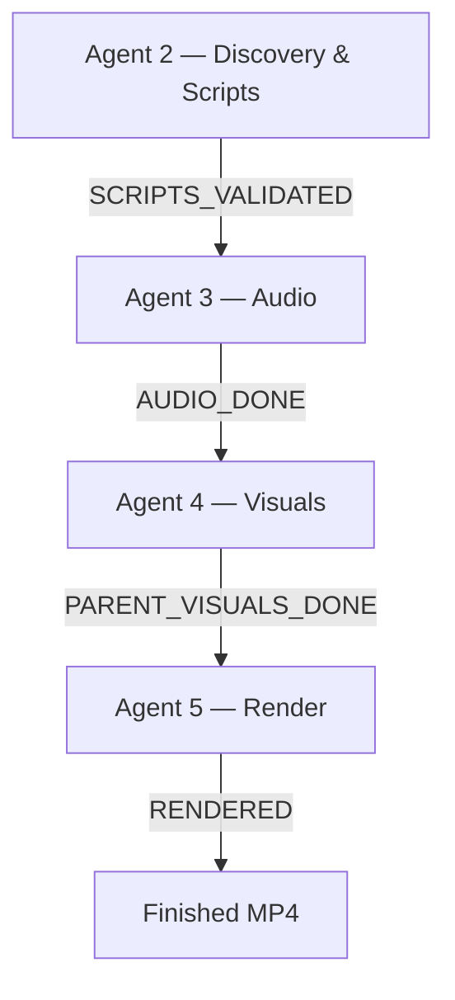
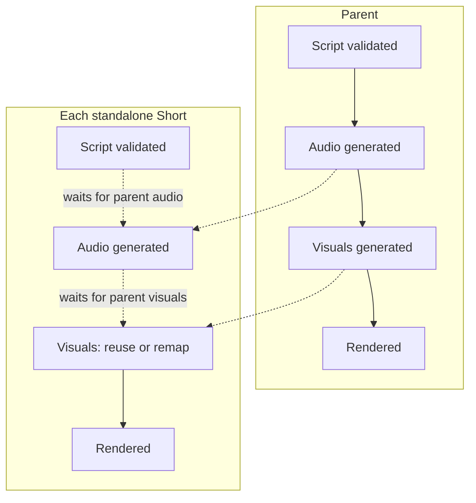

# Content Factory


An autonomous pipeline that discovers real Reddit/web stories, writes multilingual scripts, generates voice and AI visuals, and renders publish-ready long-form videos and standalone TikTok-style Shorts — with zero daily human intervention beyond a Telegram approval tap.

Designed and built end-to-end: architecture, agent design, prompt engineering, validator systems, and a full V1 → V2 redesign driven by real output review.

---

## What it actually does

Give it a niche (horror, true crime, history — anything with a story structure) and a content schedule. From there:

1. It finds a real, verifiable story matching the niche and scores it for viral potential
2. It sends you the story on Telegram for a one-tap approve/reject
3. It writes a full script — not as one shot, but as a blueprint (hook, central question, major turns, payoff) followed by section-by-section generation, so the ending is written knowing exactly what was already revealed
4. It independently plans and writes 3–5 standalone short-form episodes from the same story, each with its own hook and cliffhanger — these are not clips cut from the long video, they're written as their own thing
5. It generates voice narration, transcribes it back for word-perfect captions, designs a shot-by-shot visual storyboard, generates the images, and renders the final video — for the long-form piece and every short, independently

The output is a finished MP4 (or several), ready to upload.

---

## Why this exists

Most "AI video" pipelines fall into one of two traps: they're either a thin wrapper around a single prompt (one Claude call writes a script, one TTS call reads it, done — and the output looks like it), or they bolt together a dozen third-party APIs with no validation layer, so quality problems only surface after a human watches the finished video.

This project treats video generation as a series of independently checkable decisions, not one big leap of faith. Every creative output Claude produces — a hook, a visual beat, a Flux prompt — passes through a deterministic Python check before anything downstream spends money or time on it. Claude proposes; Python decides.

---

## Architecture

### The core principle: Claude reasons, Python decides

Every place this pipeline could have let an LLM call the shots on a workflow decision, it doesn't. Section generation loops, retry counts, accept/reject thresholds, and status transitions are all deterministic Python — Claude's output is always a *suggestion* that Python validates, scores, or gates before acting on it. This wasn't a style preference; it's what made this system debuggable. (See [Engineering decisions](#engineering-decisions-worth-knowing-about) below for what learning that the hard way looked like.)

### Five agents, one job each



| Agent | Owns | Never touches |
|---|---|---|
| **Agent 2** — Discovery & Scripts | story sourcing, scoring, Telegram approval, blueprint + sequential script generation, short-episode planning | audio, images, rendering |
| **Agent 3** — Audio | TTS (Cartesia), Whisper transcription, audio persistence | scripts, visuals, rendering |
| **Agent 4** — Visuals | storyboard generation, all visual + media validation, Flux image generation, short-episode visual remapping | audio, rendering, publishing |
| **Agent 5** — Render | Remotion rendering, technical render verification (black-frame/silence detection), final file persistence | generating or validating any visual content |

No agent imports another agent's internals — enforced and verified by an AST-based import-graph audit, not just convention.

### Parent and child run on independent, gated tracks

A long-form video and its standalone Shorts aren't generated in lockstep, but they're not fully parallel either — each short's pipeline stage is gated on the *matching* parent stage, not the parent's full completion:



Shorts reuse the parent's already-generated images wherever a narration phrase scores above a match-confidence threshold — no redundant image generation, no redundant cost — and only generate something new when nothing in the parent's visual set actually fits.

### The validation layer

Every storyboard beat and every Flux prompt passes through a shared, deterministic validator before any paid API call:

- Cover-frame quality (the first frame a viewer sees before deciding to click)
- Forbidden mood-language detection (catches generic "atmospheric, cinematic, moody" prompts that produce generic images)
- Visual repetition and "AI slideshow" risk across the full beat sequence
- Flux prompt specificity — does the prompt name an actual subject, or is it filler
- Media-asset integrity — does the generated file actually exist and is it non-empty, checked immediately after generation and again after database persistence

Validators are MINOR (logged, observability-only) or MAJOR (triggers one regeneration attempt) — nothing silently fails, and nothing infinitely retries.

---

## Built by iteration, not by guessing

The first working version of this pipeline produced videos. They just weren't good — generic visuals, slow pacing, a weak hook, double audio at clip boundaries. Rather than guess at fixes, every major architectural change in V2 traces back to a specific piece of output feedback:

| Real feedback | Root cause found | What changed |
|---|---|---|
| "Visuals look generic / AI-generated" | Storyboard prompts defaulted to mood words ("dark, atmospheric, mysterious") instead of naming concrete subjects from the narration | Forbidden-word validator + mandatory subject-first prompt structure |
| "Video feels slow, too many static shots" | Every beat held the screen for a fixed duration regardless of narrative content | Beats now carry an intensity tag (high/medium/low) that drives variable shot duration |
| "Shorts feel like fragments, not real videos" | Shorts were literal cuts of the long-form audio/video | Shorts are now planned and written as standalone episodes with their own hook and cliffhanger, generated independently |
| "Double audio at the start of every Short" | Two audio tracks (rehook + main narration) started at the same frame | Re-sequenced into non-overlapping time windows |
| Every Short was silently regenerating images instead of reusing the parent's | A field was being dropped during an in-memory data transformation, invisible to static code review | Found via a runtime data-flow audit; fixed and confirmed end-to-end with real database persistence |

That last one is worth a callout: it's the kind of bug that no amount of reading the code would catch, because each individual function was correct in isolation — the failure only existed in the data flowing *between* them. It's also why this project's validation strategy includes runtime proof-of-execution for any change touching multi-step data pipelines, not just static type/lint checks.

---

## Engineering decisions worth knowing about

**Cost-aware model routing.** Every Claude call is tagged with a task type, and every task type is mapped to a model tier in one central routing table — structural/classification work (scoring, planning) runs on a cheaper, faster model; creative generation (the actual script and storyboard writing) runs on the stronger model. Unknown task types fail loudly rather than silently defaulting.

**No silent fallbacks.** When something fails — a Flux generation, a Whisper call, a render — the system has an explicit, logged fallback path, never a quiet substitution. A failed image generation is visible in the logs as exactly that, not hidden behind a placeholder that looks fine until someone notices the video is wrong.

**Status as the single source of truth for orchestration.** Every piece of work is gated by one database status field, polled by independent schedulers — not by one process directly calling the next. This is what makes the parent/child gating in the diagram above actually safe under real-world timing: a short's audio task doesn't need to know anything about whether the parent's video finished rendering, it just checks one status value.

---

## Stack

| Layer | Technology |
|---|---|
| Orchestration | Python, Celery, Celery Beat, PostgreSQL |
| Reasoning / generation | Claude API (structured tool-use for every machine-readable output) |
| Voice | Cartesia |
| Transcription | Whisper |
| Images | Flux (via fal.ai) |
| Rendering | Remotion |
| Approval interface | Telegram Bot API |

---

## Running locally

Backend (Python 3.11+, PostgreSQL, Redis):

```bash
pip install -r requirements.txt
alembic upgrade head
```

Start the API, the Celery worker, and Celery Beat (each in its own process):

```bash
uvicorn app.main:app --reload
celery -A app.scheduler worker --loglevel=info
celery -A app.scheduler beat --loglevel=info
```

Video rendering (Node.js 18+):

```bash
cd remotion
npm install
```

Configuration: the app reads its settings from a `.env` file at the project root (no `.env.example` is currently checked in). Required keys include database/Redis connection strings, an Anthropic API key, a TTS provider key (Cartesia, with ElevenLabs supported as a legacy option), an OpenAI key for Whisper, a fal.ai key for Flux image generation, Telegram bot credentials, and a Fernet key for credential encryption.

---

## Status

This is the V2 architecture: full agent separation, the validator layer described above, and the standalone-Shorts redesign. V3 development (deeper validator coverage, stock-footage reintroduction, analytics) is ongoing in a private repository.

---

## License

This project is licensed under the MIT License.
