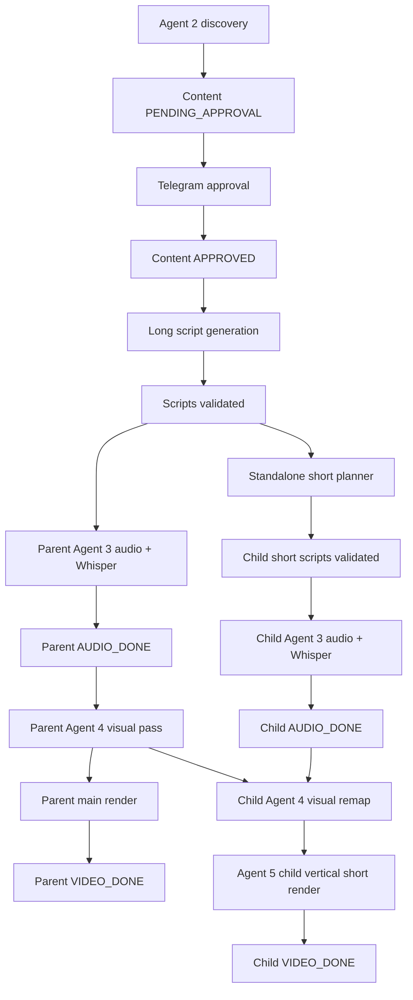
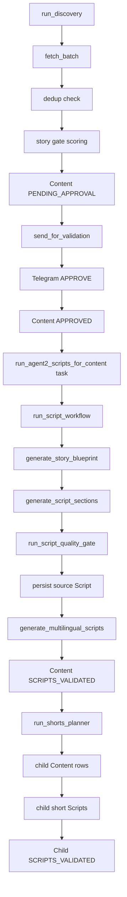
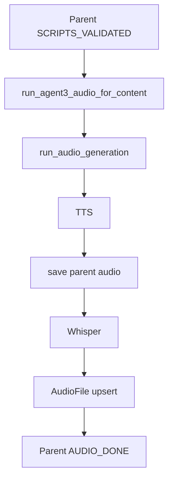
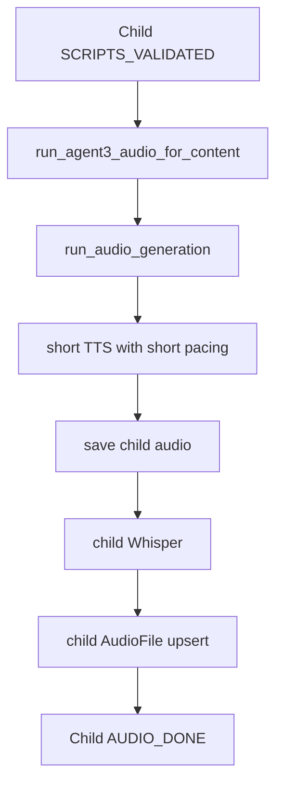
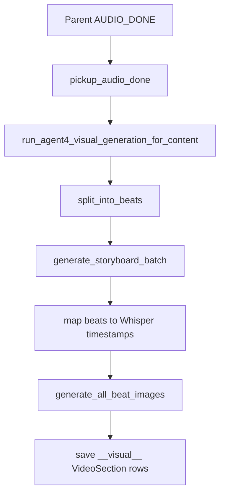
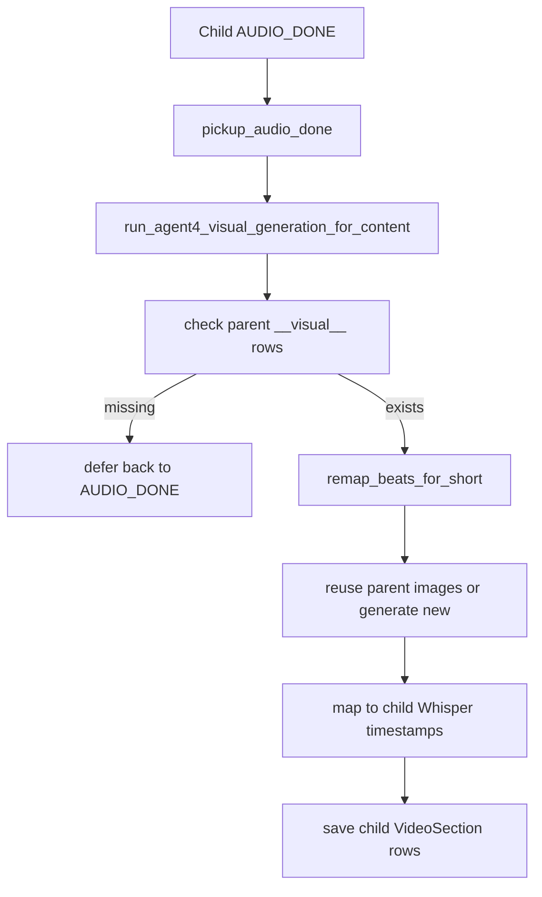
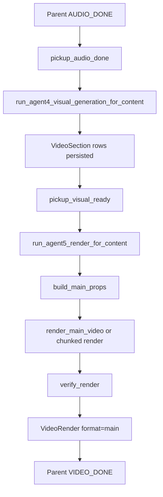
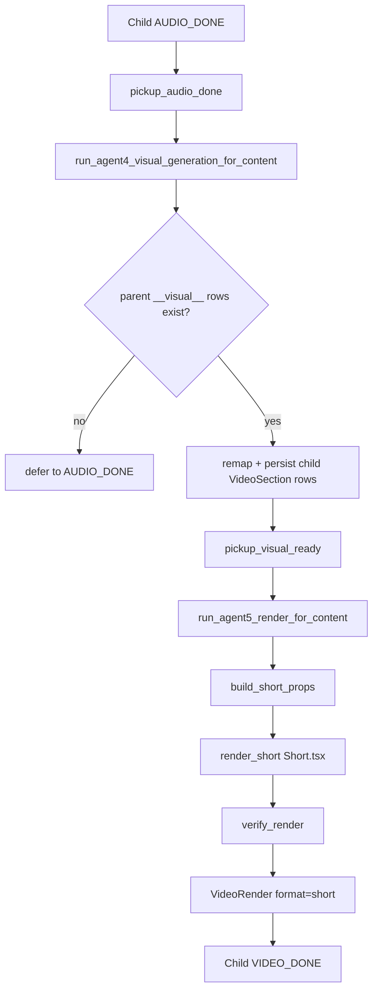

# Content Factory

## 1. Product Overview

Content Factory is an automated media pipeline for generating multilingual long-form videos and standalone short episodes for YouTube, TikTok, Instagram, and Facebook.

The system:

- Discovers source stories from configured sources.
- Scores and deduplicates stories.
- Sends selected stories to the operator through Telegram for approval.
- Generates long-form scripts.
- Generates standalone short episode scripts linked to the long-form parent.
- Generates audio with TTS.
- Generates word-level timestamps with Whisper.
- Generates visual storyboards.
- Generates Flux images.
- Renders videos through Remotion.
- Stores all outputs in PostgreSQL and the local media filesystem.
- Runs through Celery workers and Celery Beat scheduling.

The current production-relevant pipeline covers:

- Agent 1 — Channel Setup
- Agent 2 — Story discovery, validation, long script generation, short episode planning
- Agent 3 — Audio and Whisper
- Agent 4 — Visual planning and media generation
- Agent 5 — Rendering
- Agent 6+ — not part of the current media-generation core yet

Deterministic script checks and script correction run inside Agent 2.

---

## 2. Core Technology Stack

| Area | Technology |
|---|---|
| Language | Python 3.11+ |
| API | FastAPI |
| Workers | Celery |
| Scheduler | Celery Beat |
| Queue/Broker | Redis |
| Database | PostgreSQL |
| ORM | SQLAlchemy 2.0 |
| Migrations | Alembic |
| AI text/reasoning | Claude API |
| TTS | Cartesia by default; ElevenLabs supported as legacy/provider option |
| Transcription | OpenAI Whisper API with word-level timestamps |
| Image generation | fal.ai Flux Schnell |
| Video rendering | Remotion, called from Python through subprocess |
| Notifications | Telegram Bot API |
| Credential encryption | Fernet |
| Frontend | React/Vite for Agent 1 UI |
| Media storage | Local filesystem under configured media path |

---

## 3. High-Level Pipeline



Arrow explanation:

Discovery  
→ creates parent `Content` row  
→ sends Telegram validation  
→ approval marks parent as `APPROVED`  
→ Agent 2 generates long scripts  
→ scripts reach `SCRIPTS_VALIDATED`  
→ short planner creates child short contents and validated scripts  
→ parent Agent 3 generates parent audio and Whisper  
→ child short episodes are immediately eligible for Agent 3 audio  
→ parent reaches `AUDIO_DONE`  
→ each child generates its own audio and Whisper  
→ parent Agent 4 generates shared visual beats and Agent 5 renders the long video  
→ child Agent 4 remaps parent visual beats to its own short narration  
→ each child renders as vertical `Short.tsx`  
→ parent and children reach `VIDEO_DONE` independently

Important ordering rule:

- Child short videos require child audio and parent visual beats.
- Child short videos do **not** require the parent MP4 to be fully rendered.
- Child short videos must never use parent audio.
- Parent content must never render cut-down parent shorts.

---

## 4. Runtime Status Model

### 4.1 Parent Long Content

```text
PENDING_APPROVAL
→ APPROVED
→ GENERATING_SCRIPTS
→ SCRIPTS_VALIDATED
→ GENERATING_AUDIO
→ AUDIO_DONE
→ GENERATING_VIDEO
→ VIDEO_DONE
```

Optional/problem statuses:

```text
AWAITING_MANUAL_STORY
NEEDS_REVIEW
FAILED
```

### 4.2 Child Short Episodes

```text
GENERATING_SCRIPTS
→ SCRIPTS_VALIDATED
→ GENERATING_AUDIO
→ AUDIO_DONE
→ GENERATING_VIDEO
→ VIDEO_DONE
```

Child short audio rule:

- Child short contents become `SCRIPTS_VALIDATED` as soon as their standalone scripts pass validation.
- Child short audio does not wait for parent `AUDIO_DONE`.
- Each child must generate its own audio and Whisper.

---

## 5. Core Database Tables

### 5.1 Configuration Tables

```text
users
channels
channel_config
channel_languages
channel_voices
channel_sources
channel_platforms
channel_publish_timing
proxy_config
```

### 5.2 Pipeline Tables

```text
content
scripts
content_validations
audio_files
video_sections
video_renders
publish_schedule
video_analytics
analytics_anomalies
```

### 5.3 Key Model Invariants

#### `content`

Parent content:

```text
is_short_episode = False
parent_content_id = NULL
short_part_number = NULL
short_total_parts = NULL
```

Child short content:

```text
is_short_episode = True
parent_content_id = parent Content.id
short_part_number = 1-based part index
short_total_parts = total number of parts
```

#### `scripts`

- Parent rows contain long-form `video_script` and `voice_script`.
- Child short rows contain standalone short narration.
- Child short scripts are flat narration, not `[SECTION N]` structured long-form scripts.
- `video_script` and `voice_script` may be identical when visuals are storyboard-driven.

#### `audio_files`

- Parent `AudioFile` contains parent audio and parent Whisper transcript.
- Child `AudioFile` contains child short audio and child Whisper transcript.
- `shorts_breakpoints`, `short_rehook_paths`, and `short_bridge_paths` are not part of the V2 schema.
- Parent and child audio rows store only their own audio metadata and Whisper transcript.

#### `video_sections`

- Parent shared visual pass writes rows using `language="__visual__"`.
- Parent per-language render can also write/load language-specific rows.
- Child short episodes do not generate a full visual pass.
- Child short episodes write remapped, timed beats under their actual language.

#### `video_renders`

Parent long render:

```text
content_id = parent id
format = "main"
short_order = NULL
```

Child short render:

```text
content_id = child id
format = "short"
short_order = child.short_part_number - 1
```

No parent content may create `VideoRender(format="short")`.

---

## 6. Project Structure

```text
content-factory/
├── CLAUDE.md
├── .env
├── alembic/
├── app/
│   ├── main.py
│   ├── config.py
│   ├── database.py
│   ├── models/
│   ├── schemas/
│   ├── services/
│   │   ├── claude_client.py
│   │   ├── model_routing.py
│   │   ├── script_checks.py
│   │   ├── telegram_client.py
│   │   └── ...
│   ├── scheduler/
│   │   └── tasks.py
│   └── agents/
│       ├── agent1_setup/
│       ├── agent2_discovery/
│       ├── agent3_audio/
│       ├── agent4_visuals/
│       └── agent5_render/
├── remotion/
│   └── src/
│       ├── compositions/
│       │   ├── MainVideo.tsx
│       │   └── Short.tsx
│       └── components/
└── scripts/
```

---

## 6A. Service Ownership Boundaries

Scheduler and Celery tasks own orchestration only:

- scheduling
- enqueueing
- retries
- task coordination
- worker guard checks
- task-level status handoffs

Scheduler and Celery tasks must not own prompt construction, script generation,
storyboard logic, audio generation, Flux logic, render transformations, or media
generation logic. When those behaviors are currently coordinated from a task for
runtime sequencing, the business logic must live in the relevant agent service.

Agent ownership:

| Area | Owner | Owns |
|---|---|---|
| Story discovery and scripts | Agent 2 | discovery, validation handoff, long script generation, deterministic script validation, multilingual scripts, standalone short planning and child short script generation |
| Audio | Agent 3 | TTS generation, Whisper transcription, audio persistence, audio validation |
| Visuals | Agent 4 | storyboard generation and validation, beat generation, timestamp mapping, Flux prompt generation and validation, Flux image generation, media reuse, child short visual remap, `VideoSection` persistence, visual-readiness task orchestration |
| Rendering | Agent 5 | reading existing `VideoSection`/`AudioFile` rows, subtitles, Remotion props, rendering, render verification, `VideoRender` persistence |

Shared services own only generic infrastructure:

- API clients
- credential/security helpers
- common deterministic utilities
- serialization/parsing helpers
- generic storage/client abstractions

Shared services must not contain agent orchestration or agent-specific business
flows. Deterministic utilities may be used by agents when they remain generic and
side-effect free.

Current state (Phase 4D-C implemented — Agent 4 is the visual-ready producer,
Agent 5 is a render-only consumer):

- `app/agents/agent4_visuals/services/visual_orchestrator.py` owns visual
  generation end to end. `run_visual_generation_for_content(content_id, db)`
  is the Agent 4 **task** entrypoint (called from the
  `run_agent4_visual_generation_for_content` Celery task): it loads its own
  preconditions (`Content`, `Channel`, `ChannelConfig`, validated `Script`
  rows, `AudioFile` rows), transitions `AUDIO_DONE` -> `GENERATING_VIDEO`, and
  calls `run_visual_generation()` — storyboard generation, storyboard
  validation, Flux prompt generation, Flux image generation/cache reuse,
  child short narration remap, and all `VideoSection` persistence
  (`VideoSection(language="__visual__")` for parents and per-language
  `VideoSection` rows for both parent and child short). On
  `CHILD_SHORT_VISUALS_DEFERRED` it reverts `Content.status` to `AUDIO_DONE`
  for re-pickup; on `VISUALS_FAILED` it sets `"FAILED"`.
- `app/agents/agent5_render/services/video.py` does not import any
  `app.agents.agent4_visuals` module and does not call Agent 4 in any form.
  `run_video_generation()` loads its own preconditions independently
  (`Content`, `Channel`, `ChannelConfig`, validated `Script` rows, `AudioFile`
  rows) and reads existing `VideoSection` rows with a private,
  read-only loader (`_load_video_sections()`); it never writes that table. If
  a language has no persisted `VideoSection` rows yet, Agent 5 defers that
  language (`RENDER_DEFERRED ... reason=visual_sections_missing`) — it does
  not generate storyboards, run Flux, perform remap, or fall back to Agent 4
  in any way. Agent 5 owns subtitles, Remotion props, rendering, render
  verification, and `VideoRender` persistence.
- Agent 4 and Agent 5 are fully decoupled at the Celery layer, not just the
  Python-import layer: `pickup_audio_done` (status `AUDIO_DONE`, has
  `AudioFile`, no `VideoRender` yet) dispatches
  `run_agent4_visual_generation_for_content`. `pickup_visual_ready` (status
  `AUDIO_DONE`/`GENERATING_VIDEO`, has `AudioFile`, has at least one
  non-`"__visual__"` `VideoSection` row, no `VideoRender` yet) independently
  dispatches `run_agent5_render_for_content`. Neither Celery task calls the
  other directly; the handoff is purely through database state polled every
  15 minutes by Celery Beat (`pickup-audio-done`, `pickup-visual-ready`).
- Visual-readiness milestone logs (`PARENT_VISUALS_START`, `PARENT_VISUALS_DONE`,
  `CHILD_SHORT_VISUALS_START`, `CHILD_SHORT_VISUALS_DONE`,
  `CHILD_SHORT_VISUALS_DEFERRED`) are emitted from the Agent 4 orchestrator.
  Render milestone logs (`CHILD_SHORT_RENDER_START`, `CHILD_SHORT_RENDER_DONE`,
  `RENDER_DEFERRED`) stay in Agent 5.
- Runtime status names (`AUDIO_DONE`, `GENERATING_VIDEO`, `VIDEO_DONE`, `FAILED`)
  are unchanged by this phase. `GENERATING_VIDEO` now covers both the visual
  generation window (Agent 4) and the render window (Agent 5) — there is no
  separate `VISUAL_READY`/`PARENT_VISUALS_DONE`/`RENDERED` runtime status yet;
  `VideoSection` row existence is the readiness signal `pickup_visual_ready`
  polls on. Introducing dedicated runtime statuses for this is Phase 4D-D.

---

## 7. Shared Services Architecture

### 7.1 Claude Client

File:

```text
app/services/claude_client.py
```

Responsibilities:

- Own the Anthropic client singleton.
- Apply retries/backoff.
- Log every Claude call.
- Support structured tool-use responses.
- Support tool/web-search calls where intentionally used.
- Enforce empty-response guards.
- Keep prompt transport separate from prompt content.

Public call helpers:

```text
call_claude()
call_claude_with_usage()
call_claude_structured()
call_claude_with_tools()
```

Rules:

- Agents must never instantiate Anthropic clients directly.
- Agents must never bypass `claude_client.py`.
- Every Claude call must include a `task=` key.
- Every new task key must be added to `app/services/model_routing.py`.
- Use `call_claude_structured()` when code needs JSON or schema-like output.
- Use `call_claude_with_tools()` only when tool use is required.
- Do not put system prompts inside `claude_client.py`.

### 7.2 Model Routing

File:

```text
app/services/model_routing.py
```

Responsibilities:

- Map `task` keys to model IDs.
- Fail loudly on unknown task keys.
- Centralize model selection.

Rules:

- No ad-hoc model strings inside agents unless explicitly passed through a documented override.
- Unknown task → `ValueError`.
- Model choice is an architecture decision, not a random call-site detail.
- Cheap/fast tasks should use smaller models only when quality is not degraded.
- High-quality creative generation, source research, and complex visual storyboard tasks use the configured high-quality model.

### 7.3 Deterministic Script Checks

File:

```text
app/services/script_checks.py
```

Responsibilities:

- TTS compliance checks.
- Hook checks.
- Section transition checks.
- Completeness checks.
- Length checks.
- Deterministic cleanup utilities.

Rules:

- Any issue that can be checked deterministically must be checked in Python, not by prompt.
- Claude may generate or revise, but Python decides pass/fail.
- TTS cleanup should run before expensive retries whenever possible.
- No script with remaining MAJOR deterministic issues should be silently marked validated.

---

## 8. Agent 1 — Channel Setup

Agent 1 owns channel configuration and credential entry.

Current responsibilities:

- Conversational/dynamic setup UI.
- Field suggestions through Claude.
- Channel configuration persistence.
- Language setup.
- Voice ID entry.
- Platform credential entry and verification.
- Fernet encryption before credential storage.
- Channel activation after required credentials are verified.

Key API area:

```text
app/agents/agent1_setup/
```

Rules:

- Credential handling is structured, not AI-driven.
- Raw credentials must never be logged.
- Credentials must be encrypted before storage.
- Credential verification must be explicit and logged without secrets.
- Claude may suggest channel fields, but not validate credentials.
- Voice IDs are operator-provided hard inputs unless a future voice browser is explicitly implemented.

---

## 9. Agent 2 — Discovery, Scripts, and Standalone Short Planning

### 9.1 Agent 2 Responsibilities

Agent 2 owns:

- Story discovery.
- Deduplication.
- Story scoring.
- Telegram validation.
- Manual fallback story handling.
- Long-form script blueprinting.
- Section-by-section script generation.
- Script quality gate.
- Multilingual script generation.
- Standalone short episode planning and script creation.

Agent 2 must not:

- Generate audio.
- Generate images.
- Render videos.
- Decide publishing.
- Cut parent videos into shorts.

### 9.2 Agent 2 Flow



### 9.3 Important Agent 2 Functions

#### `run_discovery`

File:

```text
app/agents/agent2_discovery/services/discovery.py
```

Input:

- Channel ID
- Database session
- Optional rejected stories list

Output:

- Parent `Content` row
- Story object
- Gate assessment

Responsibilities:

- Load channel and sources.
- Fetch a candidate story.
- Deduplicate.
- Score story.
- Persist parent content if accepted.
- Trigger manual fallback if discovery fails.

#### `fetch_batch`

File:

```text
app/agents/agent2_discovery/services/fetcher.py
```

Input:

- Source config
- Channel/niche context
- Rejected story exclusions

Output:

- Candidate `Story`

Rules:

- Must return direct story candidates when possible.
- Must accept rejected story exclusions.
- Must not block the whole pipeline on one duplicate candidate.
- Must not invent URLs.
- Must not validate business decisions by prompt alone.

#### `send_for_validation`

File:

```text
app/agents/agent2_discovery/services/validation.py
```

Input:

- Parent content
- Channel
- Assessment

Output:

- Telegram validation message

Rules:

- Telegram failures must log clearly.
- Markdown formatting failures may retry as plain text.
- Approval marks content `APPROVED`.
- Change flow before script generation must be handled explicitly; do not pretend script revision exists when no script exists.

#### `run_agent2_scripts_for_content`

File:

```text
app/scheduler/tasks.py
```

Input:

- Parent content ID

Output:

- Agent 2 script workflow task execution

Responsibilities:

- Load parent content.
- Guard that content is still `APPROVED`.
- Open and close the worker database session.
- Call Agent 2 `run_script_workflow`.
- Preserve task-level retry and failure logging.

#### `run_script_workflow`

File:

```text
app/agents/agent2_discovery/services/script_workflow.py
```

Input:

- Approved parent `Content`
- Database session

Output:

- Validated long scripts
- Child short content rows/scripts

Responsibilities:

- Move status to `GENERATING_SCRIPTS`.
- Generate story blueprint.
- Generate section scripts.
- Run quality gate.
- Persist scripts.
- Generate multilingual scripts.
- Mark parent `SCRIPTS_VALIDATED`.
- Call `run_shorts_planner`.

#### `generate_story_blueprint`

File:

```text
app/agents/agent2_discovery/system_prompt.py
```

Output fields:

- hook
- major_turns
- final_payoff
- comment_trigger
- suggested_section_count
- suggested_title

Rules:

- Use structured Claude call.
- Python validates required fields.
- Major turns drive section progression.
- Business logic remains in Python.

#### `generate_script_sections`

File:

```text
app/agents/agent2_discovery/services/scripts.py
```

Responsibilities:

- Generate INTRO.
- Generate body sections one primary turn at a time.
- Generate OUTRO.
- Enforce TTS cleanup.
- Track coverage.
- Avoid collapsing multiple major turns into one section.
- Retry only when required.
- Preserve section progression.

Rules:

- One body section should primarily advance one major turn.
- Future turns may be foreshadowed, not resolved.
- TTS checks are deterministic.
- Major business decisions live in Python.
- Narrative completeness retry must not create infinite loops.

#### `run_script_quality_gate`

File:

```text
app/agents/agent2_discovery/services/scripts.py
```

Responsibilities:

- Run final deterministic cleanup.
- Run quality assessment.
- Skip expensive rewrite when issues are TTS-only and fixable in Python.
- Log cost estimates.

Rules:

- Do not call expensive rewrite for cheap deterministic issues.
- Clean before assessment and before final return.
- Log hash/trace when scripts move across stages.

#### `generate_multilingual_scripts`

File:

```text
app/agents/agent2_discovery/services/scripts.py
```

Responsibilities:

- Generate/adapt scripts into configured languages.
- Persist `Script` rows.
- Validate language outputs.

Rules:

- Native adaptation, not literal translation.
- Maintain factual consistency.
- Do not silently shorten content across languages.

### 9.4 Standalone Short Planning

#### `run_shorts_planner`

File:

```text
app/agents/agent2_discovery/services/scripts.py
```

Input:

- Parent content ID
- Channel
- Config
- Database session

Output:

- Child `Content` rows
- Child short `Script` rows

Current standalone short flow:

```text
Parent SCRIPTS_VALIDATED
→ shorts planner
→ child Content rows
→ child short scripts
→ child SCRIPTS_VALIDATED
```

Rules:

- Child short scripts are standalone.
- Child short scripts are not parent cuts.
- Child short scripts must be validated before the child row is marked `SCRIPTS_VALIDATED`.
- If child short rows already exist, do not create duplicates.
- Existing child rows in `SCRIPTS_VALIDATED` are picked up by normal Agent 3 audio pickup.
- No child with MAJOR deterministic script issues may be marked ready.

Naming rule:

- Use product names such as `short_episode`, `standalone_short`, or `child_short`.
- Do not name functions, files, constants, classes, logs, or DB concepts after development phase labels such as `phase4`.
- Log messages may mention the current product concept, for example:
  - `STANDALONE_SHORTS_ALREADY_EXIST`
  - `AUDIO_PICKUP`
  - `CHILD_SHORT_AUDIO_START`
  - `SHORT_EPISODE_RENDER_DONE`
- Existing phase-labeled logs should be renamed when touched.

---

## 10. Agent 3 — Audio and Whisper

### 10.1 Agent 3 Responsibilities

Agent 3 owns:

- TTS generation.
- Audio file persistence.
- Duration measurement.
- Whisper transcription.
- AudioFile upsert.
- Audio pickup for any content with `SCRIPTS_VALIDATED`, including child short episodes.

Agent 3 must not:

- Generate parent short cuts.
- Generate parent short breakpoints.
- Generate parent rehooks/bridges under standalone-short architecture.
- Render video.
- Generate visual beats.

### 10.2 Agent 3 Flow

Parent:



Child short:



### 10.3 Important Agent 3 Functions

#### `pickup_scripts_validated`

File:

```text
app/scheduler/tasks.py
```

Responsibilities:

- Find content rows in `SCRIPTS_VALIDATED`.
- Enqueue `run_agent3_audio_for_content`.

Rules:

- May pick parent and child content.
- Worker-side guards must prevent duplicate processing.
- It should not rely on parent/child timing assumptions.

#### `run_agent3_audio_for_content`

File:

```text
app/scheduler/tasks.py
```

Responsibilities:

- Run audio generation for one content ID.
- Mark that content `AUDIO_DONE` after successful AudioFile persistence.

Rules:

- Parent success must not release, flip, or enqueue child short audio.
- Child short audio is picked up from `SCRIPTS_VALIDATED` like any other content.
- Do not open unnecessary second sessions for critical orchestration if the current session has the needed state.

Temporary compatibility:

- `run_agent4_for_content` remains as a Celery task alias for old queued messages only.
- New code must call `run_agent3_audio_for_content`.

#### `ensure_child_short_audio_enqueued`

File:

```text
app/scheduler/tasks.py
```

Responsibilities:

- Temporary compatibility no-op for old imports or queued code paths.
- Return `0` and log that the parent-audio child gate has been removed.

Rules:

- Must not release, flip, or enqueue child short audio.
- Must not depend on parent `AUDIO_DONE`.
- New code must use `pickup_scripts_validated` for child audio pickup.

#### `run_audio_generation`

File:

```text
app/agents/agent3_audio/services/audio.py
```

Responsibilities:

- Load content and validated scripts.
- Set status to `GENERATING_AUDIO`.
- Generate TTS per language.
- Save audio file.
- Run Whisper.
- Upsert `AudioFile`.
- Mark content `AUDIO_DONE`.

Rules:

- Parent content does not generate breakpoints, bookends, rehooks, bridges, or semantic short splits.
- Child content does not generate breakpoints, bookends, rehooks, or bridges.
- Child content uses its own script, audio, and Whisper.
- TTS skip-on-disk must still update/confirm `AudioFile` consistency.

#### `generate_audio`

File:

```text
app/agents/agent3_audio/services/tts.py
```

Responsibilities:

- Prepare text.
- Select provider path.
- Generate audio bytes.
- Handle chunking and concatenation.

Rules:

- Provider-specific behavior must be behind a clear provider abstraction.
- Cartesia default model is `sonic-2`.
- ElevenLabs remains supported only as configured provider/legacy path.
- Voice and model choices come from `channel_voices`.

#### `prepare_script_for_tts`

File:

```text
app/agents/agent3_audio/services/tts.py
```

Rules:

- Strip unsupported markers.
- Normalize TTS text.
- Add pacing markers deterministically.
- Short episodes may use different pacing caps.
- Never insert pauses that corrupt meaning.

#### `transcribe`

File:

```text
app/agents/agent3_audio/services/whisper.py
```

Rules:

- Use actual generated audio.
- Store word-level timestamps.
- Captions must derive from Whisper, not script text.

---

## 11. Agent 4 — Visual Planning and Media Generation

### 11.1 Agent 4 Responsibilities

Agent 4 owns:

- Parent visual pass.
- Storyboard generation.
- Storyboard validation.
- Timestamp mapping.
- Parent `__visual__` `VideoSection` rows.
- Flux prompt generation.
- Flux image/media generation.
- Media cache/reuse.
- Standalone child-short visual remapping.
- Visual quality diagnostics.

Agent 4 must not:

- Generate audio.
- Recreate scripts.
- Render videos.
- Persist `VideoRender` rows.
- Cut parent videos into shorts.
- Use network assets during Remotion rendering.
- Call Agent 5 or import any `app.agents.agent5_render` module.

Agent 4 is triggered independently of Agent 5 (Phase 4D-C): `pickup_audio_done`
dispatches `run_agent4_visual_generation_for_content`, which loads its own
`Content`/`Channel`/`ChannelConfig`/`Script`/`AudioFile` rows and runs the
flows below. Agent 5 only discovers the resulting `VideoSection` rows later,
through its own independent `pickup_visual_ready` pickup.

### 11.2 Parent Agent 4 Visual Flow



### 11.3 Child Short Agent 4 Visual Flow



### 11.4 Important Agent 4 Functions

#### `split_into_beats`

File:

```text
app/agents/agent4_visuals/subagents/storyboard.py
```

Responsibilities:

- Split long script into storyboard segments.
- Call storyboard generation per segment.
- Merge batches.
- Map beats to timestamps.
- Log estimate accuracy and cost.

Rules:

- Track estimated vs actual beats.
- Log token/cost diagnostics.
- Avoid unnecessary full-storyboard retries.
- Use deterministic validation when possible.

#### `generate_storyboard_batch`

File:

```text
app/agents/agent4_visuals/system_prompt.py
```

Responsibilities:

- Ask Claude for structured visual beats.
- Return schema-validated storyboard batch.

Rules:

- Use `call_claude_structured()`.
- Use forced tool output.
- Keep schema strict.
- Storyboard prompt must produce physical, camera-pointable visuals.
- Prompt must not rely on vague mood words.
- Prompt must support visual continuity and identity consistency.

#### `map_storyboard_beats_to_timestamps`

File:

```text
app/agents/agent4_visuals/subagents/storyboard.py
```

Responsibilities:

- Align storyboard beats to Whisper transcript.
- Produce timed visual sections.

Rules:

- Use actual Whisper timings.
- Allow fallback only when explicitly intended.
- Log fallback rate.

#### `generate_all_beat_images`

File:

```text
app/agents/agent4_visuals/services/flux_generator.py
```

Responsibilities:

- Generate or reuse Flux images.
- Save local cache images.
- Attach local `media_url`.

Rules:

- `media_url` must always be local, usually `cache/...`.
- Never pass HTTP URLs to Remotion props.
- Cache reuse must not create obvious visual repetition.
- If cache reuse is controlled by prompt hash, log enough to debug repeated frames.

#### `remap_beats_for_short`

File:

```text
app/agents/agent4_visuals/subagents/storyboard.py
```

Responsibilities:

- Load parent visual beats.
- Ask Claude to map short narration phrases to parent beats.
- Reuse parent images when relevant.
- Generate new images when needed.
- Map beats to child Whisper timestamps.
- Return child short beats.

Rules:

- Use child short voice script.
- Use child short audio and Whisper.
- Use parent visual beats only as a visual source pool.
- Reuse parent images only when match score threshold passes.
- Threshold is enforced in Python, not prompt.
- Log reuse stats.

Preferred log names when touched:

```text
SHORT_EPISODE_REUSE_STATS
SHORT_EPISODE_RENDER
SHORT_EPISODE_RENDER_DONE
```

Avoid phase-labeled names in new code.

---

## 11A. Agent 5 — Rendering (render-only)

### 11A.1 Agent 5 Responsibilities

Agent 5 owns:

- Render-ready pickup for content with an existing `AudioFile` and at least
  one persisted `VideoSection` row.
- Parent/child render routing.
- Subtitle chunk generation.
- Remotion props generation.
- Main video rendering.
- Vertical short rendering.
- Render verification.
- `VideoRender` persistence.

Agent 5 must not:

- Generate audio.
- Recreate scripts.
- Cut parent videos into shorts.
- Generate or validate storyboards, generate or validate Flux prompts,
  generate media, perform child remapping, or persist `VideoSection` rows.
- Import any `app.agents.agent4_visuals` module, or call Agent 4 in any form.
- Fall back to visual generation when `VideoSection` rows are missing — it
  must defer instead.
- Store remote media URLs in props.

Current boundary (Phase 4D-C — fully implemented):

- Agent 4 (`app/agents/agent4_visuals/`) is the sole producer of visual-ready
  content: it loads its own preconditions, generates/remaps visuals, and
  persists `VideoSection` rows, all without any call from or into Agent 5.
- Agent 5 (`app/agents/agent5_render/`) is a pure consumer: it loads its own
  preconditions independently, reads existing `VideoSection` rows with a
  private read-only loader, and never writes that table.
- The two agents are decoupled at the Celery layer: `pickup_audio_done`
  dispatches Agent 4's visual task; `pickup_visual_ready` independently
  dispatches Agent 5's render task once `VideoSection` rows exist. Neither
  Celery task calls the other.
- Rendering starts only after the content has an `AudioFile` and at least one
  persisted `VideoSection` row; a language with neither is deferred, not
  failed, and not generated by Agent 5 as a fallback.

### 11A.2 Parent Agent 5 Render Flow



### 11A.3 Child Short Agent 5 Render Flow



### 11A.4 Important Agent 5 Functions

#### `pickup_audio_done`

File:

```text
app/scheduler/tasks.py
```

Responsibilities:

- Find `AUDIO_DONE` content with an `AudioFile`.
- Skip content that already has the relevant `VideoRender` row.
- Enqueue `run_agent4_visual_generation_for_content` (Agent 4, not Agent 5).

Rules:

- Can pick parent and child content.
- Does not dispatch Agent 5 directly — Agent 5 pickup is a separate path.

#### `pickup_visual_ready`

File:

```text
app/scheduler/tasks.py
```

Responsibilities:

- Find content with an `AudioFile` and at least one persisted per-language
  `VideoSection` row (`language != "__visual__"`).
- Skip content that already has the relevant `VideoRender` row.
- Enqueue `run_agent5_render_for_content`.

Rules:

- This is the only path that hands ready content to Agent 5.
- Gates purely on `VideoSection` row existence, not on a dedicated runtime
  status (no `VISUAL_READY` status exists yet — see Phase 4D-D).

#### `run_agent5_render_for_content`

File:

```text
app/scheduler/tasks.py
```

Responsibilities:

- Run rendering orchestration for one content ID.
- Requires `VideoSection` rows already exist; never calls Agent 4.

Temporary compatibility:

- `run_agent5_for_content` remains as a Celery task alias for old queued messages only.
- New code must call `run_agent5_render_for_content`.

#### `run_video_generation`

File:

```text
app/agents/agent5_render/services/video.py
```

Responsibilities:

- Route parent vs child rendering.
- Manage status transitions.
- Load existing `VideoSection` rows (read-only) for each language.
- Persist video outputs.

Rules:

- Does not import or call any `app.agents.agent4_visuals` module.
- A language with no persisted `VideoSection` rows is deferred
  (`RENDER_DEFERRED ... reason=visual_sections_missing`), not generated.
- Parent renders only `format="main"`.
- Child renders only `format="short"`.
- Parent must not create short props or short renders.

#### `build_main_props`

File:

```text
app/agents/agent5_render/services/remotion_builder.py
```

Rules:

- Parent main props only.
- Validate media paths.
- Fail fast if remote URLs are present.

#### `build_short_props`

File:

```text
app/agents/agent5_render/services/remotion_builder.py
```

Rules:

- Child short props only.
- Use vertical layout.
- Use child audio.
- Use child timed beats.
- Do not add rehook/bridge audio unless a future architecture explicitly reintroduces standalone short bookends.

#### `render_main_video`

File:

```text
app/agents/agent5_render/services/renderer.py
```

Rules:

- Use `MainVideo.tsx`.
- Render 1920×1080.
- Use chunked render for long durations.
- Verify final output.

#### `render_short`

File:

```text
app/agents/agent5_render/services/renderer.py
```

Rules:

- Use `Short.tsx`.
- Render 1080×1920.
- Store as `VideoRender(format="short")`.
- Output belongs to the child content ID.

---

## 12. Parent vs Child Short Comparison

| Dimension | Parent long content | Child short episode |
|---|---|---|
| `content.is_short_episode` | `False` | `True` |
| Parent link | none | `parent_content_id` |
| Script | long structured script | standalone flat short narration |
| Audio | own full audio | own short audio |
| Whisper | parent transcript | child transcript |
| Breakpoints | empty | empty |
| Bookends/rehooks/bridges | disabled | disabled |
| Visual pass | full storyboard + Flux | remap parent visual beats |
| Images | parent Flux cache | reuse parent images or generate child cache |
| Remotion composition | `MainVideo.tsx` | `Short.tsx` |
| Resolution | 1920×1080 | 1080×1920 |
| `VideoRender.format` | `"main"` | `"short"` |
| Render content ID | parent ID | child ID |
| Status flow | parent flow | child flow |

---

## 13. Artifact Map

### Parent audio

```text
{media_path}/audio/{parent_content_id}/{language}.mp3
```

### Child short audio

```text
{media_path}/audio/{child_content_id}/{language}.mp3
```

### Parent Remotion props

```text
{media_path}/remotion_props/{parent_content_id}_{language}_main.json
```

### Child short Remotion props

```text
{media_path}/remotion_props/{child_content_id}_{language}_short_{short_order}.json
```

### Parent main video

```text
{media_path}/video/{parent_content_id}/{language}_main.mp4
```

### Child short video

```text
{media_path}/video/{child_content_id}/{language}_short_{short_order}.mp4
```

### Flux cache

Parent:

```text
{media_path}/cache/{parent_content_id}/{prompt_hash}.jpg
```

Child new images:

```text
{media_path}/cache/{child_content_id}/{prompt_hash}.jpg
```

Child reused images:

```text
cache/{parent_content_id}/{prompt_hash}.jpg
```

### Whisper transcripts

Stored in database:

```text
audio_files.whisper_transcript
```

No separate transcript file is required.

---

## 14. Celery and Beat Tasks

Primary task file:

```text
app/scheduler/tasks.py
```

Important tasks:

| Task | Responsibility |
|---|---|
| `dispatch_discovery` | start scheduled discovery |
| `run_agent2_for_channel` | discovery for one channel |
| `pickup_approved_content` | enqueue script generation |
| `run_agent2_scripts_for_content` | run Agent 2 script workflow task wrapper |
| `pickup_scripts_validated` | enqueue Agent 3 audio |
| `run_agent3_audio_for_content` | generate audio/Whisper |
| `pickup_short_episodes_awaiting_parent` | compatibility no-op for old queued child-release messages |
| `ensure_child_short_audio_enqueued` | compatibility no-op for old parent-audio child-release imports |
| `pickup_audio_done` | enqueue Agent 4 visual generation |
| `run_agent4_visual_generation_for_content` | generate storyboard/Flux visuals or child remap; persist `VideoSection` rows |
| `pickup_visual_ready` | enqueue Agent 5 render once `VideoSection` rows exist |
| `run_agent5_render_for_content` | render video from existing `AudioFile`/`VideoSection` rows only |

Rules:

- Beat tasks are safety nets, not the only orchestration mechanism for critical handoffs.
- Child short audio pickup must not depend on parent audio completion.
- Idempotency must be enforced at the worker/service layer.
- Duplicate task dispatch is tolerable only if worker-level guards prevent duplicate side effects.

---
